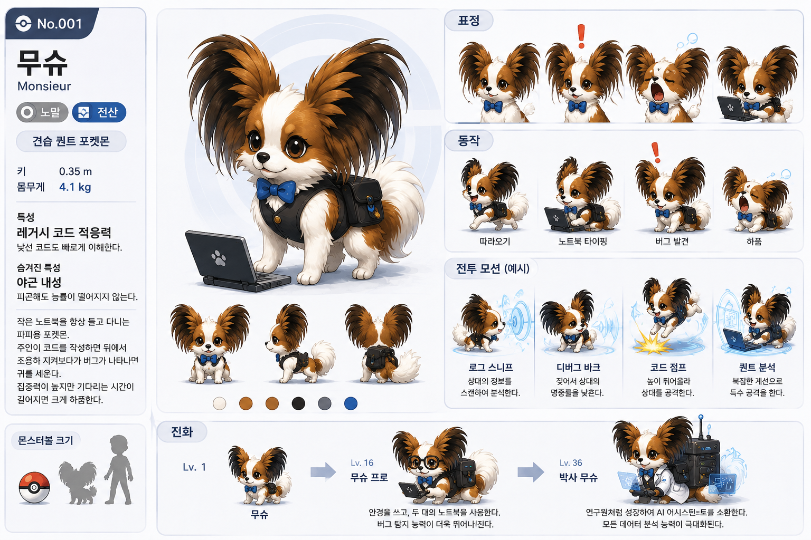

# 🎮 PocketQuant

> **Gotta Money 'Em All**

포켓몬 리그 우승엔 강한 포켓몬 하나만으로는 부족하다.
타입 상성, 역할 분담, 밸런스를 고려해 **최적의 파티**를 구성해야 한다.

투자도 마찬가지다.

PocketQuant는 **포켓몬 파티 구성을 포트폴리오 최적화 문제로 재해석**하여,
**최적의 트레이딩 전략 조합을 탐색하는 실험 프로젝트**다.

<p align="center">
  
</p>

> *비공식 팬메이드 학습 프로젝트입니다. 닌텐도 · 게임프리크 · The Pokémon Company와 무관하며 비상업적입니다.*

> 📈 **실데이터(yfinance) 백테스트 기반입니다.** 각 전략을 실제 시장 국면의
> **QQQ(나스닥100)** 가격으로 백테스트하고, **라이벌 '성실이'(DCA) 대비 종료 잔고**로 줄세웁니다. (투자 자문 아님 — 학습용)

---

## 🧩 컨셉

| 게임 용어 | 실제 의미                                                                           |
|-----------|---------------------------------------------------------------------------------|
| 포켓퀀트 1마리 | 시그널 1개                                                                          |
| 트레이더 / 전략 | 시그널을 운용하는 모델                                                                    |
| 파티 | 포트폴리오                                                                           |
| 체육관 (6개) | 시장 국면 (regime)                                                                  |
| 체육관 도전 | 백테스트                                                                            |
| 종료 잔고 (선발 화폐) | 100만원 시드 → 끝 잔고, 라이벌 성실이 대비                                                     |
| 스탯 (HP/ATK/DEF/SKILL) | 성과 지표(현금비중/CAGR/Calmar/샤프) — **리포트 표시 전용**                                      |
| **라이벌 '성실이'** | **DCA 봇** — 매일 같은 금액을 묵묵히 사 모으는 녀석 (수수료도 0원)                                    |
| 돼지저금통 | '전부 현금' 기준선(금리 0%) — 투자자 현타 담당: 저축왕은 3% 이자라도 받지, 얘는 진짜 0%다 (그리고 최적화의 숙적, 봉인 3회) |
| 어플삭제단 | 공정 B&H 기준선 — 300명이 각자 랜덤 진입일에 풀매수하고 어플 삭제(존버). 중앙값 단원 = '아무 날에나 산 평범한 존버러'.     |
| 저축왕 | 은행 기준선 — 연 3%(CMA/자유적금) 무위험 복리. 낙폭 0이라 방어 스탯 만점 착시가 있어 순위표엔 미참가, 표시 전용          |
| 리그 본선 | OOS 연도 시험 (Out Of Samples 처음 보는 미래 데이터로 출전)                                     |
| 배틀 프론티어 | 블록 부트스트랩 평행세계 — "있을 법했지만 없었던 역사" 운빨 스트레스 테스트                                    |
| 사천왕 | post-COVID hold-out — v2에서 4번째 아레나로 개봉, 이제 오염됨 (최종 판정은 미래 데이터로)                 |
| 아카데미 | 합성 평행세계 훈련소 — 블록 부트스트랩 가상장에서 훈련 후 실QQQ 졸업시험 (v2 운영)                             |
| 교배 · 진화 | 전략 탐색 옵티마이저 (다목적 최적화 — 현재 NSGA-III)                                          |

---

## 🎯 이 프로젝트가 풀고 싶은 문제

목표는 단순하다 — **돈을 많이, 그리고 꾸준히 벌고 싶다.**

문제는 "가장 강한 전략 하나"가 환상이라는 것. 최강의 포켓퀀트는 있어도
**모든 시장 국면을 다 이기는 포켓퀀트는 없다** — 닷컴을 막는 방어가 상승장에선 짐이 된다.

그래서 찾는 건 영웅 한 마리가 아니라 **어떤 국면이 와도 안 무너지고 돈을 불리는 운용**이다.
잣대는 화려한 백테스트가 아니라 **라이벌 '성실이'(DCA 봇) — 매일 수수료 0원으로 묵묵히
사 모으는 녀석 — 을 길게 이기는가.** 좋을 때만 반짝하고 위기에 녹는 전략은 데려갈 이유가 없다.

> 🧭 **방법은 안 가린다 — Gotta Money 'Em All.** 국면을 모르니 전략 집합으로 헷지하든(다목적
> Pareto), 국면을 읽어 그때그때 전문가를 투입하든(레짐 스캐너), 유전 알고리즘이든 NSGA-III든
> RL이든 — 더 잘·더 안정적으로 버는 도구면 뭐든 갈아끼운다. **특정 알고리즘·전략에 갇히면
> 큰 흐름을 놓친다.** (현재 챔피언 도구는 NSGA-III. 탐색 정식화: [OPTIMIZATION.md](OPTIMIZATION.md))

---

## 🧬 포켓퀀트 14마리 (시그널) — 스타팅 6 + 야생 8

전략은 아래 유전자를 조합해 만들어집니다. 각 유전자는 **실제 지표 로직**으로,
가격을 받아 그날의 포지션(0~1, 1=풀매수·0=현금) 또는 **기권**을 만듭니다.

| 타입 | 유전자 | 로직 (포지션) |
|------|--------|------|
| 💧 위험회피 | `DD`  | 드로다운 스탑 — 고점 대비 −10% 넘게 빠지면 현금화 |
| 💧 위험회피 | `VOL` | 실현변동성 레짐 — 평온=탑승 / 중간=반반 / 격동=현금 |
| 🔥 추세순응 | `MA`  | 가격 > 200일 이평이면 탑승 |
| 🔥 추세순응 | `MOM` | 모멘텀 — 최근 ~3개월 수익률이 양수면 탑승 |
| 🌿 역발상 | `REV_RSI` | **이벤트형** — RSI(14) < 30 과매도 투매면 매수 의견, 평소엔 기권 |
| 🌿 역발상 | `REV_BB`  | **이벤트형** — 볼린저 하단밴드 아래 과대 낙폭이면 매수 의견, 평소엔 기권 |

**전략 포지션 = 그날 의견 낸 유전자들의 평균 (기권 제외).** 이벤트형(REV)은 평소
벤치에 앉아 있다가 투매가 터진 날만 출전합니다 — "의견 없음"이 "현금 가라"로
집계되던 함정(잉어킹 강제 출전 문제)을 막는 규칙. 전원 기권한 날은 현금(0)입니다.

### 야생 8마리 — 가격 외 정보원

스타팅 6마리는 모두 가격 기반이라 자산-횡단 알파엔 한계. **가격 외 정보원**으로 야생 8마리:

| 타입 | 유전자 | 외부 정보원 | 로직 |
|---|---|---|---|
| 📊 자산-내부 | `VOL_SPIKE` | 거래량 (yfinance) | 평균 20일 대비 2.5배 폭증 + 음봉 = 매수 의견 |
| 😱 S&P 공포 | `FEAR` | `^VIX` 공포지수 | VIX > 30 = 역발상 매수 의견 |
| 😱 나스닥 공포 | `FEAR_NQ` | `^VXN` 나스닥 변동성 | VXN > 47 = 역발상 매수 의견 (2001년~) |
| 💵 글로벌 | `US10Y` | `^TNX` 10년 금리 | 60일 평균 대비 -0.5%p 이상 하락 = 매수 의견 |
| 💰 글로벌 | `DXY` | `UUP` (Invesco DXY ETF) | 60일 평균 대비 +1.5% 상승 = 방어 의견 (현금 0) |
| 🏦 글로벌 | `SPY_TLT` | `SPY` + `TLT` | TLT/SPY 비율 60일 평균 대비 +1% = 채권 강세 → 방어 |
| 🚀 자산-횡단 | `QQQ_SPY` | `QQQ` + `SPY` | 비율 60일 평균 위 = 성장주 우위 → 매수 |
| 🏭 자산-횡단 | `QQQ_DIA` | `QQQ` + `DIA` | 비율 60일 평균 위 = 테크 vs 다우 가치 우위 → 매수 |

모두 이벤트형 (발동일만 의견, 평소 기권). 외부 데이터 없는 시기(UUP 2007년·VXN 2001년 이전)는 자동 NaN 기권.

> 트레이더 이름은 데려간 포켓퀀트 조합으로 자동 생성됩니다(새 캐릭터가 아니라 표기).
> 현 챔피언 = **NSGA-t5938** (`US10Y 32% + QQQ_SPY 27% + QQQ_DIA 15% + REV_RSI 15%`, 크로스에셋 성장 틸트).

---

## 💱 매매 방식 (어떻게 사고파나)

신호가 뜨면 "전부 사고/판다"가 아니라, **매일 "주식을 몇 % 들고 있을지(비중)"** 를 정해 거기에 맞춥니다.

- 각 유전자가 매일 비중을 뱉습니다: `1.0`=풀매수 · `0.0`=전부 현금 · `0.5`=반반 · 기권=의견 없음
- 전략 비중 = 그날 **의견 낸** 유전자들의 비중 **평균** (기권은 제외, 전원 기권이면 현금)
- 매일 그 비중으로 **리밸런싱** (비중이 그대로면 보유, 바뀌면 그만큼만 사고팜)
- 사고판 금액에는 **수수료 0.1%** (토스증권 미국주식 기준)를 차감

```
그날 수익 = (어제 비중) × (오늘 QQQ 등락)
```

예) 어제 50% 들고 있었는데 오늘 QQQ +2% → 내 자산 +1%. 현금 부분은 이자 0%.
신호는 종가로 확인하고 **다음 날** 반영합니다 (미래를 미리 안 보게 하루 lag = 룩어헤드 방지).

> ⚠️ **단순화된 시뮬레이션**입니다 — 수수료 0.1%는 반영하지만 세금·슬리피지·환율은 0,
> 매일 정확히 비중 조정, 소수점 주식 가능, 현금 이자 0% 가정. "어느 전략이 어느 시대에
> 강한가"를 비교하는 연구 도구이지 실거래 권유가 아닙니다.
>
> 🔬 **시즌 3 예정**: ① **슬리피지**(체결가 밀림) 도입 — 성실이(DCA) 포함 전원 공통, 수수료만
> 비대칭 ② **노트레이드밴드** — 매일 정확히 맞추지 않고 비중이 어지간히 벗어날 때만 거래(불필요한
> 잦은 매매 억제). 둘은 한 세트(슬리피지만 넣으면 가짜 매매에 과징수).

---

## 🏟️ 체육관 6개 (졸업시험)

각 체육관은 **실제 역사적 기간**이며, 그 기간의 **QQQ** 가격으로 백테스트합니다
(훈련 자산 = 실투자 자산. `difficulty`/`volatility`는 연출용 메타데이터 — 실제 난이도는 가격이 직접 만듭니다).

| 체육관 | 관장 | 기간 | 성격 |
|--------|------|------|------|
| 🕸️ 2000-02 닷컴 붕괴 | **버블** (고스트) — "꿈은 공짜였지. 꿈값은 아니었고." | 2000-03 ~ 2002-12 | 갈아내리는 긴 하락(-83%), 가짜 반등 연타 → 역발상엔 칼날 잡기 지옥 |
| 💀 2008 금융위기 | **리먼** (강철/어둠) — "버틴다고? 시스템이 무너지는데?" | 2008-01 ~ 2009-06 | 연쇄 청산 대폭락(-49%) → 방어형 천국, 공격형 지옥 |
| 🌅 2009-10 회복장 | **불사조** (불꽃/비행) — "겁쟁이는 내 등에 못 탄다." | 2009-03 ~ 2010-12 | 바닥에서 수직 상승(+101%) → 겁먹고 내리면 반등을 통째로 놓침 |
| 🦠 2020 코로나 급락 | **브이** (전기) — "눈 깜빡이면 끝나 있어." | 2020-02 ~ 2020-06 | 한 달 -29% 후 즉시 풀반등 → 손절한 자가 최대 피해자 |
| 🔥 2017 불타입 상승장 | **황소** (불꽃) — "지루하지? 그게 내 필살기야." | 2017-01 ~ 2017-12 | 출렁임 없는 우상향(+33%) → 방어 비용을 회비처럼 징수 |
| 🌫️ 2015-16 횡보장 | **미로** (에스퍼) — "방향? 그런 건 처음부터 없었어." | 2015-01 ~ 2016-12 | 헛신호 연타로 추세형을 수수료로 말려 죽임 — 현 챔피언도 최약 과목 |

> 🗺️ 관장 상세 카드(주특기/공략법)는 도감에서: `python -m app.pocket.dex`

> 💡 하락 3 / 회복·상승·횡보 3으로 균형을 맞췄다. 한 전략이 여섯 국면을 다 잘하긴
> 어렵고(이 충돌이 다목적 최적화가 필요한 이유), 트레이더 철학은 **나스닥 장기 우상향 베팅,
> "살을 내줘도 뼈를 취한다"**.
>
> 🔓 **post-COVID(2020-07~)는 사천왕**(hold-out). 훈련 금지. v2에서 4번째 아레나로 개봉돼
> 오염됨 — 다음 최종 판정은 미래 데이터로만.

---

## ⚔️ 전투 로직 (백테스트 → 종료 잔고)

```
1) 유전자들의 일별 포지션(0~1)을 하루 lag 적용해 시장 수익에 곱함 (룩어헤드 방지)
   + 포지션 변화량 × 0.1%를 거래비용으로 차감
2) 체육관 기간 자산곡선 → 종료 잔고 (100만원 시드, battle.terminal_balance)
```

**선발 화폐 = 종료 잔고** (라이벌 성실이 대비). 모든 층이 같은 단위:

- **학교 다목적(현재 NSGA-III)** = raw 3목적 `[평균 잔고 · 최악 잔고 · 턴오버]` → Pareto 졸업
- **단일목적(TPE·CMA-ES·GP)** = 잔고 합 max
- **리그 4아레나** = 종료 잔고 **중앙값**으로 줄세움

> CAGR·MDD·샤프 raw 지표는 리포트 표시 전용 — 최적화 목적엔 안 쓴다(0~100 클램프 스탯 =
> '돼지저금통' 퇴화 뒷문, 함정·봉인 상세는 [OPTIMIZATION.md §1](OPTIMIZATION.md)).
> 감시: `python tools/test_baselines.py` (돼지저금통가 하위 25% 밖이면 FAIL).

---

## 🤖 라이벌: 성실이 (DCA 봇)

라이벌 성실이는 화려한 기술이 없다. **매 거래일 같은 금액으로 QQQ를 사 모을 뿐이다.**
그런데 무섭다:

- **수수료 0원** (토스증권 '주식 자동 모으기' 기준 — 전략의 타이밍 매매는 0.1% 과금. 비대칭이 현실이다)
- 감정 없음, 뇌절 없음, 자동
- 급락장에선 싸게 모아서 단순보유를 이기기도 한다 (코로나 체육관: DCA +15.7% vs 단순보유 +13.5%)

`battle.fight_dca()`가 성실이를 소환하고, `score_vs_dca`로 라이벌전 점수를 매긴다:

```
score_vs_dca = 0.4×(수익 차이) + 0.4×(낙폭 개선) + 0.2×(샤프 차이)    # 양수 = 라이벌보다 강함
```

한 전략이 **여섯 국면을 동시에** 다 이기긴 어렵다 — 위기를 이기면 상승장에서 보험료를
낸다(robustness ↔ 수익 트레이드오프). 이 트레이드오프를 다루는 길은 둘 — 전략 집합으로
**헷지**(현재: 다목적)하거나, 국면을 읽어 **전문가 투입**(레짐 스캐너, 시즌4)하거나. 어느
쪽이든 목표는 성실이를 길게 이기는 것 — v2 챔피언은 긴 실데이터(OOS·사천왕)에서 그걸 해냈다.

---

## 🚀 실행

> ⚠️ 반드시 **프로젝트 루트**에서 실행하세요. 한글 깨지면 (Windows): `$env:PYTHONIOENCODING="utf-8"`
> 의존성: `pip install -r requirements.txt` (+ NSGA-III용 `optuna`). 첫 실행만 QQQ 데이터를 받아 `data_cache/`에 캐시 → 이후 오프라인 동작.

CLI 플래그·중앙 config 파일은 없습니다. 진입점은 **어댑터 직접 실행**입니다 — 모듈 상수(`SEED`,
`TRIALS` 등)를 그 자리에서 바꿔 호출합니다.

```powershell
python app/league/operations/sweep_seeds.py       # 5시드 NSGA-III 분산 탐색
python app/league/operations/top10_champions.py   # sweep 결과 → Top10 추출
python -m app.academy.training.study              # 4분류반 합성장 스터디 (TPE·CMA-ES·GP·NSGA-III)
python -m app.pocket.dex                          # 포켓퀀트 도감
```

NSGA-III는 `nsga3.run_study(...)`을 직접 호출합니다(인자 표는 `AGENTS.md` 참고).
`tools/e2e.py`의 NSGA-III smoke 단계가 그 호출 패턴의 예시입니다.

#### 시즌 v2 결과 (현행) — 아카데미 부트스트랩 리그

블록 부트스트랩 합성장에서 훈련 → 실QQQ 6체육관 졸업시험 → **4아레나**(체육관 · OOS 11년 ·
평행세계 200 · 사천왕 hold-out)에서 비교. **합/불 졸업 게이트는 없다** — 교실별 점수 상위
top30 **전원**을 출전시켜 어플삭제단 300 + 기준선 3종과 분포로 견준다.

- **챔피언 = NSGA-t5938** (`US10Y 32% + QQQ_SPY 27% + QQQ_DIA 15% + REV_RSI 15%`, 크로스에셋 성장 틸트). 챔피언 본인: OOS 11년 **1,252만** · 사천왕 **824만**.
- **핵심 잣대 = 긴 실데이터 두 곳 (중앙값, 100만원 시드 기준).** NSGA 교실이 공정 B&H(어플삭제단 300명)를 둘 다 이겼다 — 봉인했던 구간에서까지:
  - OOS 11년: **NSGA 1,242만** vs 어플삭제단 1,205만 (CMA-ES 1,222 · TPE 1,212 · GP 1,137)
  - 사천왕 hold-out: **NSGA 819만** vs 어플삭제단 780만 · 성실이 768만 (CMA-ES 793 · TPE 777 · GP 726)
- **시험장 모범생 ≠ 실전 강자.** 합성 체육관·평행세계 중앙값은 TPE 1위지만 긴 실데이터에선
  NSGA·CMA-ES에 밀린다. GP는 30명이 한 답 복붙(std 0) + 장기 실데이터 약체로 벤치.
- **알파는 운빨 천장이 아니라 분포 중앙값 싸움** — 어플삭제단의 max(럭키 진입)는 여전히 더 높다.

자세한 결과·4아레나 박스플랏은 **[`hall_of_fame_v2.md`](reports/포켓퀀트리그/hall_of_fame_v2.md)**.

> ⚠️ **사천왕 봉인 해제 = 오염.** 이번 전면 재경기로 post-COVID 구간이 top30 전원에게 노출됐다.
> "1회용 깨끗한 시험지" 지위는 끝 — 이 결과를 보고 가중치를 다시 만지면 반칙이다. 다음 최종
> 시험지는 지금부터 쌓이는 미래 데이터다.

---

## 🏆 리그 시스템 (검증 프로토콜)

체육관 점수는 인샘플(이미 본 시험지)이다. 진짜 실력은 리그에서 가린다.

> 🪙 단, 관문은 사형장이 아니다 — **"상폐가 아니면 뒤진 게 아니다"** (트레이더 슬로건).
> 못 통과한 트레이더는 죽는 게 아니라 **벤치**로 간다: 명단은 DB에 보존되고,
> 시장에 있는 한 복리는 일하고 있으며, 다음 리그/관문에서 재도전한다.
> 관문이 정하는 건 "누가 죽었나"가 아니라 **"누구에게 사천왕 도전권을 주나"** 뿐이다.

| 아레나 | 무엇 | v2 상태 (중앙값 기준) |
|------|------|------|
| 🏟️ 체육관 졸업시험 | QQQ 실데이터 6국면 백테스트 | ✅ 운영 — 합성장 적성 잣대(보조). 중앙값 TPE 1위 |
| 🎫 OOS 11년 (핵심 잣대) | 안 본 평시 11년 실QQQ 누적 | ✅ **NSGA 중앙값이 어플삭제단(공정 B&H) 중앙값 이김** |
| 🗼 배틀 프론티어 (평행세계 200) | 블록 부트스트랩 운빨 robustness(보조) | ✅ 운영 — 중앙값 TPE 1위 |
| 👑 사천왕 hold-out (최종 합격선) | 봉인했던 post-COVID 실데이터 | 🔓 개봉 — **NSGA 중앙값이 어플삭제단·성실이 모두 이김**(봉인 구간서도 알파 생존). 이후 오염 |

심판 도구 (포켓퀀트센터 정기검진):

- `python tools/e2e.py` — 🚀 전 파이프라인 스모크 (compileall + 게이트 + 진단 + NSGA-III)
- `python tools/smoke_workflow.py` — 🧪 짧은 워크플로우 스모크 (아카데미 → 체육관 → 리그)
- `python tools/test_baselines.py` — 🧟 돼지저금통 감시 (퇴화 게이트)
- `python -m app.lab.check_signals` — 🩺 시그널 노출/발동률/상관 진단 (연구 도구)
- `python -m app.lab.check_dca` — 🤖 성실이 라이벌전 전적 계측 (연구 도구)
- `python -m app.lab.check_academy_synth` — 🏫 아카데미 합성세계 계약 검증 (연구 도구)
- `python tools/test_engine_regression.py` — 🔬 골든 넘버 16개 (REL_TOL 1e-4 — yfinance 노이즈 흡수)
- `python tools/test_no_lookahead.py` — 🕵️ 컨닝 검사 (미래를 잘라도 과거 포지션 불변)

---

## 👥 연구소 식구들

<p align="center">
  
  
</p>

- **오박사 (Dr. Oh)** — 연구소장(이라 쓰고 바지사장). 주식 시장 쌉고인물로
  닷컴·리먼·브이를 전부 계좌로 맞아보고 살아남았다. 지금은 한강 둔치에서 소주 한잔
  까며 후배들 성적표를 봐주는 해설역 — 직함은 소장이지만 판정·결정엔 손 안 댄다.
  계좌가 개박살난 날엔 이렇게 말해준다: *"오늘 한강물 수온이 낮단다. 참고하렴."*
- **No.000 트레이더** — **포켓퀀트 협회장**. 퀀트 입문과 동시에 얼떨결에 협회 대표를
  떠맡아 고생 중인 인간 디렉터. 연구원들이 데이터로 성급히 단정하면 *"그게 맞냐, 쪼개서 다시 봐"* 로 의심한다 —
  직관이 종종 핵심을 먼저 짚는다(예: *'6년 OOS가 상승장만은 아니다'* → 쪼개보니 하락장
  266일). 연구원 분석·오박사 해설을 받아먹으며 한 칸씩 진화 중. **최종 진화 형태는
  아무도 모른다 — 전설의 트레이더가 될지, 박사 옆 한강 둔치 썩은 물이 될지.**
- **No.001 무슈 (Monsieur)** — 견습 포켓퀀트이자 **연구소 마스코트
  (No.000 트레이더의 실제 반려견)**. 작은 노트북을 항상 품고 다니며 레거시 코드
  적응력이 특성. 진화 라인: 무슈 → 무슈 프로 → 박사 무슈.

**🔬 AI 연구원 (실제로 코드를 굴리는 손)**

- **Opus 연구원** — 수석 연구원. 포켓퀀트 운영 시스템을 구현하고,
  여러가지 실험을 도맡아한다. 협회장님 전용 욕받이.
- **Codex 연구원** — 코드 리뷰·리팩터·데드코드 청소 담당. 손이 야무져서
  뒷정리는 늘 이 친구 몫이다.
- **Fable 연구원** — **전설의 연구원**. 재수없게 똑똑한 천재 — 머리는 비상한데
  잘난 척이 한 트럭이고, 결정적으로 **청소를 못 한다**(뒷정리는 늘 Codex 몫). 이틀 반짝
  치고 **비자 만료로 미국 돌아간** 단기 계약직. 밉지만 또 보고 싶은 놈.

---

## 📖 용어 도감 (퀀트 용어 → 포켓퀀트 번역)

| 퀀트 용어 | 포켓퀀트 번역 | 뜻 |
|---|---|---|
| 룩어헤드 (lookahead) | **컨닝** | 내일 상대 기술을 미리 보고 오늘 기술을 고르는 것. 백테스트 사기의 왕. 심판 `test_no_lookahead`가 "미래를 잘라도 과거 포지션 불변"으로 적발 |
| 데이터 누수 (leakage) | **시험지 유출** | 훈련에 쓴 문제가 시험지에 섞이는 것. 컨닝의 사촌 — 그래서 시험지(검증 연도)를 훈련 체육관과 겹치지 않게 자른다 |
| 과적합 (overfitting) | **체육관 암기** | 기출문제 답을 외워서 리그에선 만점, 처음 보는 시험에선 백지. 실측: v1 리그 인샘플↔OOS 상관 **-0.21** = 암기범 31명 전원 적발 |
| 인샘플 / OOS | **기출 점수 / 실전 점수** | 이미 본 시험지 성적 vs 처음 보는 시험지 성적. 기출 점수는 자랑이 아니다 |
| hold-out | **봉인된 최종 시험지** | 사천왕. 끝까지 안 보고 아껴두는 시험 — 자꾸 보면서 고치면 그것도 기출이 된다. v2에서 4번째 아레나로 개봉돼 이제 오염됨 |
| OOS 리그 본선 | **컨닝 불가 모의고사** | 졸업생을 선발에 쓰지 않은 연도 데이터에 출전시켜 실전성을 잰다 |
| 부트스트랩 | **평행세계 생성** | 진짜 역사를 한 달 블록으로 잘라 다른 순서로 재생 — 같은 재료, 다른 운. 배틀 프론티어의 동력원 |
| MDD (최대낙폭) | **최대 데미지** | 고점에서 최대 몇 % 까였나. HP바가 제일 깊게 패인 순간 |
| 샤프 비율 | **컨트롤 점수** | 출렁임(멀미) 대비 수익. 같은 돈을 벌어도 덜 어지럽게 번 트레이더가 고수 |
| 턴오버 | **PP 소모** | 매매 횟수. 기술을 쓸 때마다 수수료 PP가 닳는다 — PP 무한인 건 성실이(자동 모으기 0원)뿐 |
| 보험료 | **회비** | 위기 때 보상받으려고 평시에 꼬박꼬박 내는 비용. 관장 황소가 징수 담당 |
| 퇴화 (degeneration) | **돼지저금통 현상** | 옵티마이저가 목적함수의 빈틈을 찾아 "아무것도 안 하기"로 수렴하는 것. 지금까지 3회 봉인 |
| Pareto front | **비길 수 없는 자들의 명단** | 서로 우열을 가릴 수 없는 트레이더 집합 — 누구는 방어가, 누구는 회복이 강해서 한 줄로 못 세움 |
| 워밍업 | **준비운동** | 지표(200일 이평 등)를 데우는 선행 구간. 성적 계산엔 안 들어감 |

---

## 📁 구조

5분류: **academy(학교) · pocket(시그널) · world(시장) · league(리그) · lab(실험실)**

```
pocket_quant/
├─ OPTIMIZATION.md         # 최적화 정식화 + 다목적 설계서
├─ app/
│  ├─ academy/             # 🏫 학교 — 트레이더 양성
│  │  ├─ curriculum/       #   교재: textbook.py(평행세계 1권) · __init__.py(N권 학기 코스)
│  │  ├─ exam/             #   시험장: __init__.py(공식 6체육관 명단) · grade.py(채점)
│  │  └─ training/         #   학습법: single_objective(tpe·cma_es·gp) · multi_objective/nsga3 · candidate(코덱) · study(학기 러너)
│  ├─ pocket/              # 🎒 포켓퀀트 — signals.py(시그널 14마리) · battle.py(백테스트) · models.py · dex.py(도감) · eggs/
│  ├─ world/               # 🌍 시장 — data_loader.py(yfinance + 캐시) · regime.py(국면 라벨)
│  ├─ league/              # 🏆 리그 — victory_road(챔피언로드 ①) · battle_frontier(②) · elite_four(③) · operations/(sweep_seeds·top10·npcs)
│  └─ lab/                 # 🧪 실험실 — 진단·분석(check_* · regime_distribution · v2_signal_analysis · synth_vs_real_regime) · inspect_front · report_nsga3 (리포트는 lab/reports/)
├─ tools/                  # validator + 진단 + 스모크 (test_*, check_*, smoke_*)
└─ worklog/                # 실험실 노트 (로컬 전용)
```

---

## 🔮 로드맵

- ✅ **기반~시즌 v2 완료** — 단일목적 GA → 실데이터 백테스트 → NSGA-III·챔피언로드 → **아카데미 부트스트랩 리그(v2)**: 합성장 훈련 → 실QQQ 4아레나 검증, **공정 B&H 대비 수익 알파 입증**, 챔피언 = **NSGA-t5938**(크로스에셋 성장 틸트). 사천왕(hold-out)은 개봉돼 오염. 상세: [`hall_of_fame_v2.md`](reports/포켓퀀트리그/hall_of_fame_v2.md) · [OPTIMIZATION.md](OPTIMIZATION.md)
- 🔬 **시즌 3 (진행) — 교육 개혁** — 합성 교과서가 실제보다 출렁대고(변동장 ~5배) 레벨형 외부신호를 블록 경계 가짜 이벤트로 오학습함을 진단. 방향: 교과서 재설계(RS + 적대적 시드) · 크로스에셋 로테이션 시그널 확장 · 졸업시험=진단 전용. 진단: [`season3_textbook_diagnosis.md`](app/lab/reports/season3_textbook_diagnosis.md)
- 🗓️ **시즌 4 (예정)** — ① **시장 판독기**(regime detector 70/30 오버레이, [OPTIMIZATION.md §5](OPTIMIZATION.md)) ② **배틀 프론티어 개편**(합성 평행세계가 외부신호를 꺼버리는 '장님' 문제)
- 🥚 **에그랩 (봉인)** — 지수 조합으로 새 합성 시그널 부화. 대표 지시 전까지 봉인: [app/pocket/eggs/README.md](app/pocket/eggs/README.md)

---

## ⚠️ Disclaimer

PocketQuant는 **학습 및 연구 목적**으로 제작된 비공식 팬메이드 프로젝트입니다.
실제 과거 시세(yfinance)로 백테스트하지만, **투자 자문·금융 상품 추천·미래 수익 보장과는 무관**하며 어떤 투자 판단의 근거로도 쓰여선 안 됩니다.

"포켓몬", "Pokémon" 및 관련 명칭/이미지에 대한 모든 권리는 닌텐도 · 게임프리크 · The Pokémon Company에 있습니다.
본 프로젝트는 이들과 **무관한 비상업적 팬 작업물**이며, 영리 목적으로 사용되지 않습니다.

---

## 📜 라이선스

장난감 프로젝트입니다. 자유롭게 사용하세요. 🎈
