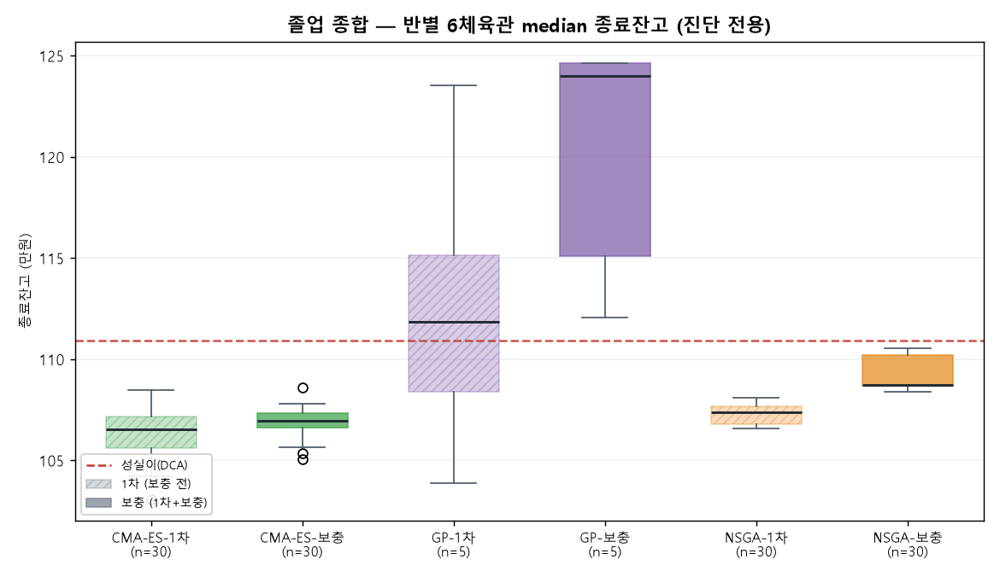
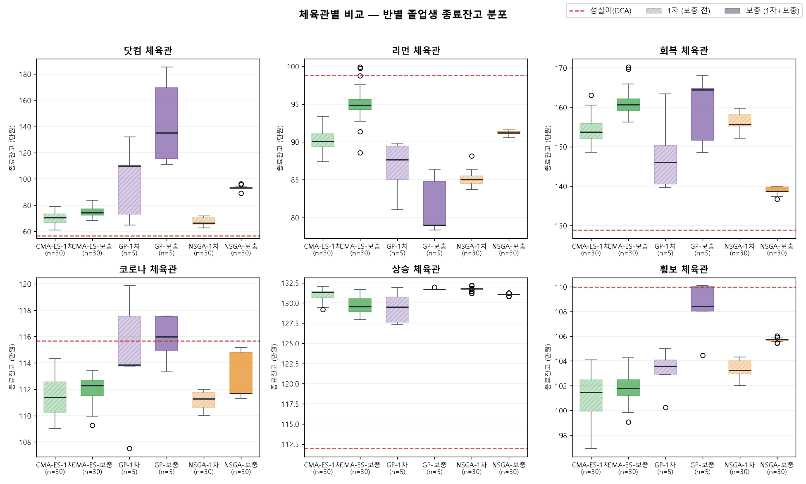

# 🎓 졸업 시험 성적표 — 실QQQ 6체육관

> **진단 전용** (선발 아님 — 선발은 학교 합성장 median 점수로 끝). top30 출처: `classroom_top30_20260622_195214_v2.json` · 시드 100만원 · 잣대=종료잔고 median
> stamp: 20260622_195214

## 종합 (후보별 6체육관 median 종료잔고 분포, 만원)

| 반 | n | median | p25 | p75 | min | max |
|---|---:|---:|---:|---:|---:|---:|
| GP-보충 | 5 | 124 | 115 | 125 | 112 | 125 |
| GP-1차 | 5 | 112 | 108 | 115 | 104 | 124 |
| NSGA-보충 | 30 | 109 | 109 | 110 | 108 | 111 |
| NSGA-1차 | 30 | 107 | 107 | 108 | 107 | 108 |
| CMA-ES-보충 | 30 | 107 | 107 | 107 | 105 | 109 |
| CMA-ES-1차 | 30 | 107 | 106 | 107 | 103 | 108 |
| 성실이(DCA) | 1 | 111 | · | · | · | · |

## 체육관별 분석 (반별 졸업생 종료잔고 분포, 만원)

> 각 체육관에서 반별 졸업생 분포. 점선=그 체육관 성실이(DCA). 반 median이 성실이보다 낮으면 그 체육관이 그 반의 약점 과목.

### 닷컴 체육관

| 반 | n | median | p25 | p75 | min | max |
|---|---:|---:|---:|---:|---:|---:|
| GP-보충 | 5 | 135 | 115 | 170 | 111 | 185 |
| GP-1차 | 5 | 110 | 73 | 110 | 65 | 132 |
| NSGA-보충 | 30 | 93 | 93 | 94 | 89 | 96 |
| CMA-ES-보충 | 30 | 74 | 72 | 77 | 68 | 84 |
| CMA-ES-1차 | 30 | 70 | 67 | 73 | 61 | 79 |
| NSGA-1차 | 30 | 66 | 65 | 70 | 63 | 72 |
| 성실이(DCA) | 1 | 57 | · | · | · | · |

### 리먼 체육관

| 반 | n | median | p25 | p75 | min | max |
|---|---:|---:|---:|---:|---:|---:|
| CMA-ES-보충 | 30 | 95 | 94 | 96 | 89 | 100 |
| NSGA-보충 | 30 | 91 | 91 | 91 | 91 | 92 |
| CMA-ES-1차 | 30 | 90 | 89 | 91 | 87 | 93 |
| GP-1차 | 5 | 88 | 85 | 89 | 81 | 90 |
| NSGA-1차 | 30 | 85 | 84 | 85 | 84 | 88 |
| GP-보충 | 5 | 79 | 79 | 85 | 78 | 86 |
| 성실이(DCA) | 1 | 99 | · | · | · | · |

### 회복 체육관

| 반 | n | median | p25 | p75 | min | max |
|---|---:|---:|---:|---:|---:|---:|
| GP-보충 | 5 | 164 | 152 | 165 | 148 | 168 |
| CMA-ES-보충 | 30 | 161 | 159 | 162 | 156 | 170 |
| NSGA-1차 | 30 | 156 | 155 | 158 | 152 | 160 |
| CMA-ES-1차 | 30 | 154 | 152 | 156 | 149 | 163 |
| GP-1차 | 5 | 146 | 140 | 150 | 140 | 163 |
| NSGA-보충 | 30 | 139 | 139 | 140 | 137 | 140 |
| 성실이(DCA) | 1 | 129 | · | · | · | · |

### 코로나 체육관

| 반 | n | median | p25 | p75 | min | max |
|---|---:|---:|---:|---:|---:|---:|
| GP-보충 | 5 | 116 | 115 | 118 | 113 | 118 |
| GP-1차 | 5 | 114 | 114 | 118 | 108 | 120 |
| CMA-ES-보충 | 30 | 112 | 111 | 113 | 109 | 113 |
| NSGA-보충 | 30 | 112 | 112 | 115 | 111 | 115 |
| CMA-ES-1차 | 30 | 111 | 110 | 113 | 109 | 114 |
| NSGA-1차 | 30 | 111 | 111 | 112 | 110 | 112 |
| 성실이(DCA) | 1 | 116 | · | · | · | · |

### 상승 체육관

| 반 | n | median | p25 | p75 | min | max |
|---|---:|---:|---:|---:|---:|---:|
| NSGA-1차 | 30 | 132 | 132 | 132 | 131 | 132 |
| GP-보충 | 5 | 132 | 132 | 132 | 132 | 132 |
| CMA-ES-1차 | 30 | 131 | 131 | 131 | 129 | 132 |
| NSGA-보충 | 30 | 131 | 131 | 131 | 131 | 131 |
| CMA-ES-보충 | 30 | 130 | 129 | 131 | 128 | 132 |
| GP-1차 | 5 | 130 | 128 | 131 | 127 | 132 |
| 성실이(DCA) | 1 | 112 | · | · | · | · |

### 횡보 체육관

| 반 | n | median | p25 | p75 | min | max |
|---|---:|---:|---:|---:|---:|---:|
| GP-보충 | 5 | 108 | 108 | 110 | 104 | 110 |
| NSGA-보충 | 30 | 106 | 106 | 106 | 105 | 106 |
| GP-1차 | 5 | 104 | 103 | 104 | 100 | 105 |
| NSGA-1차 | 30 | 103 | 103 | 104 | 102 | 104 |
| CMA-ES-보충 | 30 | 102 | 101 | 102 | 99 | 104 |
| CMA-ES-1차 | 30 | 101 | 100 | 102 | 97 | 104 |
| 성실이(DCA) | 1 | 110 | · | · | · | · |
