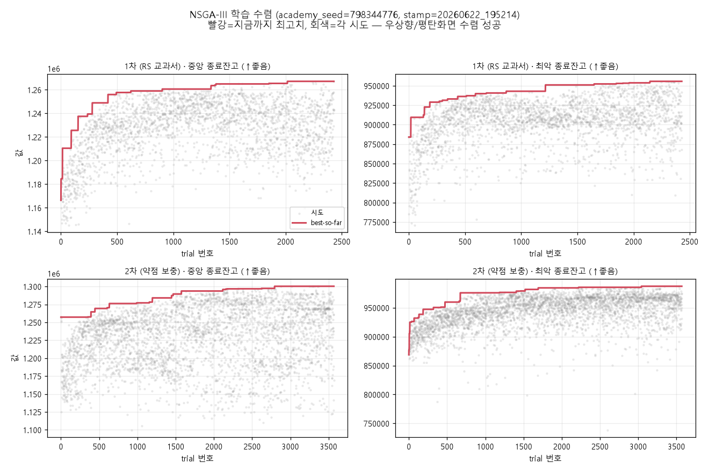
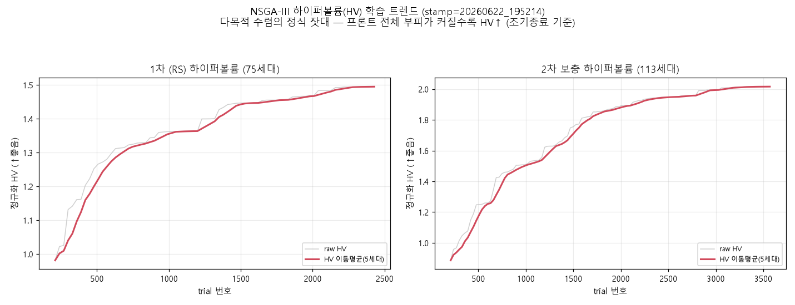
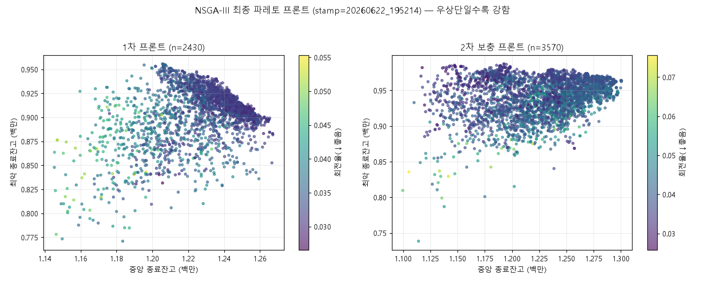
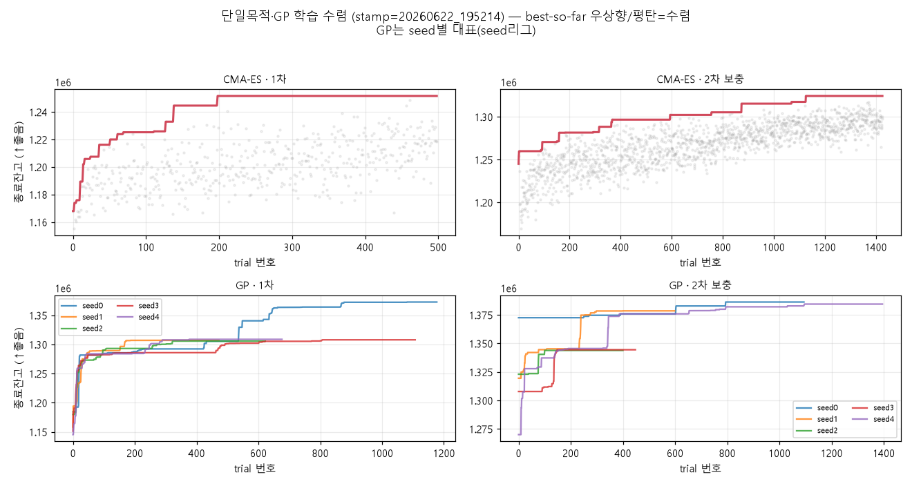
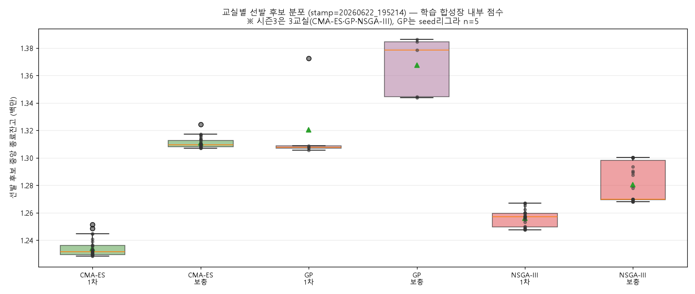

# 학습 과정 검증 레포트 — 20260622_195214

> 생성: `app/lab/optimization/report_training_curves.py` · academy_seed=798344776

## 1. NSGA-III 수렴 (학습 이력 보존됨 — DB)

- 1차 2430 trial · 2차(보충) 3570 trial. 빨강 best-so-far가 우상향 후 평탄 = 수렴 성공.
- 목적 2개: 중앙 종료잔고(↑)·최악 종료잔고(↑). 회전율은 turnover cap 스펙으로 별도 필터.

### 하이퍼볼륨(HV) 트렌드 — 다목적 수렴의 정식 잣대

- best-so-far가 극단 1점만 본다면, HV는 **파레토 프론트 전체 부피**라 프론트가 촘촘·넓어지는
  것까지 잡는다. 빨강(이동평균)이 우상향 후 평탄 = 진짜 수렴. 조기종료도 이 HV로 판정한다.

## 2. 단일목적·GP 수렴 (CMA-ES·GP)

CMA-ES·GP도 storage 보존 후 학습이라 수렴곡선 확인 가능.

## 3. 3교실 선발 분포

## 4. 정직한 한계

- **3교실 전부 학습 이력 DB 보존** — NSGA(목적별 best-so-far + HV) · CMA-ES·GP(best-so-far) 모두 수렴곡선 검증 가능. GP는 seed리그라 n=5(표본 작음).
