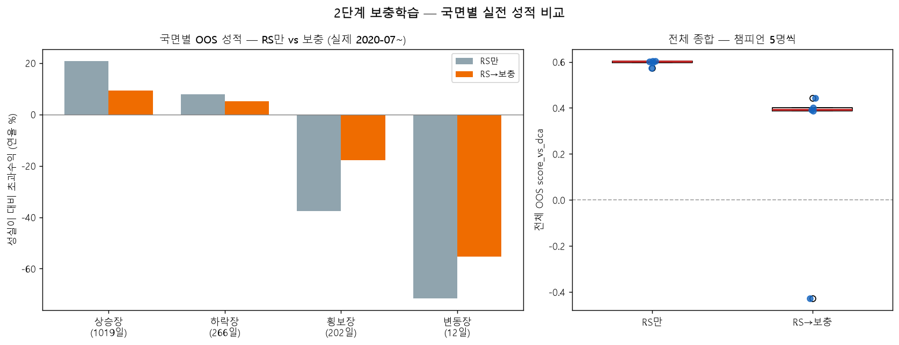

# 2단계 보충학습 전이검증 PoC — RS만 vs RS→약점 보충
> seed 5 · 교과서 12권 · 1차 300/2차 200 트라이얼 · 보충 skew ×3.0 · OOS 2020-07-01~(봉인 전).

## ① 약점 진단 (1차 집단 5명의 국면별 평균 score_vs_dca)

| 국면 | 점수 |
|---|--:|
| 상승장 | +0.276 |
| 하락장 | +0.802 |
| 횡보장 | -0.120 **← 약점(보충 대상)** |
| 변동장 | -0.039 |

→ 보충 교과서는 **횡보장**를 ×3.0 집중 출제(베이스 섞음).

## ② OOS 성적 (score_vs_dca, 양수=성실이 이김)

| 집단 | 중앙값 | 최악 | 5명 |
|---|--:|--:|---|
| RS만 | +0.602 | +0.572 | +0.60, +0.57, +0.60, +0.60, +0.60 |
| RS→약점 보충 | +0.392 | -0.428 | +0.39, +0.39, +0.44, +0.40, -0.43 |

## ③ 국면별 OOS 성적 (실제 OOS를 국면으로 쪼갬, 성실이 대비 연율%)

| 국면 | OOS 일수 | RS만 | RS→보충 | 보충 효과 |
|---|--:|--:|--:|:--:|
| 상승장 | 1019 | +20.7 | +9.4 | ↓ |
| 하락장 | 266 | +7.9 | +5.1 | ↓ |
| 횡보장 | 202 | -37.6 | -17.8 | ↑ |
| 변동장 | 12 | -71.6 | -55.3 | ↑ |

## 판정 (사전등록)

2집단 중앙·최악 **모두** ≥ 1집단 → **불합격: 보충 효과 없음/악화**
단, 종합 점수는 상승장(68%)에 눌리므로 ③ 국면별 표에서 하락·횡보 효과를 함께 본다.

재현: `.venv/Scripts/python.exe -m app.lab.optimization.rs_transfer_poc`
