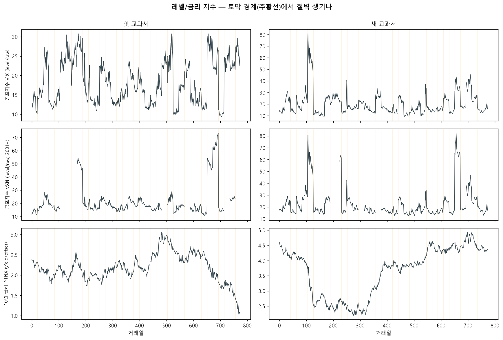

# 교과서 생성 비교 — 옛(무작위 블록) vs 새(국면조건부 블록)
> 실제 QQQ(1999-03-10~2020-06-30) 재료. 옛=textbook.make_world, 새=make_world_rs. 각 30권 생성 후 재분류·꼬리 비교.

## 분위기 비율 (재분류, %)

| 출처 | 상승장 | 하락장 | 횡보장 | 변동장 | 실제거리 |
|---|--:|--:|--:|--:|--:|
| **실제** | 58.4 | 22.9 | 18.0 | 0.7 | 0.0 |
| 옛 교과서 | 49.0 | 28.8 | 19.7 | 2.5 | 18.9 |
| 새 교과서 | 50.1 | 30.4 | 17.0 | 2.5 | 18.7 |

## 급락·급등 안전 점검 (최대 일변동)

- 실제 15.6% / 옛 15.6% / 새 15.6%
- 옛·새 둘 다 **진짜 토막의 진짜 수익률**을 쓰므로 일별 꼬리가 실제와 일치 (그래프 ③ 겹침) = 인위적 급락·급등 없음. 어제 RS 정규분포 방식(극단 μ로 하락 과대생성)과 결정적으로 다른 점.

## 읽는 법
- ① 곡선: 옛·새 모두 그럴듯한 지수 경로, 튀는 점프 없음(이음매 연속).
- ② 비율: 새 교과서가 RS로 분위기 순서를 통제. (P·π를 실제서 추정한 균일 비교라 차이가 크지 않을 수 있음 — 진짜 레버는 약점 국면 가중=적대적 시드, 다음 단계.)
- ③ 꼬리: 셋이 겹치면 합성이 실제 변동성을 왜곡 안 한다는 뜻.

## 레벨/금리 지수 경계 절벽 점검 (시즌3 문제 재발 여부)

단위 = 하루 평균 변화 절대값. '경계'가 '내부'·'실제'보다 훨씬 크면 절벽(가짜 이벤트).

| 지수 | 실제 내부 | 옛 경계 | 옛 내부 | 새 경계 | 새 내부 |
|---|--:|--:|--:|--:|--:|
| ^VIX | 1.060 | 8.776 | 1.055 | 8.362 | 1.069 |
| ^VXN | 1.099 | 13.227 | 1.078 | 11.936 | 1.115 |
| ^TNX | 0.043 | 0.000 | 0.043 | 0.000 | 0.043 |

- **^TNX(offset)**: 경계≈내부≈실제면 절벽 없음 = 시즌3 수리 유지(새 방식도 안전).
- **VIX/VXN(raw)**: 경계가 내부보다 커도 무해 — FEAR는 절대 임계(>30/>47)만 보지 변화를 안 본다(시즌3 결정). 새 방식이 옛 방식과 같은 수준이면 OK.

재현: `.venv/Scripts/python.exe -m app.lab.rs_hybrid_textbook`
