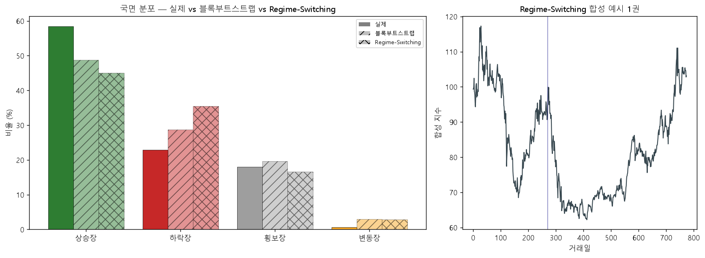

# 생성 모델 PoC — Regime-Switching(마르코프 국면전환)
> 실제 QQQ(1999-03-10~2020-06-30)에서 국면별 수익률·전이확률 추정 → 마르코프 체인으로 합성 50권 생성 → 재분류해 국면 분포 비교. 블록 부트스트랩이 못 살린 분포를 푸는지 확인.

## 추정된 국면별 일일 수익률 (연율 환산)

| 국면 | 평균 μ | 변동성 σ |
|---|--:|--:|
| 상승장 | +39.6% | 16.7% |
| 하락장 | -70.6% | 43.8% |
| 횡보장 | -12.1% | 24.0% |
| 변동장 | +36.2% | 69.1% |

## 국면 분포 비교

| 출처 | 상승장 | 하락장 | 횡보장 | 변동장 | 실제거리 |
|---|--:|--:|--:|--:|--:|
| **실제** | 58.4% | 22.9% | 18.0% | 0.7% | 0.0 |
| 블록부트스트랩(현재) | 48.7% | 28.7% | 19.6% | 3.0% | 19.3 |
| Regime-Switching | 45.0% | 35.5% | 16.6% | 2.9% | 29.6 |

## 결론 (PoC) — 순진한 Regime-Switching도 분포를 못 살린다

- **실제거리**: 블록부트스트랩 19.3 → Regime-Switching 29.6 (오히려 악화). 하락장 과대생성(35.5% vs 실제 22.9%), 변동장 2.9%로 여전(실제 0.7%).
- **PoC가 드러낸 핵심**: 생성한 **숨은 상태**(상승/하락 의도)와 가격을 다시 분류한 **관측 국면**이 다르다. 분류기(regime.py)가 MA50/200·60일수익률 같은 **지연된 장기 함수**라, 국면을 명시 생성해도 재분류 분포가 의도대로 안 나온다. 게다가 분류된 '하락 day'에서 추정한 μ(-70%/yr)가 극단이라 생성 시 하락을 더 부풀린다.
- **함의**: 분포 미스매치의 상당 부분은 **생성 방법이 아니라 분류기 정의**(상대변동성·지연 MA) 탓. 그래서 cGAN 같은 정교한 생성기도 **같은 벽**에 부딪힐 수 있다 — '진짜 같은 생성'과 '재분류 분포 일치'는 별개 문제. 일지의 **진단지 격하**(합성 분포에 집착 말기)가 더 현실적이라는 근거.

**PoC 판정**: 순진한 RS는 블록 부트스트랩 대비 이득 없음. 살리려면 ⓐ 국면 지속(전이행렬을 더 끈적하게)·ⓑ 팻테일(t분포)·ⓒ GARCH 변동성 군집·ⓓ 분류기 자체 재검토가 필요. 큰 투자 전 '실전 OOS 전이' 검증이 관문 — 더 진짜 같은 합성이 실전을 더 잘 맞춘다는 보장은 아직 없다.

재현: `.venv/Scripts/python.exe -m app.lab.textbook.regime_switching_poc`
