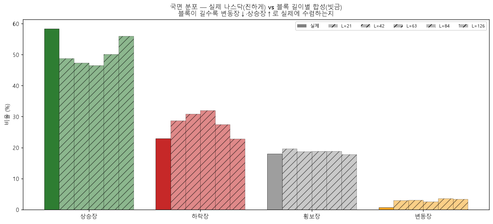
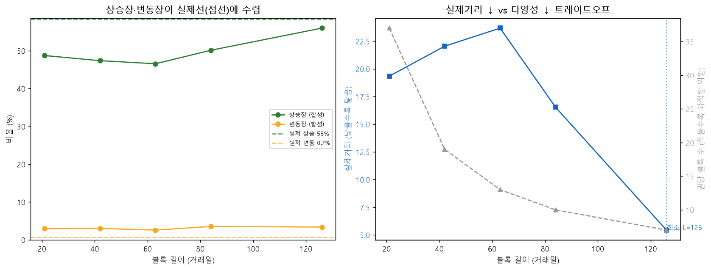

# 국면 격차 손보기 — 블록 길이별 합성 국면 분포 (실데이터 실험)
> 블록 길이 (21, 42, 63, 84, 126)별로 합성 50권씩, 실제 QQQ(1999-03-10~2020-06-30)와 국면 분포 비교. 분류기 `world/regime.py`.

## 블록 길이별 국면 분포

| 블록 | 상승장 | 하락장 | 횡보장 | 변동장 | 실제거리 | 블록/권 |
|---|--:|--:|--:|--:|--:|--:|
| **실제** | 58.4% | 22.9% | 18.0% | 0.7% | 0.0 | — |
| L=21 | 48.7% | 28.7% | 19.6% | 3.0% | 19.3 | 37 |
| L=42 | 47.4% | 30.9% | 18.7% | 3.0% | 22.1 | 19 |
| L=63 | 46.6% | 32.0% | 18.8% | 2.6% | 23.7 | 13 |
| L=84 | 50.1% | 27.5% | 18.9% | 3.5% | 16.5 | 10 |
| L=126 ⭐ | 56.0% | 22.8% | 17.8% | 3.4% | 5.4 | 7 |

## 결론 — 블록 길이는 깨끗한 레버가 아니다

1. **추세 갭(상승장)은 길이로 잡힌다.** L=126일에서 상승 56.0%·하락 22.8%·횡보 17.8%가 실제(58/23/18)에 거의 수렴 — 실제거리 최소 5.4.
2. **변동장(4.7배)은 길이로 안 잡힌다.** 모든 길이에서 2.6~3.5%로 평평(변동폭 1.0pp), 실제 0.7% 근처도 못 감. 짧은 합성창(774일)에서 변동성 백분위가 정의상 상위 15%를 만들고, 그중 추세 애매한 전환 구간이 변동장으로 잡히는 구조적 문제 → 길이로는 못 푼다.
3. **다양성 붕괴.** 실제거리 최소인 L=126는 권당 블록이 7개뿐(현 21일은 37개) → 챔피언이 7조각만 외우는 과적합 위험.

**→ 권고: 블록 길이만으로 끝내지 말 것.** 추세 갭은 적당한 길이로 일부 줄이되, 변동장·다양성을 같이 잡으려면 일지 §III-2의 다른 레버가 필요하다 — **국면 비율 맞춤 샘플링**(블록을 국면 라벨로 뽑아 실제 58/23/18/0.7에 맞춤) + **폭락장 분리**(닷컴·금융위기 블록은 일반 교과서서 빼고 별도 시험장). 다음 실험 후보.

재현: `.venv/Scripts/python.exe -m app.lab.textbook_blocklen_regime`
