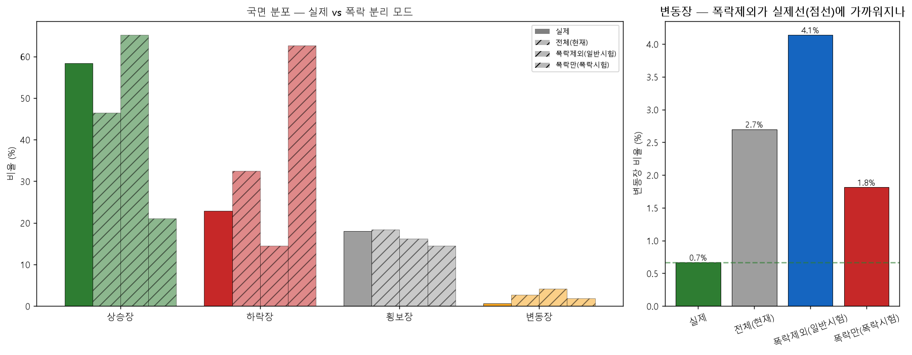

# 폭락장 분리 — 고변동 블록을 일반 교과서서 빼기 (실데이터 실험)
> 21일 블록을 실현변동성 상위 20%(임계 0.32)로 폭락 판정. 세 모드 합성 50권씩, 국면 분포를 실제 QQQ와 비교. 블록 21일 유지(권당 37블록=다양성 보존).

## 모드별 국면 분포

| 모드 | 풀 블록수 | 상승장 | 하락장 | 횡보장 | 변동장 | 실제거리 |
|---|--:|--:|--:|--:|--:|--:|
| **실제** | — | 58.4% | 22.9% | 18.0% | 0.7% | 0.0 |
| 전체(현재) | 5342 | 46.5% | 32.4% | 18.4% | 2.7% | 23.9 |
| 폭락제외(일반시험) | 4273 | 65.2% | 14.5% | 16.2% | 4.1% | 20.5 |
| 폭락만(폭락시험) | 1069 | 21.1% | 62.6% | 14.5% | 1.8% | 81.8 |

## 결론 — 변동장은 못 고치나, 두 코헤어런트 시험은 얻는다

1. **변동장은 폭락 분리로도 안 고쳐짐(오히려 늘어남).** 전체 2.7% → 폭락제외 **4.1%**(실제 0.7%). 위기 블록을 빼도 변동장이 안 줄고 되레 늘었다 — 변동장 판정의 변동성 기준이 **상대(그 세계 내 상위 15%)**라, 위기를 빼 잔잔해진 세계에서도 똑같이 상위 15%가 생기고 그게 추세 애매한 잔물결에 붙어 변동장이 된다. **변동장 4.7배는 블록 조작(길이·선택·폭락분리)으로 못 푸는 구조적 산물.**
2. **그래도 얻는 것 — 두 코헤어런트 시험.** 폭락제외 = 상승 65.2%(추세 시험), 폭락만 = 하락 62.6%(방어 시험). 흩뿌려 섞지 않고 추세장/위기장을 **갈라** 각각 코헤어런트하게 평가 → 일지 §III-2의 진짜 값은 '분포 맞추기'가 아니라 이 **이원화**다.

**→ 국면 격차 3실험 종합**: 블록 부트스트랩은 실제 국면 분포(특히 변동장)를 못 살린다 — 길이·국면샘플링·폭락분리 셋 다 변동장을 못 잡았다(구조적 한계). 그러니 합성 분포를 억지로 맞추려 말고: ⓐ **합성을 진단지로 격하**(일지 §III-2, 합성 한계 인정) + ⓑ 필요하면 **폭락 분리로 추세/방어 2트랙** 평가. 근본 우회(cGAN 등)는 검증 부담 큰 별도 트랙.

재현: `.venv/Scripts/python.exe -m app.lab.textbook_crash_split`
