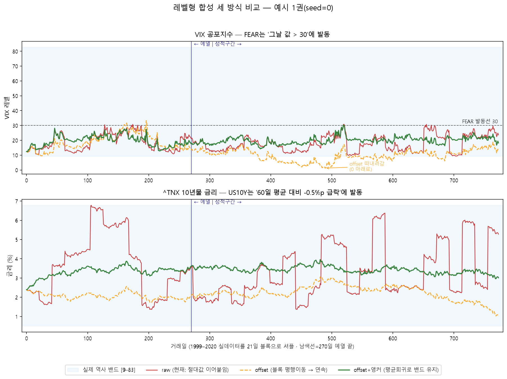
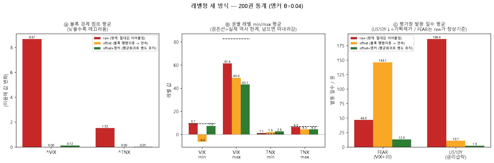

# 레벨형 신호 합성 — raw vs offset vs offset+앵커 (실데이터 실험)
> 실제 QQQ/VIX/금리(1999-03-10~2020-06-30)로 합성 200권. 레벨형(^VIX/^TNX)을 세 방식으로 복원해 비교. 앵커 평균회귀 세기 θ=0.04, 평균 μ=자기 역사 평균.

## 예시 한 권 — 세 방식이 어떻게 다른가

*VIX 패널(위): 빨강 raw는 블록 경계마다 절벽이 튄다. 주황 offset은 절벽은 없지만 0 아래로 떠내려간다(가짜 공포). 초록 앵커는 파란 밴드 안에 머문다. TNX 패널(아래): offset·앵커 둘 다 매끄럽고 밴드 안 — 금리는 offset으로 충분.*

*ⓐ 경계 점프는 offset·앵커 둘 다 0으로 사라짐. ⓑ VIX max를 보면 raw 61 → 앵커 43으로 진짜 위기 스파이크가 눌린다. ⓒ US10Y는 raw 186 → offset 11(가짜 175일 제거), FEAR는 raw 47이 정상 기준인데 offset 146(폭증)·앵커 13(과소).*

## ⓐ 블록 경계 점프 (낮을수록 매끄러움)

| 레벨형 | raw | offset | anchor |
|---|--:|--:|--:|
| ^VIX | 8.672 | 0.0000 | 0.1187 |
| ^TNX | 1.520 | 0.0000 | 0.0066 |

## ⓑ 떠내려감 — 권별 레벨 범위 vs 실제 역사 밴드

| 레벨형 | 실제 [min, max] | raw [min,max] | offset [min,max] | anchor [min,max] |
|---|--:|--:|--:|--:|
| ^VIX | [9.1, 82.7] | [9.7, 61.4] | [-6.4, 49.0] | [7.3, 43.1] |
| ^TNX | [0.5, 6.8] | [1.1, 6.3] | [1.9, 4.3] | [2.6, 4.3] |

## ⓒ 평가창 발동 일수 (권당 평균)

| 신호 | raw | offset | anchor |
|---|--:|--:|--:|
| FEAR (VIX>30) | 46.5 | 146.1 | 12.9 |
| US10Y (금리급락) | 186.4 | 10.7 | 1.9 |

## 처방 결론

| 레벨형 | 처방 | 근거 |
|---|---|---|
| **^TNX (US10Y)** | **offset 채택** | 가짜 금리인하 176일 제거(186→11), 밴드도 유지. 앵커는 과함. |
| **^VIX (FEAR)** | **raw 유지 권장** | FEAR는 절대 임계라 절벽이 무해. offset은 떠내려가 폭증(146), 앵커는 위기 압축으로 과소(13); raw 47이 진짜에 가장 충실. |

재현: `.venv/Scripts/python.exe -m app.lab.textbook_offset_stitch`
