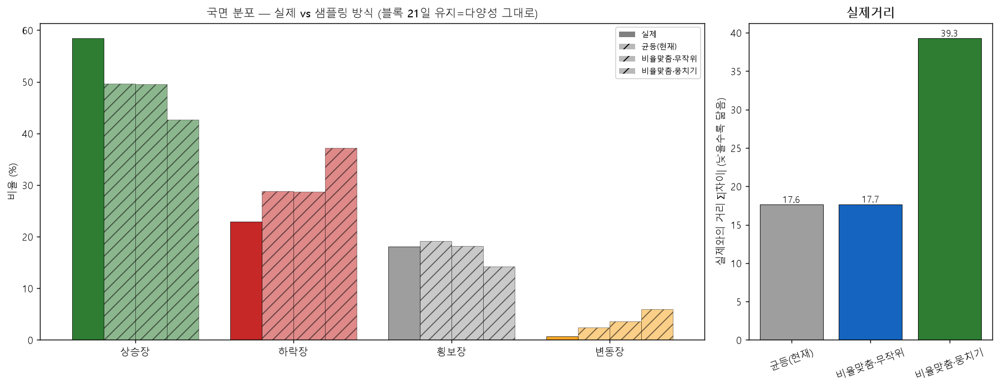

# 국면 비율 맞춤 샘플링 — 블록을 국면 라벨로 뽑기 (실데이터 실험)
> 21일 블록을 국면 라벨로 뽑아 실제 비율에 맞춤. 합성 50권, 블록 길이는 21일 유지(권당 37블록=다양성 그대로). 블록 길이 레버(다양성 붕괴)와 대비.

## 블록 국면 풀 / 목표 배분

| 국면 | 풀 크기(실제 블록) | 목표 블록/권 |
|---|--:|--:|
| 상승장 | 3089 | 22 |
| 하락장 | 1196 | 8 |
| 횡보장 | 758 | 7 |
| 변동장 | 29 | 0 |

## 방식별 국면 분포

| 방식 | 상승장 | 하락장 | 횡보장 | 변동장 | 실제거리 |
|---|--:|--:|--:|--:|--:|
| **실제** | 58.4% | 22.9% | 18.0% | 0.7% | 0.0 |
| 균등(현재) ⭐ | 49.6% | 28.8% | 19.2% | 2.4% | 17.6 |
| 비율맞춤·무작위 | 49.6% | 28.7% | 18.2% | 3.6% | 17.7 |
| 비율맞춤·뭉치기 | 42.6% | 37.2% | 14.2% | 6.0% | 39.3 |

## 결론 — 국면 비율 맞춤 샘플링도 답이 아니다

1. **비율맞춤·무작위 ≈ 균등** (실제거리 17.7 vs 17.6, 상승장 둘 다 ~50%). 블록을 실제 비율(22/8/7)로 골라 넣어도 출력 분포가 안 바뀐다 — 균등 추출도 이미 실제 역사(대부분 상승장)에서 뽑아 입력 비율이 비슷하기 때문. **입력 블록 구성이 출력 국면을 결정하지 않는다.**
2. **뭉치기는 더 나쁨** (실제거리 39.3, 변동장 6.0%). 국면별로 몰면 상승→하락 거대 전환 한 번이 긴 '추세 애매+고변동' 구간을 만들어 변동장·하락장을 오히려 키운다.
3. **근본 원인**: 국면은 MA200(약 200일=10블록) 같은 **장기 문맥** 속성인데 블록은 21일. 이어붙이면 그 장기 추세가 깨지고, 출력 국면은 **블록 선택이 아니라 이음매 전환 동역학**이 지배한다. 그래서 블록을 아무리 골라 넣어도(비율·순서) 출력 분포를 못 바꾼다.

**→ 두 실험 종합**: 블록 부트스트랩은 짧은 블록으론 실제 국면 분포를 못 살린다. 길이를 크게(L≈126) 하면 추세는 살지만 다양성 붕괴, 선택/순서로는 통제 불가. 남은 길 = **폭락장 분리**(흩뿌려진 위기만 따로 빼 변동장 줄이기, 미검증)거나, 일지의 **'졸업시험을 합격선이 아닌 진단지로 격하'**(합성 분포를 억지로 안 맞추고 합성의 한계를 인정). 다음 세션 결정거리.

재현: `.venv/Scripts/python.exe -m app.lab.textbook_regime_sampling`
