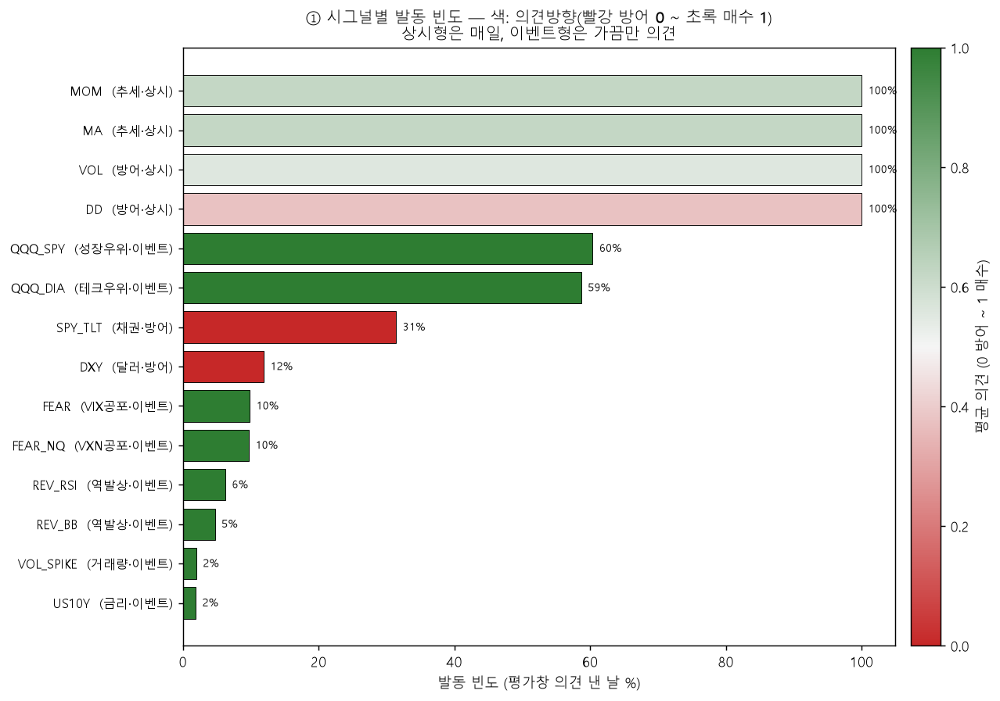
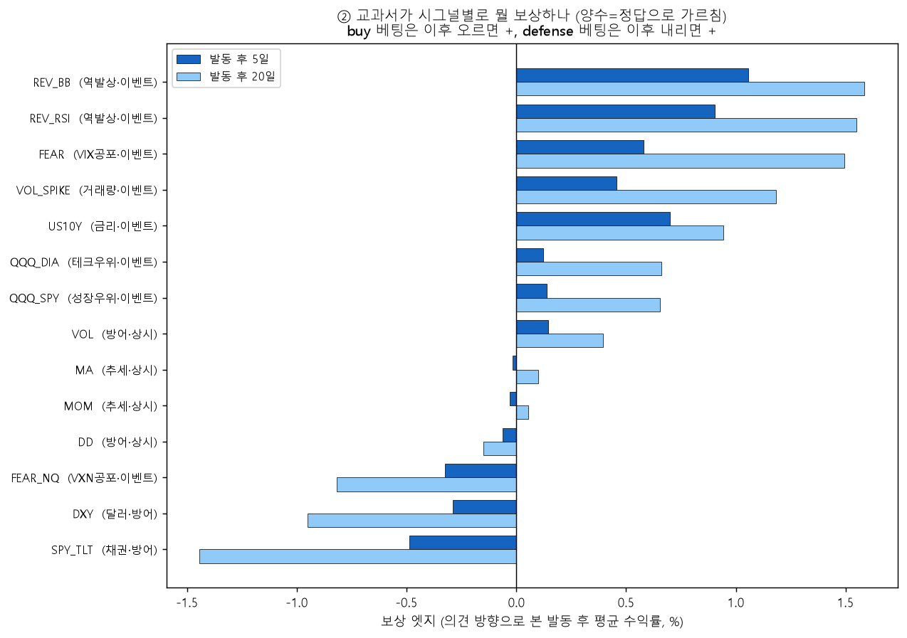
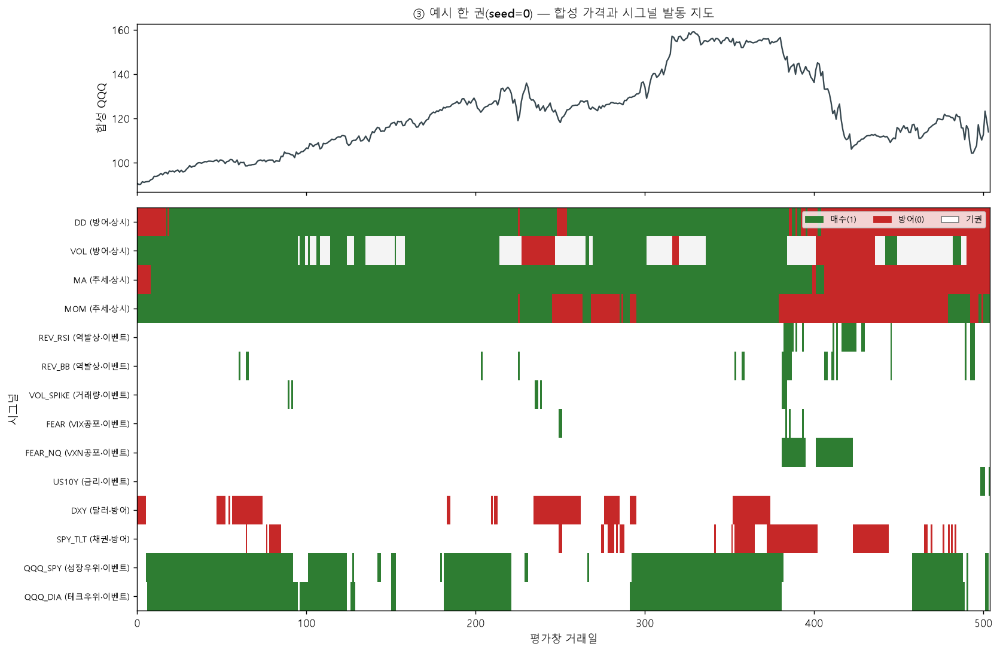

# 교과서 시그널 엑스레이 — 합성 세계에서 뭘 배우나
> 합성 60권(`make_world`)에서 14 시그널의 발동 빈도·의견 방향·보상 엣지. 금리 offset·VXN FEAR_NQ 반영 후 현재 상태.

*상시형(MA/MOM/DD/VOL)은 100% 매일 의견. 이벤트형은 가끔만 — 크로스에셋 ~60%, 공포·역발상은 2~10%. 색이 초록일수록 매수, 빨강일수록 방어(DD·DXY·SPY_TLT가 방어).*

*오른쪽(+)일수록 교과서가 그 베팅을 보상 = GP가 정답으로 외울 이유. 상위는 전부 역발상·공포(REV_BB/REV_RSI/FEAR/VOL_SPIKE), 하위는 방어형(SPY_TLT/DXY). 합성 교과서가 '떨어질 때 사라'를 보상하는 구조 — 실전(긴 우상향=추세 보상)과 거꾸로.*

*위 가격이 폭락하는 구간(~380일)에 역발상·공포가 초록(매수)으로 몰리고, 상시형은 그때 빨강(방어)으로 돈다. 누가 언제 의견을 내는지 한눈에 보이는 지도.*

## 시그널별 요약 (보상 엣지 20일 내림차순)

| 시그널 | 분류 | 발동빈도 | 의견 | 엣지5(%) | 엣지20(%) |
|---|---|--:|:--:|--:|--:|
| REV_BB | 역발상·이벤트 | 5% | 🟩매수 | +1.06 | +1.59 |
| REV_RSI | 역발상·이벤트 | 6% | 🟩매수 | +0.90 | +1.55 |
| FEAR | VIX공포·이벤트 | 10% | 🟩매수 | +0.58 | +1.50 |
| VOL_SPIKE | 거래량·이벤트 | 2% | 🟩매수 | +0.46 | +1.18 |
| US10Y | 금리·이벤트 | 2% | 🟩매수 | +0.70 | +0.94 |
| QQQ_DIA | 테크우위·이벤트 | 59% | 🟩매수 | +0.12 | +0.66 |
| QQQ_SPY | 성장우위·이벤트 | 60% | 🟩매수 | +0.14 | +0.66 |
| VOL | 방어·상시 | 100% | 🟨혼합 | +0.15 | +0.39 |
| MA | 추세·상시 | 100% | 🟨혼합 | -0.02 | +0.10 |
| MOM | 추세·상시 | 100% | 🟨혼합 | -0.03 | +0.05 |
| DD | 방어·상시 | 100% | 🟨혼합 | -0.06 | -0.15 |
| FEAR_NQ | VXN공포·이벤트 | 10% | 🟩매수 | -0.32 | -0.82 |
| DXY | 달러·방어 | 12% | 🟥방어 | -0.29 | -0.95 |
| SPY_TLT | 채권·방어 | 31% | 🟥방어 | -0.49 | -1.44 |

## 주요 발견

1. **교과서 정답 = 역발상·공포.** 엣지 상위는 REV_BB(+1.59%)·REV_RSI(+1.55%)·FEAR(+1.50%)·VOL_SPIKE 순. 합성 교과서가 '떨어질 때 사라'를 보상 → 실전(추세 보상)과 반대 = v2 train/test 미스매치의 뿌리 재확인.
2. **US10Y 고침 확인.** 발동 빈도가 **2%**로 급감(offset 전 ~37%) — 경계 절벽이 만들던 가짜 금리인하 이벤트가 사라졌다. 남은 발동은 진짜 급락뿐.
3. **방어형은 벌받음.** SPY_TLT(-1.44%)·DXY(-0.95%)가 엣지 바닥 — 합성 세계가 출렁여도 결국 우상향이라 방어 베팅은 손해.
4. **의외 — FEAR_NQ(VXN)가 FEAR(VIX)와 정반대.** 같은 공포형인데 FEAR는 +1.50%, FEAR_NQ는 **-0.82%**(음수). 발동 빈도는 둘 다 10%로 잘 맞췄지만(임계 47 빈도매칭 성공), VXN은 폭락 한복판에 더 길게 발동해 '바닥'이 아닌 '추가 하락 직전'을 산다 (히트맵 확인). 단 합성 엣지는 실전과 반대일 수 있으니(역발상이 합성서 이기고 실전서 짐) **FEAR_NQ가 나쁘다고 단정 말고 실전 OOS로 따로 검증** 필요.

재현: `.venv/Scripts/python.exe -m app.lab.textbook_signal_xray`
