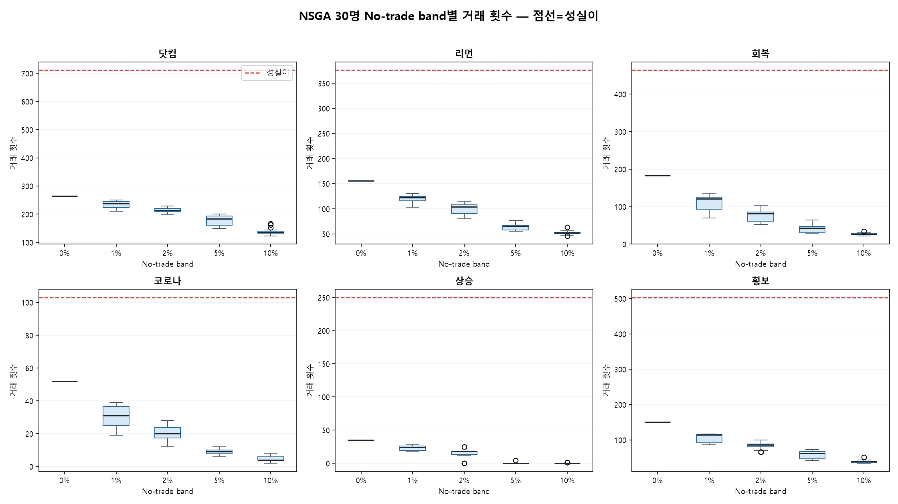
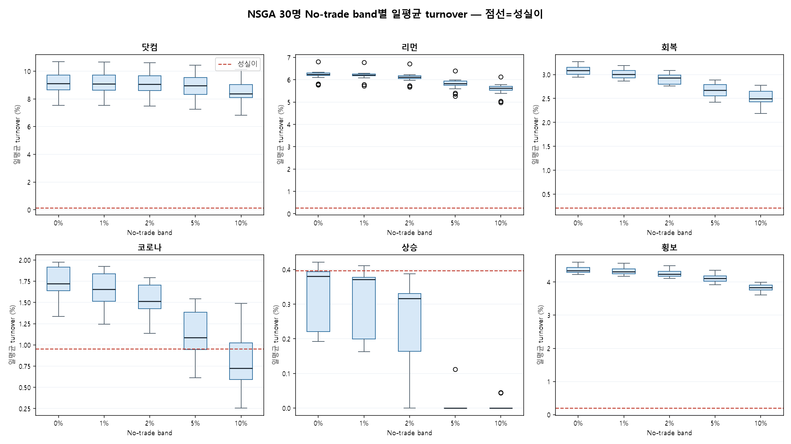

# NSGA 30명 No-trade band 거래량 진단

- source: `C:\HomeLab\my_project\quant\pocket_quant\app\academy\training\results\invalid_cost_model\20260622_115015\nsga_top30_20260622_115015_v2.json`
- 비용 모델 미완 학습 산출물 기반이므로 선발/판정용이 아니라 거래량 진단용이다.

## 요약표

| 체육관 | band | 거래횟수 median | 성실이 거래횟수 | turnover median | 성실이 대비 |
|---|---:|---:|---:|---:|---:|
| 닷컴 | 0% | 264 | 711 | 9.106% | 64.9x |
| 닷컴 | 1% | 237 | 711 | 9.091% | 64.8x |
| 닷컴 | 2% | 213 | 711 | 9.054% | 64.6x |
| 닷컴 | 5% | 183 | 711 | 8.957% | 63.9x |
| 닷컴 | 10% | 136 | 711 | 8.378% | 59.7x |
| 리먼 | 0% | 156 | 376 | 6.240% | 23.6x |
| 리먼 | 1% | 122 | 376 | 6.209% | 23.5x |
| 리먼 | 2% | 104 | 376 | 6.115% | 23.1x |
| 리먼 | 5% | 66 | 376 | 5.834% | 22.1x |
| 리먼 | 10% | 52 | 376 | 5.632% | 21.3x |
| 회복 | 0% | 183 | 464 | 3.087% | 14.4x |
| 회복 | 1% | 120 | 464 | 3.003% | 14.0x |
| 회복 | 2% | 82 | 464 | 2.933% | 13.7x |
| 회복 | 5% | 44 | 464 | 2.670% | 12.4x |
| 회복 | 10% | 28 | 464 | 2.497% | 11.6x |
| 코로나 | 0% | 52 | 103 | 1.720% | 1.8x |
| 코로나 | 1% | 31 | 103 | 1.655% | 1.7x |
| 코로나 | 2% | 20 | 103 | 1.516% | 1.6x |
| 코로나 | 5% | 9 | 103 | 1.086% | 1.1x |
| 코로나 | 10% | 4 | 103 | 0.726% | 0.8x |
| 상승 | 0% | 35 | 250 | 0.381% | 1.0x |
| 상승 | 1% | 24 | 250 | 0.371% | 0.9x |
| 상승 | 2% | 18 | 250 | 0.317% | 0.8x |
| 상승 | 5% | 0 | 250 | 0.000% | 0.0x |
| 상승 | 10% | 0 | 250 | 0.000% | 0.0x |
| 횡보 | 0% | 151 | 503 | 4.349% | 22.0x |
| 횡보 | 1% | 114 | 503 | 4.307% | 21.8x |
| 횡보 | 2% | 86 | 503 | 4.240% | 21.4x |
| 횡보 | 5% | 62 | 503 | 4.106% | 20.7x |
| 횡보 | 10% | 38 | 503 | 3.829% | 19.3x |
