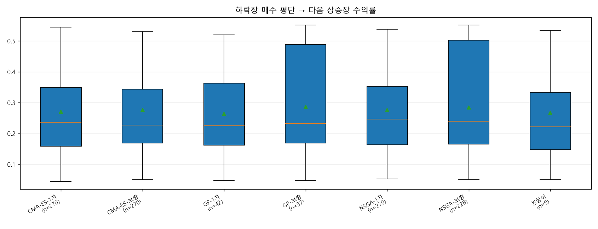
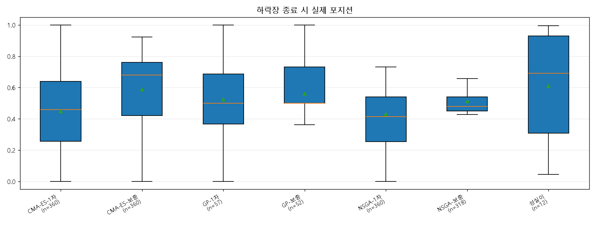

# 시즌3 하락장 평단가 분석

- top30: `classroom_top30_20260622_195214_v2.json`
- 질문: 하락장에서 산 물량이 다음 상승장에서 얼마나 먹혔나?
- 기준: 일 단위 Regime Scanner 라벨의 bear 일자 매수만 집계

| group | n | bear avg cost median | next bull return median | bear end position median |
|---|---:|---:|---:|---:|
| NSGA-1차 | 270 | 104.90 | 24.7% | 0.42 |
| NSGA-보충 | 228 | 102.47 | 23.9% | 0.48 |
| CMA-ES-1차 | 270 | 105.03 | 23.6% | 0.46 |
| GP-보충 | 37 | 102.25 | 23.1% | 0.50 |
| CMA-ES-보충 | 270 | 103.57 | 22.7% | 0.68 |
| GP-1차 | 42 | 56.58 | 22.4% | 0.50 |
| 성실이 | 9 | 105.37 | 22.1% | 0.69 |