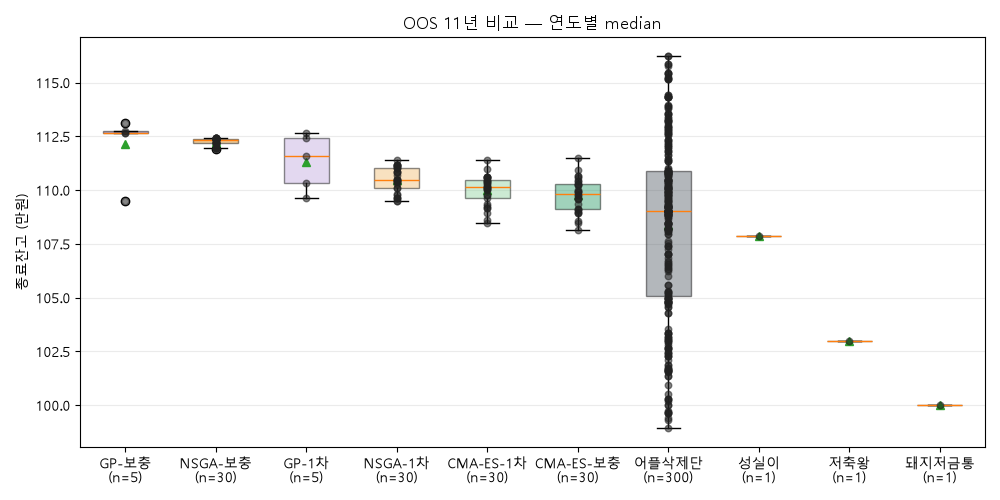
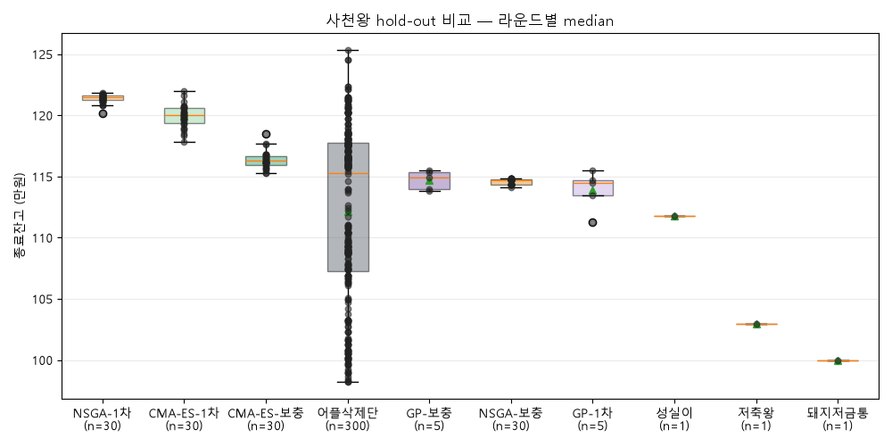
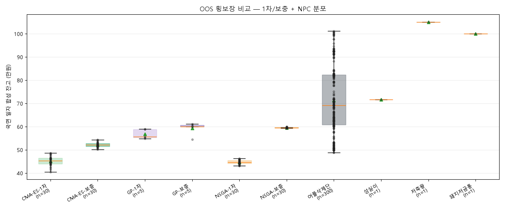
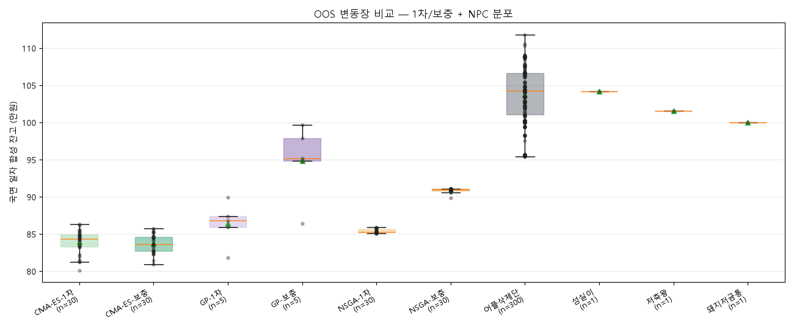
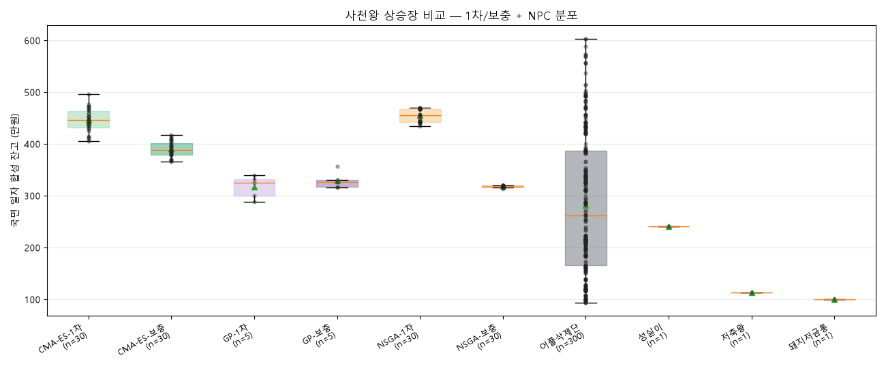
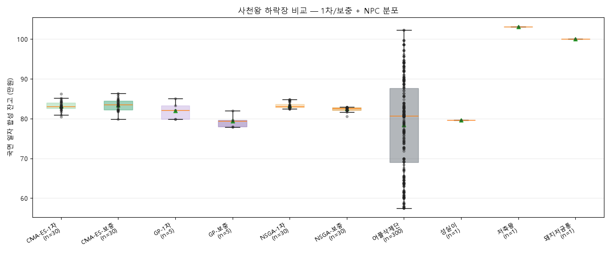
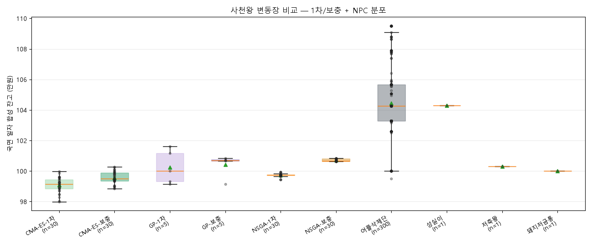

# Season3 League

- top30: `C:\HomeLab\my_project\quant\pocket_quant\app\academy\training\results\classroom_top30_20260622_195214_v2.json`
- cost_model: `season3_flat_1bp_band5`
- contestants: candidates 130명 + baseline 303명
- order: 빅토리 로드 (OOS) 11년 → 사천왕 hold-out

## 종합 비교

| group | n | overall min | overall median | overall max | victory road (OOS) median | holdout median |
|---|---:|---:|---:|---:|---:|---:|
| NSGA-1차 | 30 | 1164711 | 1173376 | 1176824 | 1104482 | 1214392 |
| CMA-ES-1차 | 30 | 1150784 | 1163879 | 1174214 | 1101368 | 1199926 |
| CMA-ES-보충 | 30 | 1130958 | 1141294 | 1156544 | 1098282 | 1162665 |
| GP-보충 | 5 | 1133760 | 1136660 | 1141338 | 1126414 | 1149386 |
| NSGA-보충 | 30 | 1130740 | 1134706 | 1136130 | 1123408 | 1147142 |
| GP-1차 | 5 | 1118302 | 1124951 | 1130386 | 1115639 | 1145055 |
| 어플삭제단 | 300 | 986808 | 1119773 | 1188604 | 1090345 | 1153078 |
| 성실이 | 1 | 1110023 | 1110023 | 1110023 | 1078858 | 1117944 |
| 저축왕 | 1 | 1029818 | 1029818 | 1029818 | 1029879 | 1029637 |
| 돼지저금통 | 1 | 1000000 | 1000000 | 1000000 | 1000000 | 1000000 |

## 관문별 비교

## 국면별 비교 — 빅토리 로드 (OOS)

### 상승장

### 하락장

### 횡보장

### 변동장

### 빅토리 로드 (OOS) 라운드별 참고표

| round | daily regime mix | CMA-ES-1차 median | CMA-ES-보충 median | GP-1차 median | GP-보충 median | NSGA-1차 median | NSGA-보충 median | best baseline | balance |
|---|---|---:|---:|---:|---:|---:|---:|---|---:|
| 2003 | 상승장 81% / 하락장 12% / 횡보장 6% | 1296322 | 1287406 | 1279147 | 1291257 | 1315133 | 1236106 | 어플삭제단 | 1530875 |
| 2004 | 상승장 54% / 하락장 25% / 횡보장 21% | 1037146 | 1047467 | 1044840 | 1055594 | 1049027 | 1055195 | 어플삭제단 | 1239853 |
| 2005 | 상승장 50% / 하락장 14% / 횡보장 35% | 961969 | 990001 | 971686 | 978117 | 956126 | 979720 | 어플삭제단 | 1167189 |
| 2006 | 상승장 50% / 하락장 25% / 횡보장 21% / 변동장 4% | 1050879 | 1053328 | 1039795 | 1059762 | 1060682 | 1057464 | 어플삭제단 | 1209826 |
| 2007 | 상승장 79% / 횡보장 8% / 변동장 14% | 1168530 | 1152666 | 1131524 | 1153001 | 1177418 | 1148642 | 어플삭제단 | 1211158 |
| 2011 | 상승장 52% / 하락장 21% / 횡보장 21% / 변동장 6% | 965462 | 972308 | 1006293 | 1075194 | 969503 | 1030316 | 어플삭제단 | 1117073 |
| 2012 | 상승장 67% / 하락장 10% / 횡보장 23% | 1101368 | 1098282 | 1132787 | 1139403 | 1104482 | 1127552 | 어플삭제단 | 1152788 |
| 2013 | 상승장 90% / 횡보장 10% | 1328702 | 1295908 | 1282220 | 1294298 | 1333696 | 1289760 | 어플삭제단 | 1337339 |
| 2014 | 상승장 83% / 횡보장 4% / 변동장 13% | 1161866 | 1132292 | 1115639 | 1126414 | 1170985 | 1123408 | 어플삭제단 | 1242346 |
| 2018 | 상승장 65% / 하락장 17% / 횡보장 1% / 변동장 16% | 998432 | 1032093 | 1032560 | 1073140 | 1011250 | 1053394 | 어플삭제단 | 1047142 |
| 2019 | 상승장 75% / 하락장 6% / 횡보장 18% / 변동장 0% | 1213114 | 1217113 | 1210335 | 1212749 | 1209630 | 1216775 | 어플삭제단 | 1429288 |

## 국면별 비교 — 사천왕

### 상승장

### 하락장

### 횡보장

### 변동장

### 사천왕 라운드별 참고표

| round | daily regime mix | CMA-ES-1차 median | CMA-ES-보충 median | GP-1차 median | GP-보충 median | NSGA-1차 median | NSGA-보충 median | best baseline | balance |
|---|---|---:|---:|---:|---:|---:|---:|---|---:|
| 2020 하반기 | 상승장 96% / 횡보장 4% | 1214310 | 1163800 | 1149297 | 1143319 | 1225238 | 1146890 | 어플삭제단 | 1253404 |
| 2021 | 상승장 86% / 횡보장 14% | 1208032 | 1174987 | 1145055 | 1183877 | 1217840 | 1155222 | 어플삭제단 | 1331412 |
| 2022 | 상승장 3% / 하락장 80% / 횡보장 14% / 변동장 3% | 840028 | 844178 | 835148 | 804614 | 838426 | 856463 | 저축왕 | 1029758 |
| 2023 | 상승장 79% / 하락장 3% / 횡보장 18% | 1375982 | 1401881 | 1326174 | 1312311 | 1392647 | 1313732 | 어플삭제단 | 1574692 |
| 2024 | 상승장 88% / 횡보장 5% / 변동장 6% | 1197184 | 1153869 | 1154881 | 1173564 | 1214392 | 1173846 | 어플삭제단 | 1296313 |
| 2025 | 상승장 71% / 하락장 18% / 횡보장 10% / 변동장 1% | 1187622 | 1204484 | 1134812 | 1149386 | 1177530 | 1142112 | 어플삭제단 | 1456998 |
| 2026 (~06-09) | 상승장 61% / 하락장 11% / 횡보장 28% | 1117295 | 1119028 | 1084774 | 1077215 | 1112019 | 1075580 | 어플삭제단 | 1266527 |
