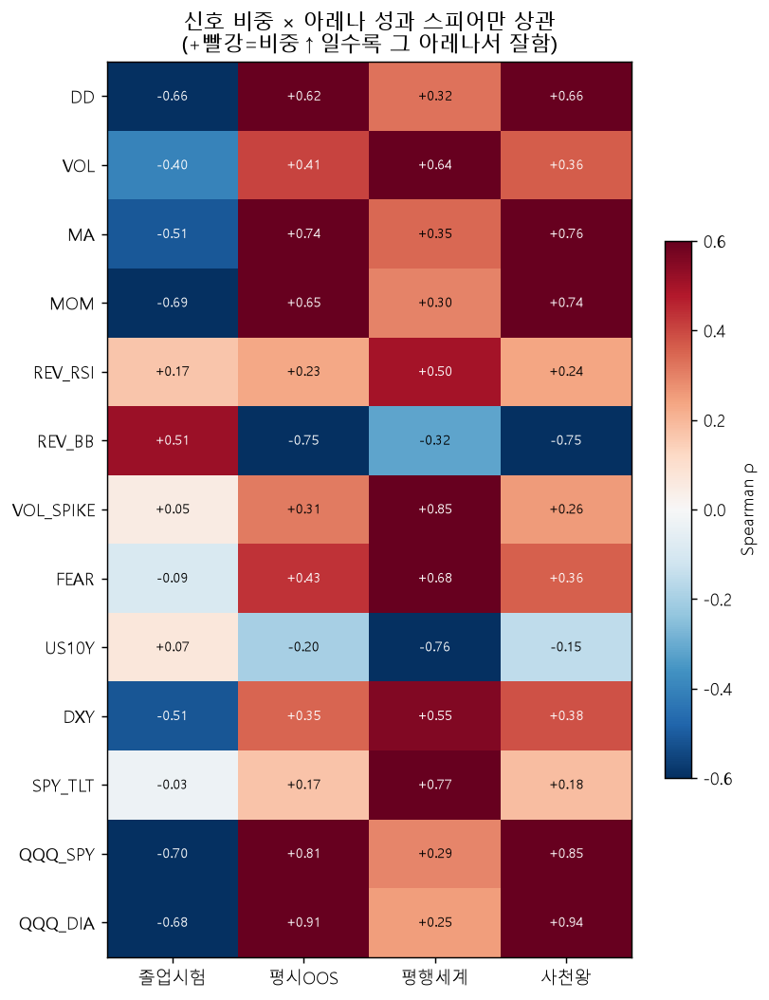

# v2 리그 시그널 분석 — 상·하위 비중 + 아레나별 성과 (시즌 3 준비)
> 후보 **120명**(TPE/CMA-ES/GP/NSGA ×30) · 4아레나(졸업시험/평시OOS/평행세계/사천왕) · 13신호 정규화 비중. 종합순위 = 4아레나 백분위 평균.
> ⚠️ 생존자/상관 분석 = 인과 아님. fANOVA(학습목적)와 과녁이 다를 수 있음(train/test 미스매치).

## [1] 상·하위 30 평균 비중 (lift 내림차순)

| 신호 | 상위30 비중% | 하위30 비중% | lift%p |
|---|--:|--:|--:|
| VOL_SPIKE | 10.2 | 0.0 | +10.2 |
| QQQ_DIA | 7.9 | 0.0 | +7.9 |
| REV_RSI | 20.3 | 13.6 | +6.7 |
| VOL | 6.6 | 0.0 | +6.6 |
| QQQ_SPY | 6.4 | 0.0 | +6.4 |
| FEAR | 4.7 | 0.0 | +4.7 |
| DXY | 1.8 | 0.0 | +1.8 |
| SPY_TLT | 1.8 | 0.0 | +1.8 |
| MA | 1.5 | 0.0 | +1.5 |
| DD | 0.3 | 0.0 | +0.3 |
| MOM | 0.2 | 0.0 | +0.2 |
| US10Y | 24.4 | 44.1 | -19.7 |
| REV_BB | 13.8 | 42.3 | -28.4 |

## [2] 신호 × 아레나 스피어만 상관 (비중↑ ↔ 그 아레나 성과)

| 신호 | 졸업시험 | 평시OOS | 평행세계 | 사천왕 |
|---|--:|--:|--:|--:|
| DD | -0.66 | +0.62 | +0.32 | +0.66 |
| VOL | -0.40 | +0.41 | +0.64 | +0.36 |
| MA | -0.51 | +0.74 | +0.35 | +0.76 |
| MOM | -0.69 | +0.65 | +0.30 | +0.74 |
| REV_RSI | +0.17 | +0.23 | +0.50 | +0.24 |
| REV_BB | +0.51 | -0.75 | -0.32 | -0.75 |
| VOL_SPIKE | +0.05 | +0.31 | +0.85 | +0.26 |
| FEAR | -0.09 | +0.43 | +0.68 | +0.36 |
| US10Y | +0.07 | -0.20 | -0.76 | -0.15 |
| DXY | -0.51 | +0.35 | +0.55 | +0.38 |
| SPY_TLT | -0.03 | +0.17 | +0.77 | +0.18 |
| QQQ_SPY | -0.70 | +0.81 | +0.29 | +0.85 |
| QQQ_DIA | -0.68 | +0.91 | +0.25 | +0.94 |

## [3] 그룹별 아레나 평균 잔고 (만원)

| 그룹 | 졸업시험 | 평시OOS | 평행세계 | 사천왕 |
|---|--:|--:|--:|--:|
| CMA-ES | 702 | 1220 | 116 | 794 |
| GP | 727 | 1137 | 111 | 726 |
| NSGA | 714 | 1240 | 115 | 819 |
| TPE | 731 | 1214 | 118 | 780 |
| _어플삭제단-001_ | 601 | 1098 | 100 | 690 |
| _어플삭제단-002_ | 628 | 1224 | 111 | 803 |
| _어플삭제단-003_ | 624 | 1179 | 104 | 740 |
| _어플삭제단-004_ | 595 | 1250 | 113 | 811 |
| _어플삭제단-005_ | 593 | 1208 | 110 | 782 |
| _어플삭제단-006_ | 606 | 1236 | 112 | 815 |
| _어플삭제단-007_ | 616 | 1252 | 115 | 825 |
| _어플삭제단-008_ | 621 | 1218 | 110 | 804 |
| _어플삭제단-009_ | 612 | 1246 | 117 | 806 |
| _어플삭제단-010_ | 605 | 1247 | 114 | 813 |
| _어플삭제단-011_ | 601 | 1099 | 100 | 692 |
| _어플삭제단-012_ | 621 | 1213 | 110 | 805 |
| _어플삭제단-013_ | 605 | 1255 | 116 | 817 |
| _어플삭제단-014_ | 647 | 1180 | 106 | 747 |
| _어플삭제단-015_ | 607 | 1260 | 114 | 825 |
| _어플삭제단-016_ | 600 | 1211 | 110 | 780 |
| _어플삭제단-017_ | 629 | 1225 | 110 | 799 |
| _어플삭제단-018_ | 634 | 1199 | 105 | 749 |
| _어플삭제단-019_ | 606 | 1206 | 109 | 770 |
| _어플삭제단-020_ | 631 | 1109 | 101 | 700 |
| _어플삭제단-021_ | 651 | 1181 | 108 | 762 |
| _어플삭제단-022_ | 613 | 1259 | 114 | 829 |
| _어플삭제단-023_ | 611 | 1211 | 110 | 789 |
| _어플삭제단-024_ | 641 | 1147 | 103 | 744 |
| _어플삭제단-025_ | 634 | 1143 | 103 | 736 |
| _어플삭제단-026_ | 612 | 1267 | 117 | 800 |
| _어플삭제단-027_ | 647 | 1157 | 104 | 745 |
| _어플삭제단-028_ | 638 | 1105 | 102 | 715 |
| _어플삭제단-029_ | 597 | 1102 | 100 | 692 |
| _어플삭제단-030_ | 640 | 1183 | 106 | 753 |
| _어플삭제단-031_ | 593 | 1208 | 110 | 782 |
| _어플삭제단-032_ | 648 | 1132 | 103 | 730 |
| _어플삭제단-033_ | 622 | 1111 | 102 | 707 |
| _어플삭제단-034_ | 652 | 1128 | 103 | 731 |
| _어플삭제단-035_ | 622 | 1178 | 104 | 744 |
| _어플삭제단-036_ | 636 | 1147 | 103 | 746 |
| _어플삭제단-037_ | 650 | 1128 | 103 | 728 |
| _어플삭제단-038_ | 595 | 1253 | 113 | 811 |
| _어플삭제단-039_ | 613 | 1259 | 114 | 829 |
| _어플삭제단-040_ | 611 | 1256 | 115 | 821 |
| _어플삭제단-041_ | 678 | 1176 | 107 | 759 |
| _어플삭제단-042_ | 639 | 1202 | 105 | 754 |
| _어플삭제단-043_ | 598 | 1237 | 112 | 811 |
| _어플삭제단-044_ | 612 | 1268 | 118 | 801 |
| _어플삭제단-045_ | 617 | 1268 | 117 | 801 |
| _어플삭제단-046_ | 609 | 1249 | 116 | 810 |
| _어플삭제단-047_ | 600 | 1207 | 109 | 775 |
| _어플삭제단-048_ | 621 | 1265 | 118 | 810 |
| _어플삭제단-049_ | 664 | 1276 | 119 | 843 |
| _어플삭제단-050_ | 642 | 1136 | 103 | 737 |
| _어플삭제단-051_ | 632 | 1109 | 102 | 719 |
| _어플삭제단-052_ | 614 | 1093 | 101 | 694 |
| _어플삭제단-053_ | 615 | 1251 | 117 | 797 |
| _어플삭제단-054_ | 632 | 1115 | 101 | 708 |
| _어플삭제단-055_ | 625 | 1121 | 101 | 707 |
| _어플삭제단-056_ | 623 | 1123 | 101 | 707 |
| _어플삭제단-057_ | 640 | 1178 | 108 | 763 |
| _어플삭제단-058_ | 601 | 1205 | 109 | 777 |
| _어플삭제단-059_ | 614 | 1259 | 117 | 802 |
| _어플삭제단-060_ | 645 | 1121 | 102 | 720 |
| _어플삭제단-061_ | 620 | 1217 | 111 | 796 |
| _어플삭제단-062_ | 645 | 1128 | 103 | 729 |
| _어플삭제단-063_ | 625 | 1177 | 104 | 742 |
| _어플삭제단-064_ | 629 | 1225 | 110 | 799 |
| _어플삭제단-065_ | 619 | 1244 | 111 | 812 |
| _어플삭제단-066_ | 641 | 1121 | 102 | 720 |
| _어플삭제단-067_ | 636 | 1182 | 108 | 763 |
| _어플삭제단-068_ | 630 | 1213 | 111 | 800 |
| _어플삭제단-069_ | 618 | 1187 | 108 | 764 |
| _어플삭제단-070_ | 637 | 1204 | 105 | 749 |
| _어플삭제단-071_ | 586 | 1105 | 100 | 700 |
| _어플삭제단-072_ | 591 | 1111 | 100 | 695 |
| _어플삭제단-073_ | 644 | 1178 | 108 | 762 |
| _어플삭제단-074_ | 606 | 1230 | 112 | 813 |
| _어플삭제단-075_ | 608 | 1259 | 114 | 829 |
| _어플삭제단-076_ | 598 | 1238 | 113 | 814 |
| _어플삭제단-077_ | 606 | 1251 | 115 | 815 |
| _어플삭제단-078_ | 601 | 1198 | 110 | 786 |
| _어플삭제단-079_ | 643 | 1180 | 105 | 750 |
| _어플삭제단-080_ | 641 | 1222 | 110 | 805 |
| _어플삭제단-081_ | 644 | 1185 | 108 | 765 |
| _어플삭제단-082_ | 600 | 1211 | 110 | 780 |
| _어플삭제단-083_ | 594 | 1246 | 112 | 801 |
| _어플삭제단-084_ | 596 | 1247 | 112 | 805 |
| _어플삭제단-085_ | 601 | 1198 | 110 | 786 |
| _어플삭제단-086_ | 610 | 1268 | 118 | 798 |
| _어플삭제단-087_ | 631 | 1109 | 101 | 700 |
| _어플삭제단-088_ | 638 | 1254 | 119 | 829 |
| _어플삭제단-089_ | 651 | 1179 | 108 | 761 |
| _어플삭제단-090_ | 597 | 1197 | 109 | 781 |
| _어플삭제단-091_ | 623 | 1226 | 110 | 799 |
| _어플삭제단-092_ | 632 | 1224 | 110 | 805 |
| _어플삭제단-093_ | 610 | 1224 | 111 | 804 |
| _어플삭제단-094_ | 591 | 1250 | 113 | 807 |
| _어플삭제단-095_ | 610 | 1224 | 111 | 804 |
| _어플삭제단-096_ | 620 | 1097 | 101 | 694 |
| _어플삭제단-097_ | 622 | 1243 | 111 | 807 |
| _어플삭제단-098_ | 624 | 1121 | 101 | 709 |
| _어플삭제단-099_ | 615 | 1224 | 111 | 813 |
| _어플삭제단-100_ | 635 | 1158 | 104 | 750 |
| _어플삭제단-101_ | 598 | 1238 | 113 | 814 |
| _어플삭제단-102_ | 616 | 1252 | 115 | 828 |
| _어플삭제단-103_ | 629 | 1270 | 118 | 813 |
| _어플삭제단-104_ | 647 | 1142 | 102 | 735 |
| _어플삭제단-105_ | 639 | 1159 | 104 | 746 |
| _어플삭제단-106_ | 644 | 1144 | 103 | 738 |
| _어플삭제단-107_ | 657 | 1137 | 102 | 738 |
| _어플삭제단-108_ | 647 | 1181 | 108 | 764 |
| _어플삭제단-109_ | 625 | 1240 | 111 | 812 |
| _어플삭제단-110_ | 605 | 1240 | 111 | 805 |
| _어플삭제단-111_ | 619 | 1187 | 108 | 764 |
| _어플삭제단-112_ | 659 | 1286 | 119 | 839 |
| _어플삭제단-113_ | 646 | 1117 | 102 | 725 |
| _어플삭제단-114_ | 618 | 1275 | 118 | 803 |
| _어플삭제단-115_ | 628 | 1214 | 111 | 803 |
| _어플삭제단-116_ | 643 | 1157 | 104 | 747 |
| _어플삭제단-117_ | 606 | 1260 | 114 | 825 |
| _어플삭제단-118_ | 629 | 1270 | 118 | 814 |
| _어플삭제단-119_ | 606 | 1250 | 116 | 814 |
| _어플삭제단-120_ | 593 | 1242 | 114 | 818 |
| _어플삭제단-121_ | 634 | 1143 | 103 | 736 |
| _어플삭제단-122_ | 625 | 1121 | 101 | 707 |
| _어플삭제단-123_ | 611 | 1236 | 111 | 815 |
| _어플삭제단-124_ | 607 | 1230 | 112 | 804 |
| _어플삭제단-125_ | 612 | 1211 | 110 | 789 |
| _어플삭제단-126_ | 612 | 1268 | 117 | 801 |
| _어플삭제단-127_ | 622 | 1121 | 101 | 709 |
| _어플삭제단-128_ | 614 | 1216 | 110 | 797 |
| _어플삭제단-129_ | 622 | 1227 | 110 | 797 |
| _어플삭제단-130_ | 638 | 1145 | 103 | 745 |
| _어플삭제단-131_ | 646 | 1195 | 104 | 743 |
| _어플삭제단-132_ | 624 | 1270 | 118 | 816 |
| _어플삭제단-133_ | 608 | 1249 | 114 | 818 |
| _어플삭제단-134_ | 597 | 1241 | 113 | 811 |
| _어플삭제단-135_ | 643 | 1148 | 104 | 738 |
| _어플삭제단-136_ | 619 | 1244 | 111 | 812 |
| _어플삭제단-137_ | 641 | 1178 | 106 | 748 |
| _어플삭제단-138_ | 609 | 1258 | 115 | 821 |
| _어플삭제단-139_ | 596 | 1238 | 113 | 814 |
| _어플삭제단-140_ | 622 | 1265 | 118 | 810 |
| _어플삭제단-141_ | 599 | 1247 | 112 | 805 |
| _어플삭제단-142_ | 646 | 1143 | 103 | 740 |
| _어플삭제단-143_ | 620 | 1265 | 118 | 809 |
| _어플삭제단-144_ | 587 | 1105 | 100 | 700 |
| _어플삭제단-145_ | 611 | 1237 | 112 | 810 |
| _어플삭제단-146_ | 600 | 1211 | 110 | 780 |
| _어플삭제단-147_ | 636 | 1196 | 105 | 742 |
| _어플삭제단-148_ | 626 | 1264 | 118 | 813 |
| _어플삭제단-149_ | 610 | 1273 | 118 | 801 |
| _어플삭제단-150_ | 590 | 1245 | 113 | 808 |
| _어플삭제단-151_ | 600 | 1206 | 110 | 785 |
| _어플삭제단-152_ | 616 | 1250 | 115 | 819 |
| _어플삭제단-153_ | 625 | 1271 | 119 | 820 |
| _어플삭제단-154_ | 618 | 1268 | 117 | 799 |
| _어플삭제단-155_ | 626 | 1271 | 119 | 816 |
| _어플삭제단-156_ | 626 | 1264 | 118 | 813 |
| _어플삭제단-157_ | 624 | 1093 | 101 | 695 |
| _어플삭제단-158_ | 610 | 1268 | 118 | 798 |
| _어플삭제단-159_ | 625 | 1213 | 110 | 808 |
| _어플삭제단-160_ | 613 | 1225 | 111 | 811 |
| _어플삭제단-161_ | 635 | 1110 | 102 | 713 |
| _어플삭제단-162_ | 648 | 1258 | 119 | 822 |
| _어플삭제단-163_ | 596 | 1103 | 100 | 693 |
| _어플삭제단-164_ | 662 | 1176 | 108 | 760 |
| _어플삭제단-165_ | 597 | 1102 | 100 | 692 |
| _어플삭제단-166_ | 645 | 1147 | 103 | 745 |
| _어플삭제단-167_ | 606 | 1242 | 112 | 806 |
| _어플삭제단-168_ | 593 | 1104 | 100 | 697 |
| _어플삭제단-169_ | 642 | 1252 | 119 | 825 |
| _어플삭제단-170_ | 678 | 1182 | 107 | 762 |
| _어플삭제단-171_ | 610 | 1268 | 118 | 797 |
| _어플삭제단-172_ | 637 | 1161 | 104 | 747 |
| _어플삭제단-173_ | 609 | 1262 | 114 | 824 |
| _어플삭제단-174_ | 593 | 1205 | 110 | 781 |
| _어플삭제단-175_ | 626 | 1109 | 101 | 700 |
| _어플삭제단-176_ | 642 | 1180 | 108 | 762 |
| _어플삭제단-177_ | 638 | 1119 | 102 | 720 |
| _어플삭제단-178_ | 640 | 1162 | 104 | 746 |
| _어플삭제단-179_ | 644 | 1175 | 106 | 753 |
| _어플삭제단-180_ | 633 | 1224 | 110 | 801 |
| _어플삭제단-181_ | 650 | 1268 | 119 | 831 |
| _어플삭제단-182_ | 593 | 1243 | 113 | 810 |
| _어플삭제단-183_ | 597 | 1241 | 113 | 811 |
| _어플삭제단-184_ | 621 | 1213 | 110 | 805 |
| _어플삭제단-185_ | 625 | 1116 | 101 | 706 |
| _어플삭제단-186_ | 600 | 1203 | 110 | 781 |
| _어플삭제단-187_ | 621 | 1114 | 102 | 703 |
| _어플삭제단-188_ | 613 | 1246 | 117 | 802 |
| _어플삭제단-189_ | 644 | 1146 | 103 | 743 |
| _어플삭제단-190_ | 630 | 1264 | 118 | 813 |
| _어플삭제단-191_ | 655 | 1128 | 102 | 727 |
| _어플삭제단-192_ | 630 | 1118 | 102 | 709 |
| _어플삭제단-193_ | 636 | 1182 | 108 | 763 |
| _어플삭제단-194_ | 628 | 1188 | 104 | 748 |
| _어플삭제단-195_ | 599 | 1202 | 109 | 781 |
| _어플삭제단-196_ | 646 | 1178 | 106 | 748 |
| _어플삭제단-197_ | 609 | 1255 | 117 | 817 |
| _어플삭제단-198_ | 625 | 1178 | 104 | 744 |
| _어플삭제단-199_ | 622 | 1241 | 111 | 805 |
| _어플삭제단-200_ | 646 | 1254 | 119 | 827 |
| _어플삭제단-201_ | 597 | 1202 | 110 | 778 |
| _어플삭제단-202_ | 630 | 1177 | 104 | 745 |
| _어플삭제단-203_ | 620 | 1096 | 101 | 695 |
| _어플삭제단-204_ | 642 | 1150 | 104 | 731 |
| _어플삭제단-205_ | 642 | 1254 | 119 | 829 |
| _어플삭제단-206_ | 610 | 1207 | 110 | 787 |
| _어플삭제단-207_ | 662 | 1177 | 107 | 754 |
| _어플삭제단-208_ | 649 | 1180 | 108 | 761 |
| _어플삭제단-209_ | 639 | 1147 | 103 | 746 |
| _어플삭제단-210_ | 599 | 1199 | 109 | 778 |
| _어플삭제단-211_ | 642 | 1164 | 104 | 745 |
| _어플삭제단-212_ | 634 | 1170 | 104 | 746 |
| _어플삭제단-213_ | 601 | 1211 | 111 | 784 |
| _어플삭제단-214_ | 646 | 1201 | 105 | 755 |
| _어플삭제단-215_ | 646 | 1144 | 103 | 739 |
| _어플삭제단-216_ | 615 | 1252 | 115 | 825 |
| _어플삭제단-217_ | 596 | 1102 | 100 | 697 |
| _어플삭제단-218_ | 598 | 1215 | 110 | 783 |
| _어플삭제단-219_ | 643 | 1136 | 103 | 737 |
| _어플삭제단-220_ | 621 | 1269 | 118 | 802 |
| _어플삭제단-221_ | 612 | 1219 | 111 | 811 |
| _어플삭제단-222_ | 643 | 1186 | 106 | 753 |
| _어플삭제단-223_ | 626 | 1178 | 104 | 741 |
| _어플삭제단-224_ | 625 | 1177 | 104 | 747 |
| _어플삭제단-225_ | 626 | 1178 | 104 | 741 |
| _어플삭제단-226_ | 594 | 1096 | 100 | 696 |
| _어플삭제단-227_ | 609 | 1262 | 114 | 824 |
| _어플삭제단-228_ | 625 | 1227 | 111 | 804 |
| _어플삭제단-229_ | 598 | 1232 | 112 | 807 |
| _어플삭제단-230_ | 610 | 1256 | 115 | 827 |
| _어플삭제단-231_ | 638 | 1120 | 102 | 722 |
| _어플삭제단-232_ | 625 | 1177 | 104 | 747 |
| _어플삭제단-233_ | 611 | 1246 | 117 | 806 |
| _어플삭제단-234_ | 592 | 1208 | 110 | 788 |
| _어플삭제단-235_ | 653 | 1206 | 105 | 758 |
| _어플삭제단-236_ | 666 | 1276 | 119 | 843 |
| _어플삭제단-237_ | 648 | 1252 | 119 | 825 |
| _어플삭제단-238_ | 647 | 1147 | 103 | 745 |
| _어플삭제단-239_ | 648 | 1268 | 119 | 831 |
| _어플삭제단-240_ | 606 | 1250 | 116 | 814 |
| _어플삭제단-241_ | 635 | 1147 | 103 | 746 |
| _어플삭제단-242_ | 594 | 1253 | 113 | 811 |
| _어플삭제단-243_ | 606 | 1250 | 116 | 814 |
| _어플삭제단-244_ | 630 | 1264 | 118 | 813 |
| _어플삭제단-245_ | 640 | 1155 | 104 | 750 |
| _어플삭제단-246_ | 630 | 1118 | 102 | 709 |
| _어플삭제단-247_ | 645 | 1121 | 102 | 720 |
| _어플삭제단-248_ | 647 | 1255 | 119 | 826 |
| _어플삭제단-249_ | 622 | 1220 | 110 | 796 |
| _어플삭제단-250_ | 609 | 1228 | 111 | 809 |
| _어플삭제단-251_ | 606 | 1255 | 116 | 819 |
| _어플삭제단-252_ | 606 | 1210 | 109 | 771 |
| _어플삭제단-253_ | 595 | 1096 | 100 | 696 |
| _어플삭제단-254_ | 646 | 1146 | 103 | 744 |
| _어플삭제단-255_ | 599 | 1202 | 109 | 776 |
| _어플삭제단-256_ | 664 | 1174 | 107 | 759 |
| _어플삭제단-257_ | 638 | 1148 | 103 | 747 |
| _어플삭제단-258_ | 635 | 1158 | 104 | 750 |
| _어플삭제단-259_ | 636 | 1109 | 102 | 716 |
| _어플삭제단-260_ | 623 | 1270 | 118 | 817 |
| _어플삭제단-261_ | 623 | 1216 | 110 | 797 |
| _어플삭제단-262_ | 632 | 1156 | 104 | 748 |
| _어플삭제단-263_ | 610 | 1268 | 118 | 798 |
| _어플삭제단-264_ | 636 | 1109 | 102 | 716 |
| _어플삭제단-265_ | 631 | 1114 | 102 | 714 |
| _어플삭제단-266_ | 619 | 1091 | 101 | 695 |
| _어플삭제단-267_ | 621 | 1114 | 102 | 703 |
| _어플삭제단-268_ | 598 | 1230 | 112 | 804 |
| _어플삭제단-269_ | 608 | 1204 | 109 | 772 |
| _어플삭제단-270_ | 625 | 1218 | 110 | 804 |
| _어플삭제단-271_ | 665 | 1181 | 107 | 759 |
| _어플삭제단-272_ | 613 | 1245 | 114 | 823 |
| _어플삭제단-273_ | 653 | 1182 | 108 | 760 |
| _어플삭제단-274_ | 648 | 1132 | 103 | 729 |
| _어플삭제단-275_ | 609 | 1197 | 109 | 772 |
| _어플삭제단-276_ | 625 | 1196 | 104 | 742 |
| _어플삭제단-277_ | 622 | 1270 | 118 | 815 |
| _어플삭제단-278_ | 651 | 1138 | 103 | 740 |
| _어플삭제단-279_ | 594 | 1240 | 112 | 799 |
| _어플삭제단-280_ | 670 | 1179 | 107 | 763 |
| _어플삭제단-281_ | 629 | 1222 | 110 | 798 |
| _어플삭제단-282_ | 597 | 1239 | 114 | 820 |
| _어플삭제단-283_ | 631 | 1185 | 104 | 745 |
| _어플삭제단-284_ | 587 | 1106 | 100 | 698 |
| _어플삭제단-285_ | 646 | 1117 | 102 | 726 |
| _어플삭제단-286_ | 624 | 1116 | 102 | 708 |
| _어플삭제단-287_ | 601 | 1212 | 111 | 783 |
| _어플삭제단-288_ | 649 | 1158 | 103 | 743 |
| _어플삭제단-289_ | 643 | 1148 | 104 | 736 |
| _어플삭제단-290_ | 614 | 1236 | 111 | 816 |
| _어플삭제단-291_ | 609 | 1250 | 116 | 816 |
| _어플삭제단-292_ | 634 | 1110 | 102 | 713 |
| _어플삭제단-293_ | 591 | 1104 | 100 | 697 |
| _어플삭제단-294_ | 632 | 1200 | 105 | 747 |
| _어플삭제단-295_ | 639 | 1155 | 104 | 750 |
| _어플삭제단-296_ | 618 | 1218 | 111 | 803 |
| _어플삭제단-297_ | 609 | 1253 | 115 | 822 |
| _어플삭제단-298_ | 635 | 1105 | 102 | 715 |
| _어플삭제단-299_ | 641 | 1222 | 110 | 804 |
| _어플삭제단-300_ | 661 | 1178 | 107 | 758 |
| _성실이_ | 622 | 1192 | 108 | 768 |
| _저축왕_ | 629 | 1133 | 106 | 718 |
| _돼지저금통_ | 600 | 1100 | 100 | 700 |

## 읽는 법

- **[1] lift** = 상위 후보가 하위보다 더 실은 신호. 양수 클수록 '상위권의 색깔'.
- **[2] 상관** = 빨강(+)이면 그 신호 비중을 키울수록 그 아레나서 잔고가 높음, 파랑(−)이면 반대.
  아레나마다 부호가 갈리면 그 신호는 국면 의존(어떤 시장에선 약).
- **[3]** = 어느 학습법(샘플러)이 어느 아레나서 강한지. 기준선(어플삭제단·성실이)이 비교선.

재현: `.venv/Scripts/python.exe -m app.lab.season.v2_signal_analysis`
