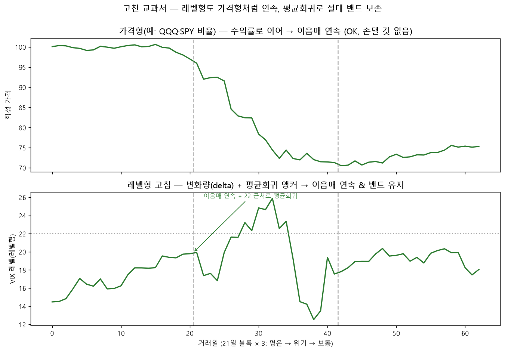

# 시즌 3 교육 개혁 진단 — 합성 교과서가 왜 '짝퉁 시험지'인가

> 작성: Opus 연구원 · 2026-06-18 · 시즌 3은 "최적화 더 돌리기"가 아니라 "시즌2 데이터 분석 →
> 교육(교과서) 개혁 먼저"(대표님 방침). 이 리포트는 그 진단 결과를 한 곳에 묶는다.
> 세부 데이터·재현 스크립트는 `app/lab/`의 각 리포트 참조.

## 한 줄 결론
합성 교과서(아카데미 블록 부트스트랩)는 **실제 나스닥보다 더 출렁대고, 외부신호(레벨형)를
가짜 이벤트로 오학습시킨다.** 그래서 거기서 1등 한 후보가 실전에선 꼴찌가 된다
(v2의 "졸업시험 ↔ 실전 反상관"). → 시즌 3 핵심 숙제 = **교과서 재설계.**

## 1. 발단 — GP 후보 30명이 전부 같은 답 (`v2_signal_analysis.md`)
- GP top30의 **종료잔고가 30개 전부 정확히 동일**(TPE/CMA는 30/30 다름). 전부
  `{REV_BB=1, US10Y=1, REV_RSI=가변}` 한 전략. REV_RSI는 잔고에 영향 0(평평한 능선).
- GP는 멍청한 게 아니라 **합성 시험의 정답을 정확히 외워(exploit) 30번 복붙**한 것 —
  trial 81에 최적점 찾고 300판 무개선 조기종료. 탐험형(TPE/CMA)은 안 외워서 오히려 다양.
- 파이프라인 문제도 같이: `select_topk.select_single`이 **중복 제거 없이** value 상위 30을
  뽑아, 수렴형(GP)의 동률점이 top30을 도배 → GP의 "30 후보"는 사실상 1개.
- 그 1개 정답이 **실전에선 함정**(US10Y). 왜 함정인지가 §2·§3.

## 2. 외부신호(레벨형)는 가짜 이벤트로 오학습된다


교과서(`curriculum/textbook.py`)는 21일 토막을 랜덤 순서로 이어붙인다. 외부 정보원을 타입별로
다르게 복원하는데:
- **price형**(SPY/TLT/QQQ비율·DXY): 수익률로 잘라 누적 복원 → **이음매 연속** ✅
- **level형**(^VIX→FEAR, ^TNX→US10Y, 거래량→VOL_SPIKE): raw 절대값 그대로 이어붙임 →
  **이음매서 점프**(평온 VIX 12 → 위기 52). US10Y/FEAR는 "평균 대비 급락/급등"에 발동하므로
  **실제로는 없는 경계 점프를 진짜 이벤트로 착각**해 발동 → 합성장에서 `US10Y=1`을 정답으로 학습.
- 실전 ^TNX엔 그 경계 점프가 없으니 `US10Y=1`이 안 통하고 끌어내림(v2: US10Y 상관 거의 다 음).

**대조 증거**: 실전서 잘 전이된 신호(QQQ_DIA/QQQ_SPY 등 크로스에셋)는 전부 **연속 복원되는
price형**, 실전서 죽은 신호(US10Y)는 **점프 나는 level형**. 우연이 아니라 합성 방식의 품질 차이.

**fix 방향**: level형도 변화량(delta)으로 이어 연속 복원하되, 변화량만 누적하면 절대 레벨이
표류(평균회귀 소실)하므로 **delta 연속 + 평균회귀 앵커**가 완성형. 가격형은 손댈 것 없음(이미 연속).



## 3. 합성 교과서는 실제보다 더 출렁댄다 (`synth_vs_real_regime.md`)


| 출처 | 상승장 | 하락장 | 횡보장 | 변동장 |
|---|--:|--:|--:|--:|
| 실제 나스닥 (1999~2020-06) | 58.4% | 22.9% | 18.0% | 0.7% |
| 합성 교과서 (80권) | 50.2% | 27.9% | 18.6% | **3.3%** |

- 합성이 **상승장 −8pp, 하락장 +5pp, 변동장 ~5배**(0.7→3.3%) = 분포가 더 출렁대는 짝퉁 확인.
- 단 **평균 연속 상승장 길이는 거의 동일**(실제 21 vs 합성 20거래일) — "추세가 짧아졌다"기보다
  **"변동·하락 비중↑"**이 핵심(regime 라벨이 일별로 잘 깨져 장기 지속성은 이 지표로 안 잡힘).
- 이 분포 차이가 v2의 反상관(역발상이 합성서 이기고 실전서 짐)을 뒷받침.

## 종합 — 시즌 3 교육 개혁 항목
1. **level형 외부신호 합성 정교화** — raw 이어붙이기 → delta 연속 복원 + 평균회귀 앵커
   (가짜 경계 이벤트 제거). 안 되면 그 신호는 합성 학습 대상에서 빼고 실데이터 OOS로만 검증.
2. **교과서를 실제 분포에 맞추기** — 합성이 변동장을 5배 과대표집. 기초 교과서는 실제 분포
   (상승~58/하락~23/횡보~18/변동~1)에 맞추고, 폭락장은 시험장 최소 쿼터로 분리(코덱스 §4).
3. **선발 다양성** — `select_topk`에 중복/동률 제거(또는 유효전략 다양성) → 수렴형(GP)이
   클론 30개로 자리 못 채우게.
4. **졸업시험 ≠ 선발 게이트** — 진단 지표로만. 본선은 교실별 top30 전원(코덱스 정책).

## 재현 (연구는 `app/lab/`에서, 규칙 #16)
```
.venv/Scripts/python.exe -m app.lab.v2_signal_analysis      # GP 붕괴·신호×아레나 상관
.venv/Scripts/python.exe -m app.lab.block_shuffle_explainer # 레벨형 합성 결함 그림
.venv/Scripts/python.exe -m app.lab.synth_vs_real_regime    # 합성 vs 실제 분포
.venv/Scripts/python.exe -m app.lab.regime_distribution     # 실제 국면 분포(코덱스안 1번)
```
