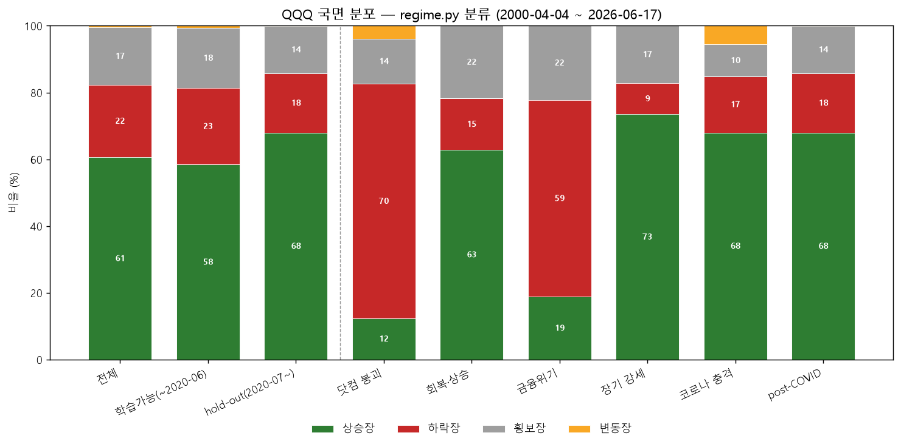

# QQQ 전체 기간 국면 분포 리포트 (시즌 3 교과서 개편용)
> 분류 가능 구간: **2000-04-04 ~ 2026-06-17** · 분류기: `app/world/regime.py` (50/200일 이동평균 + 60일 수익률 ±3% + 20일 변동성 백분위 0.85)
> 국면 = 상승장(추세 위)·하락장(추세 아래)·횡보장(애매)·변동장(애매한데 변동성 폭발)

## [1] 전체 / hold-out 분리

| 구간 | 일수 | 상승장 | 하락장 | 횡보장 | 변동장 |
|---|--:|--:|--:|--:|--:|
| 전체 | 6590 | 60.6% | 21.7% | 17.2% | 0.5% |
| 학습가능(~2020-06) | 5092 | 58.4% | 22.9% | 18.0% | 0.7% |
| hold-out(2020-07~) | 1498 | 68.0% | 17.8% | 14.2% | 0.1% |

## [2] 시대별

| 구간 | 일수 | 상승장 | 하락장 | 횡보장 | 변동장 |
|---|--:|--:|--:|--:|--:|
| 닷컴 붕괴 | 688 | 12.4% | 70.2% | 13.5% | 3.9% |
| 회복·상승 | 1258 | 62.8% | 15.4% | 21.8% | 0.0% |
| 금융위기 | 377 | 18.8% | 58.9% | 22.3% | 0.0% |
| 장기 강세 | 2644 | 73.5% | 9.3% | 17.2% | 0.0% |
| 코로나 충격 | 125 | 68.0% | 16.8% | 9.6% | 5.6% |
| post-COVID | 1498 | 68.0% | 17.8% | 14.2% | 0.1% |

## [3] ^NDX 참고 (90년대 포함)

| 구간 | 일수 | 상승장 | 하락장 | 횡보장 | 변동장 |
|---|--:|--:|--:|--:|--:|
| ^NDX 전체 (1986-10-27~) | 9986 | 62.3% | 19.1% | 14.7% | 3.8% |

## 핵심 발견

1. **나스닥은 평소가 상승장** — 학습가능 기간 58%, 전체 60%가 상승장. 하락장은 ~22%뿐이고 닷컴(70%)·금융위기(59%)에 몰빵.
2. **교과서 방어 편향 = 수치 확인** — 옛 시험장 6체육관은 하락 위주(4하락:2평시)였는데 현실 하락장은 22%. 폭락장을 현실보다 ~3배 과대표집 → 방어 신호 과보상 위험.
3. **변동장 라벨이 사실상 죽음(0.5%)** — 추세 점수에 눌려 '변동장'이 거의 안 뜬다. 레짐 스캐너 재설계 시 이 버킷 손봐야.
4. **MA200은 뒷북** — 2020 코로나(-30% 폭락)인데 하락장 16.8%뿐, 상승장 68%로 잡힘. 너무 빠른 폭락은 이동평균이 못 따라감 → 크로스에셋·위험선호 즉시 스캔 재설계 근거.
5. **hold-out이 학습기간보다 더 상승편향**(68% vs 58%) → 챔피언이 사천왕에서 B&H에 고전한 것과 일관.

## 시사점

기초 교과서를 실제 분포(상승 ~60 / 하락 ~22 / 횡보 ~18)에 맞추고, 폭락장은 희귀하지만 생존훈련용 **최소 쿼터**로 시험장 쪽에 따로 둔다 (코덱스 §4 방향과 일치).

---

재현: `.venv/Scripts/python.exe -m app.lab.textbook.regime_distribution`
