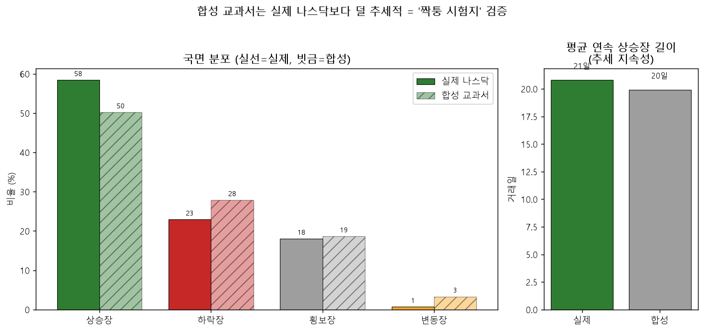

# 합성 교과서 vs 실제 나스닥 — 국면 분포·추세 지속성 (시즌 3 교육 개혁 근거)
> 합성 80권(`curriculum.make_world`) vs 실제 QQQ 1999-03-10~2020-06-30. 분류기 `world/regime.py`. 합성은 평가창(gym.start 이후)만 집계.

## 국면 분포

| 출처 | 상승장 | 하락장 | 횡보장 | 변동장 |
|---|--:|--:|--:|--:|
| 실제 나스닥 | 58.4% | 22.9% | 18.0% | 0.7% |
| 합성 교과서 | 50.2% | 27.9% | 18.6% | 3.3% |

## 추세 지속성

평균 연속 상승장 길이: **실제 21거래일 vs 합성 20거래일**.

## 측정 결론

- 합성이 실제보다 **상승장 -8.2pp, 하락장 +5.0pp, 변동장 4.9배** → 분포가 더 출렁대는 '짝퉁 시험지' 확인.
- 단 **평균 연속 상승장 길이는 거의 동일(21 vs 20거래일)** — '추세가 짧아졌다'기보다 **'변동·하락 비중↑'**이 핵심(규명: regime 라벨이 일별로 잘 깨져 장기 지속성은 이 지표로 안 잡힘).
- 이 분포 차이가 v2의 '합성↔실전 反상관'(역발상이 합성서 이기고 실전서 짐)을 뒷받침한다.

재현: `.venv/Scripts/python.exe -m app.lab.textbook.synth_vs_real_regime`
