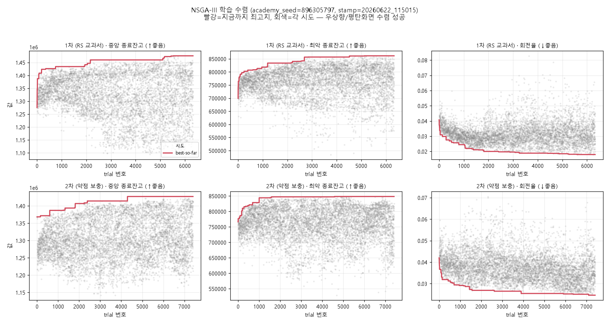
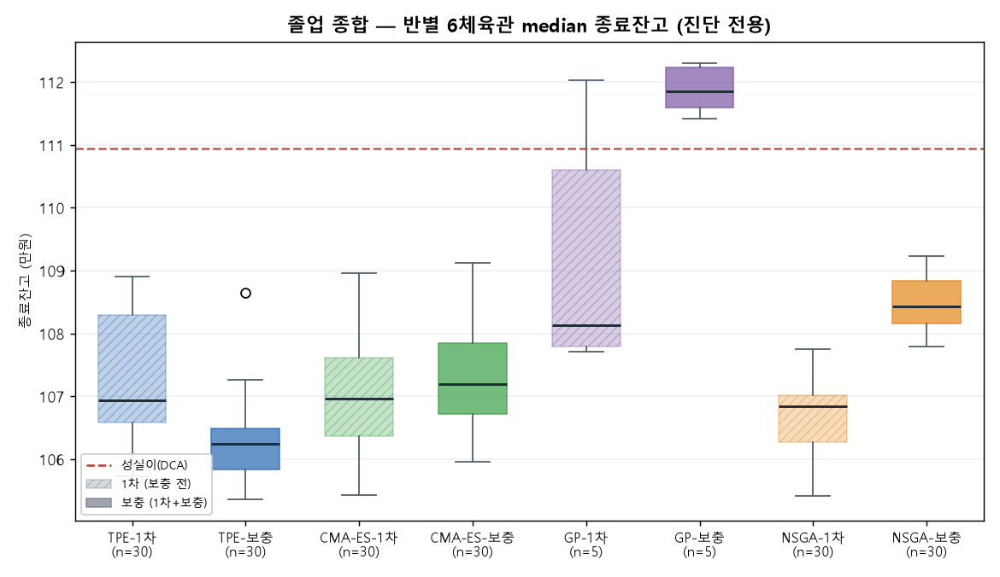

# 아카데미 훈련 레포트 — 2026-06-22

> 학기 stamp `20260622_115015` · academy_seed `896305797` · 잣대=median 종료잔고
> 4교실(TPE·CMA-ES·GP·NSGA-III) 2단계 학습(RS 1차 → 약점 보충) · 시드 100만원

## 1. 학습 개요·설정

| 항목 | 값 |
|---|---|
| 교실 | TPE · CMA-ES · GP(seed리그 5) · NSGA-III |
| 방식 | 2단계 — 1차 RS 교과서 → 약점 국면 진단 → 70/30 보충(2차) |
| 목적 | median 종료잔고(다목적 NSGA는 median·worst·turnover) |
| 합성장 | 20권(RS), 진단장 별도 |
| 학습이력 | **4교실 전부 sqlite 보존**(이번 학기부터 — 단일목적·GP도 storage on) |

## 2. 학습 결과 — 전 교실 완주

| 교실 | trial | 진단 약점 | 비고 |
|---|---:|---|---|
| TPE | 2,742 | bear(하락) | 조기종료 |
| CMA-ES | 1,852 | sideways(횡보) | 조기종료 |
| GP | 5,752 | sideways | seed리그 5×2 |
| NSGA-III | 13,740 | sideways | 1차 6,330 + 2차 7,410 |

`failed: []` — 한 교실도 죽지 않고 완주. 8개 학습 DB(4교실×2단계) 전부 보존되어
**학습 이력(trial별 수렴)을 사후 검증 가능한 첫 학기.**

## 3. 수렴 검증 — 전 교실 학습 성립

- NSGA 1·2차: 목적별 best-so-far가 상승 후 평탄 = 수렴. 2차는 보충장에서 HV가
  더 길게 개선되어 7,410까지(1차 6,330). 극단 1등 잔고는 ~5,000에서 정체하나
  파레토 프론트(부피)는 계속 개선 → 조기종료 미발동은 정상.
- TPE·CMA-ES·GP: best-so-far 계단식 상승 후 평탄. GP는 seed별 5개 독립 수렴.

## 4. 졸업 진단 — 실QQQ 6국면 (진단 전용, 선발 아님)

종합 median 종료잔고(만원): **GP-보충 112** > 성실이(DCA) **111** > NSGA-보충 108 ·
GP-1차 108 > CMA-ES/TPE/NSGA 1차류 107 > TPE-보충 106.

### 국면별 (median, vs 성실이)

| 국면 | 성실이 | 최고 전략 | 판정 |
|---|---:|---|---|
| 닷컴(폭락) | 57 | GP-1차 102 | 🟢 압승(전원 위) |
| 리먼(폭락) | 99 | TPE-보충 93 | 🔴 전원 패 |
| 회복 | 129 | GP-보충 181 | 🟢 압승 |
| 코로나 | 116 | TPE-보충 115 | 🟡 근소 패 |
| 상승(불장) | 112 | GP 133 | 🟢 승 |
| 횡보 | 110 | GP-보충 111 | 🔴 거의 패(GP-보충만 +1) |

## 5. 핵심 발견

1. **강점 = 닷컴(폭락)·회복·불장 / 약점 = 리먼·횡보(·코로나 근소).** 종합 1등
   GP-보충(112)도 전 국면 강자가 아니라, 강점 국면에서 크게 벌어 약점 손실을 메운 결과.
2. **학습 진단 ↔ 실전 약점 일치.** 학습 중 진단된 약점(대부분 sideways, TPE는 bear)이
   실제 시험 약점(횡보·리먼=베어/폭락)과 맞음 → 약점 진단 로직이 헛돌지 않음.
3. **같은 폭락도 닷컴 압승 vs 리먼 전패** — 폭락이 동질이 아니다. 리먼이 단일 최대 약점.
4. **보충(2차) 효과는 국면·교실 의존적**(균일하지 않음): 횡보에선 GP·NSGA 보충이 1차를
   넘었으나, GP는 닷컴에서 보충이 1차보다 크게 하락하는 등 부작용도.

## 6. 한계·다음

- **GP는 n=5**(seed리그)로 표본이 작아 30명 교실과 동급 신뢰 금지 — 단 직전 복구 학기에
  이어 **두 학기 연속 GP가 성실이를 넘은 유일 교실**(재현성은 있음).
- 졸업시험은 **진단(아이큐)일 뿐 선발 아님.** 실제 줄세움은 리그(OOS→사천왕)에서.
- 다음 후보: **리먼·횡보 약점 공략**(보충 설계 재검토) / 리그 줄세우기 / 조기종료를
  HV 전체가 아닌 돈 목적 기준으로(turnover 미세 gain에 끌려가지 않게).

— Opus 연구원
