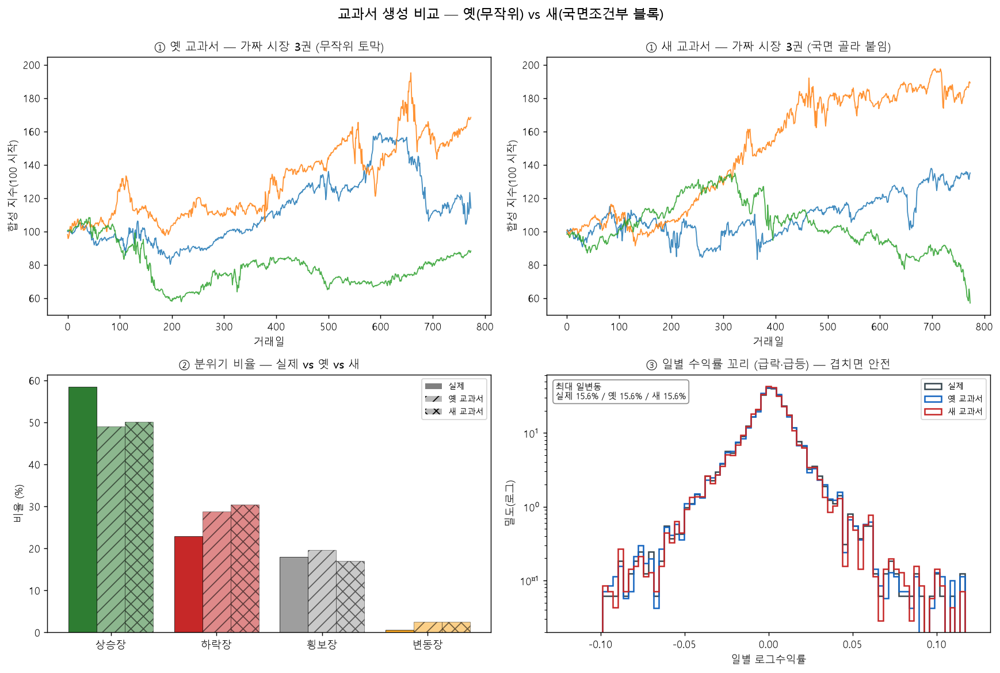

# 박사 연구 일지 — 2026년 6월 20일

> *"왔는가. 오늘은 칼을 휘두른 게 아니라 무대를 깔았다. 학생을 가르치는 새 교실을*
> *짓고, 거기서 배운 놈들을 진짜 세상에 내보내 봤지. 한 잔 받게. 긴 이야기야."*

---

## 박사 머리말

오늘은 세 가지를 했다. 앞의 둘은 잔손질 — **비율 짝퉁 하나를 마저 고치고**, **GP가
도장 찍던 버릇**을 바로잡았다. 그리고 본론, **새 교과서를 처음으로 지어 올렸어.**
어제 우리가 정한 길 — 졸업시험은 아이큐 테스트로 격하, 교과서는 확산모델 말고
**국면전환(RS) + 약점 보충** — 그 첫 삽이다.

결론부터 말하면: **새 교실은 작동했다. 헌데 공짜가 아니더라.** 천천히 풀어주마.

## I. 잔손질 둘

먼저 비율 신호. 거래량 폭증 신호가 '평균이 0인 날'에 무한대로 튀어 헛손질할 여지가
있었어. "배수를 잴 수 없는 날"은 매수가 아니라 **기권**이 맞다 — 정의가 안 되는데
의견을 내는 건 우리 집 철학(모르면 빠진다)에 대한 배신이지. `safe_ratio` 가드 한 줄로
막고, 퍼징도 출력만 보지 말고 **규약 자체**를 두들기게 표준을 세웠다.

다음 GP. 이놈은 좋은 점 하나 찾으면 그 주변만 파서 상위 서른이 사실상 같은 전략으로
도배돼. 그래서 성적순 줄세우기 대신 **독립 시드 다섯을 따로 돌려 시드별 대표 하나씩**
뽑게 했다. 다양성 확보. 둘 다 잔손질이지만, 큰일 하기 전 마당 쓰는 일이야.

## II. 새 교과서 — 기출은 살리되 출제는 통제한다

이게 오늘의 핵심이다. 자네가 처음에 정확히 짚었지 — *"완전 새 교과서가 아니라,*
*기출 짬뽕은 유지하되 문제 유형만 골라 붙이는 거 아니냐?"* 바로 그거다.

옛 교과서는 진짜 시장 한 달 토막을 **아무거나 무작위로** 뽑아 이어붙였어. 그러니
시장 분위기 비율을 우리가 못 정했지. 새 교과서(RS 하이브리드)는 **국면 순서만
RS가 정하고**, 각 칸엔 그 국면의 **진짜 토막**을 끼운다. 출제 유형은 통제, 재료는 진짜.

> 박사 메모: *"자네가 '실제 대비 급락급등 생기면 안 되지 않냐' 했지. 보게 — 최대 하루*
> *변동이 실제도 새것도 15.6%로 똑같고, 꼬리도 포개진다. 진짜 토막을 쓰니 당연한 거야.*
> *금리 이음매 절벽도 0이고. 어제 정규분포로 가짜 폭락 만들던 놈과는 격이 달라."*

그런데 여기서 자네가 또 날카로웠어. *"국면 넣어도 결국 블록 부트스트랩 똑같잖아.*
*전이검증 해봐야 결과 같겠지."* — 맞다. RS 비율을 *실제대로* 맞추면 무작위 추첨이
이미 그 비율을 재현하니 둘이 같아져. **RS의 진짜 무기는 비율을 *비트는* 것뿐**이라는 거.

## III. 약점 보충 — 학생이 못 푼 데를 골라 보충자료를 만든다

그래서 본 시험을 했다. 자네가 순서를 바로잡아 줬지 — *"1차로 가르치지도 않고 왜*
*벌써 어려운 보충자료를 만드냐. 애들이 못 푼 걸 보고 보충해야 할 거 아니냐."* 맞아,
적대적의 본질이 그거다. ① RS 교과서로 다섯을 가르치고 → ② **걔들이 제일 못 본 국면을
측정**(횡보장이더라) → ③ 그 국면을 집중 출제한 보충 교과서 → ④ 우등생을 이어받아 보충.

그리고 진짜 세상(2020년 7월 이후 나스닥)에 내보내 채점했어.

> 박사 메모: *"처음엔 '보충이 졌다'고 나왔어. 헌데 자네가 '우리 OOS가 상승장만이냐,*
> *날짜로 쪼개면 하락장도 있잖아' 했지. 찍어보니 2022년 통째로 하락장이 들어있더라.*
> *6년을 한 점수로 뭉개니 그게 묻힌 거야. 그래서 **국면별로 쪼개** 다시 봤다."*

쪼개니 진실이 나왔어. **보충 학생은 자기 약점(횡보장)을 실제로 고쳤다** — 횡보 구간
성적이 −37.6에서 −17.8로 스무 자락이나 올랐어. **약점 진단 → 맞춤 보충 → 그 국면
방어력 향상, 이 회로가 진짜로 돈다.** 헌데 공짜가 아니었지. 횡보 방어를 얻은 대가로
**상승장 수익을 크게 양보**했어(+20.7 → +9.4). 그리고 우리 시험 기간이 상승장 일색
(이레 중 이레가 상승)이라, 양보한 게 얻은 것보다 커서 종합은 떨어진 거다.

## 박사 마무리 — 무대는 챔피언을 위한 것

오늘 한 줄로:

> **새 교실(RS 교과서)은 깨끗하게 작동했고, 약점 보충은 의도대로 그 국면을 고쳤다.
> 단 그건 '험한 장 버티기'와 '상승장 벌기' 사이의 맞바꿈이다.**

여기서 자네가 마지막에 정리해 줬지 — *"이 모든 게 결국 NSGA 챔피언을 위한 무대*
*설치 아니냐."* 정확하다. 단일목적으로 '성실이 총점 이기기'만 보면, 상승장에서
방어한 놈은 손해로 찍혀. 헌데 **여러 목적을 동시에 보는 NSGA**, 특히 *제일 험한 국면*을
목적으로 둔 그 자리에선, 오늘 보충이 얻은 방어력이 비로소 제값을 받는다. 보충
메커니즘의 진짜 집은 거기야.

오늘은 그 집 마당을 닦고, 거기 깔 벽돌(작동하는 보충 회로)이 단단한지 두들겨본 날이다.
헛스윙 아니야 — 다음 시즌 챔피언이 설 무대를 깐 거지. 자네 운전 덕이다. 한 모금 더 하자.

무슈, 가자.
