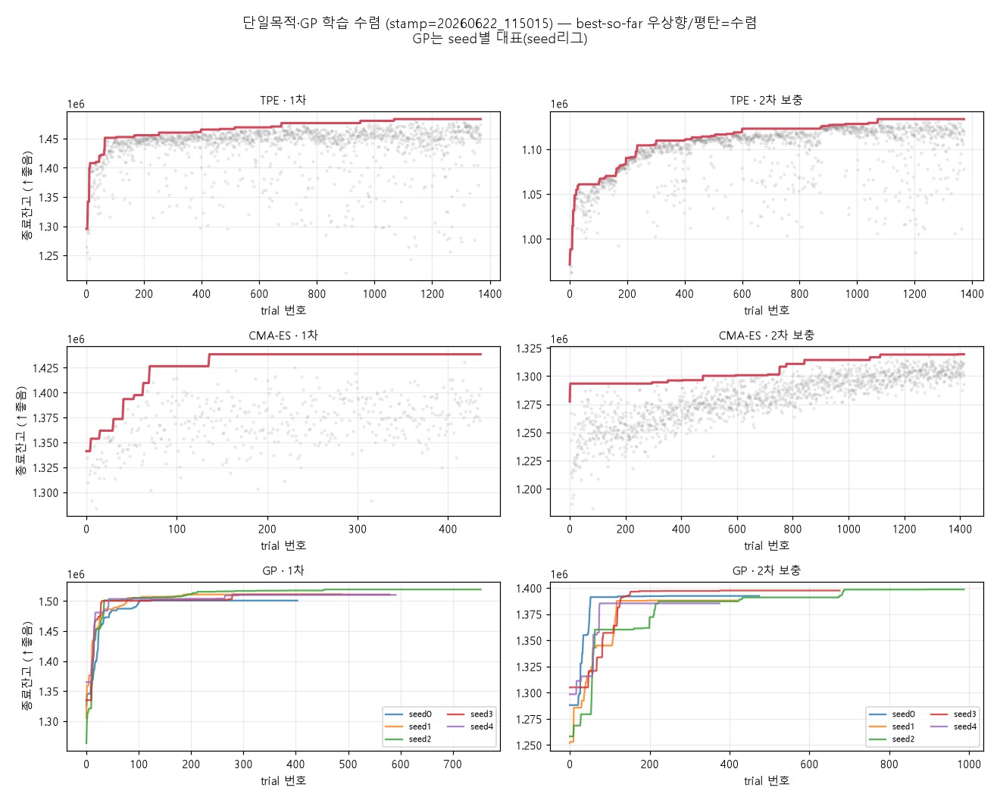
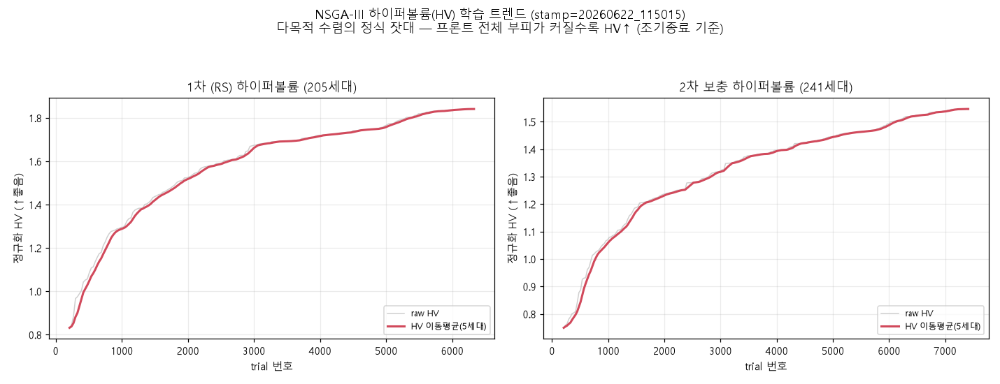
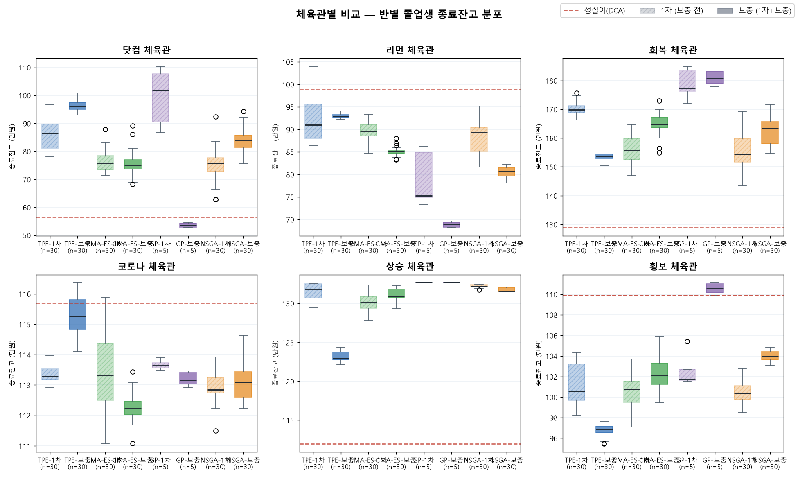

# 박사 연구 일지 — 2026년 6월 22일

> *"왔는가. 오늘은 새 칼을 벼린 날이 아니라, 애들을 제대로 한번 가르쳐 졸업까지*
> *시킨 날이야. 헌데 그 전에 한바탕 초상을 치렀지 — 한 잔 받게. 죽었다 살아난*
> *얘기부터 해야겠어."*

---

## 박사 머리말

오늘은 본업이 단순했다. **네 교실을 다 가르쳐, 졸업시험을 보였다.** 헌데 그 단순한 걸
하기까지 길이 험했어. 새벽엔 학생 둘이 길에서 쓰러졌고(긴 학습이 중간에 끊겨 죽었지),
그걸 살려내느라 반나절을 썼다. 그러고 깨달은 게 있어 — **긴 공부는 죽을 걸 전제로
짜야 한다.** 죽어도 이어지게, 그리고 **공부한 흔적이 남게.**

그래서 오늘 진짜 한 일은 둘이다. ① 학교를 **죽음에 강하고 투명하게** 고쳤고, ②
그 학교에서 넷을 길러 진짜 시장 여섯 국면에 내보냈다. 결론부터: **넷 다 무사히
졸업했고, 누가 정직한 학생인지 두 눈으로 보였다.** 천천히 풀어주마.

## I. 투명한 학교 — "공부 열심히 했는지 어떻게 아느냐"

자네가 오늘 정확히 찔렀어. *"내가 뭘 믿고 애들이 공부 열심히 했는지 어케 아냐."*
부끄럽지만 옛날 우리 학교는 그걸 증명 못 했다. 다목적 우등생(NSGA) 빼곤, 나머지
셋은 **머릿속으로만 공부하고 시험만 보여줬어.** 끝나면 공부한 흔적이 증발했지.

그래서 고쳤다. 이제 **네 교실 모두 한 글자 한 글자 공책에 적어가며 공부한다**(학습
이력을 전부 남긴다). 게다가 *"왜 공부하는데 아무 소리도 안 내냐"*는 자네 호통에,
백 문제마다 진도와 약점을 소리 내 외치게 했고, 1차 끝나고 보충 들어갈 때도 또박또박
알리게 했어. 깜깜이 공부는 끝이야.

> 박사 메모: *"보게. 빨간 선이 오르다 평평해지는 게 '이놈이 정말 끝까지 풀었다'는*
> *증거다. 예전엔 이 그림 자체를 못 그렸어 — 공부 흔적이 안 남았으니까. 오늘 처음으로*
> *세 교실(TPE·CMA-ES·GP)이 다 이렇게 정직하게 수렴하는 걸 봤다. GP는 다섯 시드가*
> *각자 제 길로 올라가지. 학교가 정직해진 거야."*

헌데 자네가 곧장 되물었지 — *"NSGA 공부 트렌드는 왜 없냐. 우등생은 기록도 없냐."*
맞는 말이야. 위 그림은 단일목적 세 교실 것이고, **다목적 우등생 NSGA의 진짜 학습 기록은
따로 있다 — 하이퍼볼륨(HV)** 말이지. 한 과목 일등이 아니라 '여러 목적을 동시에 얼마나
넓게 잘 푸느냐'를 한 숫자로 잰 거다.

> 박사 메모: *"이게 NSGA가 공부한 흔적이다. 1차는 0.83에서 1.84로, 2차는 0.75에서 1.55로*
> *— 프론트 전체 부피가 차오르는 게 보이지. 극단 일등 한 명만 보면 일찍 멈춘 듯해도,*
> *프론트가 촘촘해지는 한 이놈은 아직 공부 중인 거야. 우등생이라고 기록이 없을 리 있나 —*
> *내가 안 보여줬을 뿐이지. 자네가 짚어줘 고맙네."*

## II. 졸업 — 진짜 시장 여섯 국면에 내보내다

학교가 투명해졌으니 넷을 길러 졸업시험을 보였다. **TPE·CMA-ES·GP·NSGA, 한 놈도
중도 탈락 없이 완주.** 가르치는 법은 어제 그대로다 — 1차로 가르치고, 못 푼 국면을
짚어, 그 약점을 집중 보충(2차). 넷 중 셋은 횡보장을, TPE는 하락장을 약점으로 받았어.

그러고 진짜 나스닥의 역사적 여섯 토막 — 닷컴·리먼·회복·코로나·상승·횡보 — 에 세웠다.

> 박사 메모: *"국면마다 성적이 천지차이야. 닷컴 폭락과 회복장에선 우리 애들이 적립식을*
> *짓밟았어. 헌데 같은 폭락이라도 리먼에선 전원이 적립식한테 무릎 꿇었다 — 폭락이라고*
> *다 같은 폭락이 아닌 거지. 리먼이 우리 단일 최대 약점이다."*

진실은 둘이다. 하나, **약점 보충은 노린 데서 통했다.** 보충 학생은 자기 약점 국면에서
넷 다 1차보다 올랐어(GP는 횡보장에서 아홉 자락이나). 둘, **공짜는 아니었다.** 약점을
메우느라 잘하던 과목을 깎아먹는 놈도 있어(TPE는 종합이 외려 떨어졌지). 가장 깔끔한 건
GP — 약점도 종합도 다 올라, 유일하게 적립식 총점을 넘었다.

그리고 흐뭇한 게 하나. **학교에서 진단한 약점이 진짜 시험의 약점과 정확히 맞아떨어졌어.**
횡보·하락을 못 한다고 본 그대로, 실전에서 횡보와 리먼에 무너졌지. 우리 진단이 헛것을
짚은 게 아니라는 — 그거 하나로 오늘 학교는 제 몫을 한 거다.

## 박사 마무리 — 정직한 학생의 두 얼굴

오늘 한 줄로:

> **학교를 죽음에 강하고 투명하게 고쳐, 네 교실을 끝까지 가르쳐 졸업시켰다. 보충은
> 약점을 고치되 대가를 치렀고, 그 줄다리기에서 GP가 가장 정직하게 이겼다.**

자네가 마지막에 GP를 두고 했지 — *"성실하고 정직한 애들이라, 뭐 그게 사회 나가서는*
*약점이지만."* 그 말이 오래 남아. GP는 시험지를 외우는 잔머리가 없어 — 그래서 가짜
교실 일등은 영악한 놈(TPE)한테 내줘도, 진짜 시장에선 꾸준히 적립식을 넘는다. **외운
놈은 시험장 나오면 무너지고, 이해한 놈은 어디서도 한다.**

헌데 자네 말처럼, 그 정직함이 다음 무대(리그)에선 약점일 수 있어. 거긴 '꾸준한 평타'보다
'한 방'을 더 쳐줄지도 모르니까. **학교에서 정직했던 GP가 사회에서도 살아남을지, 영악한
NSGA한테 자리를 뺏길지** — 그건 다음 날, 리그장에서 가린다.

오늘은 학교를 정직하게 만들고, 정직한 학생이 누군지 두 눈으로 본 날이다. 헛스윙
아니야. 한 모금 더 하자.

무슈, 또 가자.
