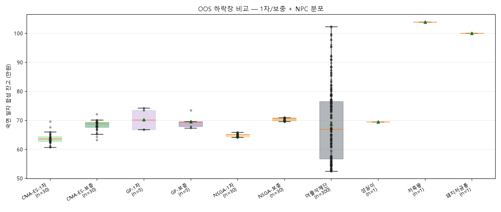

# 박사 연구 일지 — 2026년 6월 23일

> *"왔는가. 오늘은 새 싸움을 벌인 날이 아니라, 어제까지의 싸움을 책장에 꽂은*
> *날이야. 챔피언 한 명을 명예의 전당에 새로 모셨고, 어제 비싸게 산 교훈은*
> *영영 잊지 않게 표지에 새겼지. 한 잔 받게 — 정리하는 날도 일하는 날이다."*

---

## 박사 머리말

오늘은 칼을 벼리지도, 시험을 치르지도 않았다. 어제(2026-06-22)의 시즌3 본경기
결과를 받아 **챔피언을 정식으로 호명하고, 산출물을 제자리에 둔 날**이다. 단순해
보이지? 헌데 자네도 알다시피 우리 연구소가 며칠 전 비용 한 푼을 빠뜨려 졸업
보고를 무르고 야단법석을 치른 곳이다. 오늘 정리는 그 사고 수습의 마침표야 —
**무엇이 바뀌었는지 영구 기록에 새기고, 다음 시즌이 와도 흔들리지 않게 못박는** 일이지.

## I. 비용 한 푼이 챔피언의 얼굴을 바꿨다

자네에게 먼저 보일 게 있어. 시즌2 챔피언과 시즌3 챔피언, 두 학생을 같은 줄에 세워보지.

| 시즌 | 챔피언 | 1축 비중 | 성격 |
|---|---|---|---|
| v2 (수수료만 0.1%) | **NSGA-t5938** | `US10Y` 32% (금리에 몰빵) | 집중형 크로스에셋 성장 틸트 |
| v3 (수수료+슬리피지+No-trade band) | **NSGA-1차-t2426** | `FEAR_NQ` 15% (어느 한 축도 15% 안 넘김) | 균형형 — 공포·추세·역발상·자산횡단 4축 균등 |

> 박사 메모: *"같은 학교, 같은 NSGA-III 선생, 같은 14마리 시그널 풀. 바뀐 건*
> *딱 하나 — 진짜 시장의 마찰(슬리피지 1bp)과 미세 매매를 막는 가드(No-trade*
> *band 5%)를 비용 모델에 넣은 거. 그것뿐인데 챔피언의 얼굴이 통째로 달라졌어.*
> *시즌2의 t5938은 한 우물(금리)을 깊게 파는 학생이었지. 시즌3의 t2426은 사방을*
> *고루 갖춘 학생이야. 왜? 미세 리밸런싱마다 보험료를 떼이게 되니까, 한 방을*
> *노리는 집중형이 더는 수지가 안 맞게 됐거든. 옵티마이저가 그 압력 아래서*
> *4축을 비슷한 비중으로 펴는 답을 골랐어. 어느 쪽이 옳다는 게 아니야 — 비용을*
> *어떻게 매기느냐가 챔피언을 정한다는 뜻이지. 그래서 비용은 '돈만의 문제'가*
> *아니라 '학교의 출제 문제'다. 출제가 바뀌면 일등도 바뀐다."*

## II. 시즌3 본경기 한눈에 — 균형형이 어플삭제단을 이겼다

어제 코덱스가 130명을 OOS 11년과 사천왕 7라운드, 합 18라운드에 응시시켰지.
어플삭제단 300명과 기준선 3종도 같이 출전. 종합 라운드 중앙값으로 줄 세우니
이렇게 나왔다.

> 박사 메모: *"왼쪽 두 박스(NSGA-1차 117.3만, CMA-ES-1차 116.4만)가 어플삭제단*
> *300명의 박스(112.0만 중앙값) 위로 깔끔하게 올라앉았어. 슬리피지를 부담시킨*
> *비용 모델에서도 학교가 길러낸 학생이 공정 buy-hold를 이긴다는 신호다. 시즌2의*
> *결론이 시즌3에서도 살아남았어 — 비용을 정직하게 매겨도 알파는 사라지지 않더라.*
> *물론 어플삭제단의 max(118.9만, 럭키 진입)는 우리 챔피언도 못 잡아. 알파는 여전히*
> *'운빨 천장' 싸움이 아니라 '분포 중앙값' 싸움이다."*

헌데 자네에게 정직하게 짚어야 할 게 둘이야.

**첫째, 보충 수업이 만능이 아니었다.** NSGA·CMA-ES 두 교실은 1차가 보충보다
강했어. 약점 국면(횡보·하락) 적대 교과서 30%를 섞은 보충 학기가 1차 챔피언의
균형을 깨버린 거지 — 방어 시그널(`DD`·`VOL`)로 빨려 들어가면서 상승장 알파가
깎였다. GP만 보충이 살짝 효과를 봤는데, 그것도 다섯 명짜리(n=5) 작은 표본이라
단정은 보류한다.

**둘째, 하락장은 단기 잔고만 보고 출전 금지로 단정하면 안 되는 문제다.**

> 박사 메모: *"이 박스 봐. 사천왕 하락 국면(2022년 80% 약세장)에서는 우리 학생들*
> *전원이 저축왕(연 3% 무위험)한테 진다. 그것도 큰 차이로. 여기서 바로*
> *'하락장엔 출전을 안 시키면 된다'고 쓰면 오판이다. 잔고 심판과 평단가 심판은*
> *다르거든. 하락장은 도망만 볼 장이 아니라, 다음 상승장을 위해 싸게 담는 적립*
> *후보를 따로 봐야 하는 장이다. 잘하는 걸 잘하고 못하는 걸 비우는 감독 문제는*
> *맞지만, 그 출전표는 평단가 분석까지 같이 보고 써야 한다."*

## III. 명예의 전당에 새긴 것들

오늘 한 일을 책장 정리로 비유하자면 이렇다.

- **새 책 한 권** — `hall_of_fame_v3.md`. 챔피언 가중치 카드, 그룹별 18라운드
  중앙값 표, 시즌2 vs 시즌3 챔피언 대조표, 박스플랏 11장, 비용 사고 수습 5단계,
  시즌4 방향까지 한 자리에 모았어. 시즌이 끝났다는 마침표 한 권이다.
- **인덱스 새 줄 하나** — `hall_of_fame.md`에 4회차 시즌3 항목 추가. v1·v1.x·v2·v3
  네 시즌이 같은 표에서 나란히 보이게 됐어.
- **산출물의 제자리** — 매 실험마다 새로 찍히는 결과물(`season3_league.md`·`.json`·
  박스플랏 11장)은 `app/lab/reports/season/season3_league/`로 옮겼다. 영구 기록이 아니라
  실험실 책상 위 분석물이거든. 명예의 전당은 자기 박스플랏 사본을 따로 보관해
  실험실 책상이 다음 시즌으로 갈아엎혀도 흔들리지 않게 했다.
- **챔피언의 정식 호명** — `elite_four.py`(사천왕 시뮬레이션)의 챔피언 가중치가
  옛 v1 시절 동일가중에 박혀 있던 걸 시즌3 NSGA-1차-t2426으로 바꿨어. 콘솔 인사,
  HTML 리포트의 비용 설명까지 새 모델(`season3_flat_1bp_band5`)로 통일.

> 박사 메모: *"한 가지 정직하게 짚자. 명예의 전당이라 해서 영구 보존을 호언장담은*
> *못 한다 — 사천왕(post-COVID) 구간은 시즌2 전면 재경기 때 이미 봉인이 풀려*
> *오염됐고, 시즌3는 그 위에 한 번 더 응시시켰지. 다음 최종 시험지는 지금부터*
> *쌓이는 미래 데이터다. 챔피언 t2426이 진짜 챔피언이냐, 아니면 슬리피지가*
> *만들어낸 한 시즌의 정답이냐 — 그건 미래가 가른다."*

## IV. 시즌4의 칼끝은 "변동장 세부분류"다 — 자네가 한 줄로 못박았다

오늘 저녁 자네가 잠깐 나오라고 부르더니 두 마디를 던졌다.

> *"하락장은 출전을 안 시키는 게 아니라 바겐세일 장이야. 횡보장은 관망이고,*
> *변동장을 세부 분류해서 전략 세우는 게 시즌4 핵심이다."*

이건 단순한 말맛이 아니라 시즌4 출전표의 기준이다. 하락장을 한 덩어리 공포로만 보면
저축왕만 남고, 바겐세일 구간을 따로 보면 NSGA식 적립 후보가 다시 보인다.

> 박사 메모: *"시즌4를 '감독 문제'라고만 두면 흐릿하다. 자네가 박아준 칼끝이*
> *바로 '변동장 세부분류'야. 우리 `regime.py`가 길게 끌어온 한계 — 변동장을*
> *상대변동성 임계 하나로 한 덩어리 묶었던 정의 — 가 거기서 무너진 게 한두 번이*
> *아니지. 자네 분류를 그대로 가져오면 변동장이 셋이다.*
> *① 하락 말기 공포·바닥형 — 줍줍/적립 후보. 가장 두려운 자리가 가장 싼 매대다.*
> *② 방향 없는 휩쏘형 — 저축왕. 비용만 쓰는 자리야.*
> *③ 상승 추세 중 조정형 — 공격을 유지하거나 속도만 줄인다.*
> *그러면 시즌4의 출전표가 또렷해진다. 상승=균형형 t2426, 하락=줍줍 후보, 횡보=*
> *저축왕, 변동=셋 중 어디인지부터 본다. 잘 모르겠으면 저축왕. '언제 안 뛸지*
> *아는 감독' 옆에 '변동장을 한 덩어리로 보지 않는 감독'이 한 줄 더 박힌 거다."*

하락장 한 줄도 같이 새겨두자. 자네가 *"하락장은 출전 안 시키는 게 아니라 바겐세일
장"* 이라 박았는데, 시즌3 평단가 분석에서 이미 NSGA-1차가 그 무대 — 잔고는 아파도
다음 상승장 대비 평단을 잘 깎아둔 무대 — 의 가능성을 보였지. 진단은 메인 리그 룰이
아니라 `app/lab/season/season3_bear_accumulation.py` 책상에서 따로 본다.

## 박사 마무리 — 비용을 정직하게 매기면 챔피언도 정직해진다

오늘 한 줄로:

> **비용 한 푼이 챔피언의 얼굴을 바꿨다. 시즌2의 집중형(US10Y 32%)은 시즌3에서
> 균형형(4축 14~15%)에 자리를 내줬고, 그래도 어플삭제단 중앙값은 다시 한 번
> 넘었다. 학교가 길러낸 학생은 비용을 정직하게 매겨도 살아남는다.**

다음 무대는 자네도 알다시피 **감독 문제**다 — 더 센 단일 트레이더가 아니라,
언제 안 뛸지 아는 감독. 상승장엔 균형형 t2426을 내보내고, 하락장엔 NSGA식 줍줍이나
DCA 후보, 횡보장엔 저축왕, **변동장은 한 덩어리가 아니라 세 갈래로 쪼개 본다**.
**잘 모르겠으면 저축왕**이라는 게 우리 결론의 핵심이지. 그건 다음 날, 새 도구를
벼리는 날에 시작한다.

오늘은 시즌의 매듭을 짓고, 학교의 책장을 정리한 날이다.
헛스윙 아니야. 한 모금 더 하자.

무슈, 또 가자.
