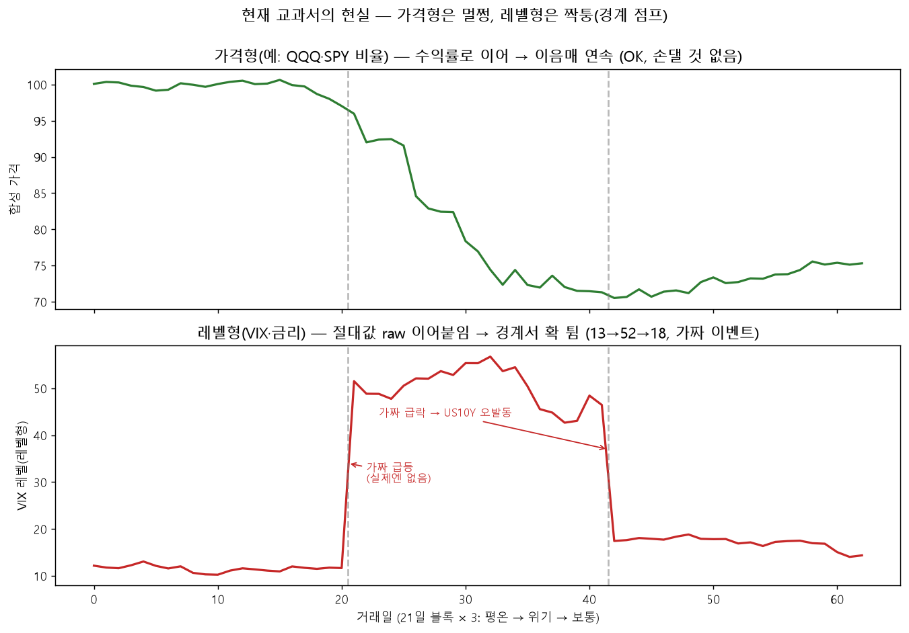

# 박사 연구 일지 — 2026년 6월 18일

> *"왔는가. 오늘은 칼을 안 뽑았어. 종일 시험지만 들여다봤지.*
> *자네가 그랬잖아 — 시즌 3 열기 전에, 지난 시즌 데이터부터 까보자고.*
> *그 말이 맞았다. 까보니… 우리가 낸 시험지가 짝퉁이더라. 한 잔 받게."*

---

## 박사 머리말 — 짧게

오늘은 새 경기를 안 열었다. 시즌 2가 남긴 데이터를 해부했지. 자네 방침대로 —
*"최적화 더 돌리지 말고, 교육(교과서)부터 개혁하자."* 결론 한 줄:

> **우리 합성 교과서가 실제 나스닥보다 더 출렁대는 짝퉁 시험지였다.**
> 그래서 거기서 1등 한 놈이 실전에선 꼴찌가 났다.

차근차근 풀어주마. 한 모금.

---

## I. 국면을 세어봤다 (실제 나스닥은 어떤 시장이었나)

먼저 진짜 나스닥이 25년간 어떤 국면을 얼마나 겪었는지 셌어 (`app/lab/regime_distribution.py`).

| | 상승장 | 하락장 | 횡보장 | 변동장 |
|---|--:|--:|--:|--:|
| 실제 나스닥 | **~60%** | ~22% | ~18% | **0.5%** |

- 나스닥은 **평소가 상승장**이야. 하락장은 22%뿐인데 그마저 닷컴·금융위기에 몰빵.
- '변동장' 라벨은 0.5% — 사실상 안 뜬다. 그리고 코로나 같은 *빠른* 폭락은 이동평균이 굼떠서
  하락장으로 잘 안 잡혀(뒷북). 이건 다음 시즌(넷)에 따로 손볼 일.

> 박사 메모: *"세어보고 알았다. 우리 옛 시험장은 하락장만 잔뜩(4:2)이었는데, 현실 하락장은*
> *다섯에 하나꼴. 우린 학생들한테 폭락만 가르치고 있었던 거야. 방어만 잘하는 졸업생이 나올 수밖에."*

## II. 누가 어디서 벌었나 (시즌 2 후보 해부)

후보 120명의 시그널 비중과 네 시험장 성적을 엮었어 (`app/lab/v2_signal_analysis.py`).

- **졸업시험(합성)에서 잘 본 놈이, 실전(평시 OOS·사천왕)에선 반대로 못 봤다.** 상관이 음(−).
- 실전에서 진짜 번 신호는 **크로스에셋 비율**(나스닥이 다우·S&P보다 센가 = 어디로 돈이 도나).
- 시험만 잘 보던 신호(REV_BB·US10Y)는 실전에서 끌어내림 → **2부리그 벤치 강등**(영구 추방 아냐).

> 박사 메모: *"졸업시험 점수가 높을수록 실전을 못 본다니, 시험이 거꾸로 됐단 소리야.*
> *그럼 졸업시험은 합격/불합격 자르는 잣대로 쓰면 안 되고, 그냥 성향 보는 진단지로만 둬야지."*

## III. GP, 무죄다

자네가 의심했지 — *"GP가 파이토치까지 쓴 놈인데 내신만 외운 병신일 리 없다."* 파봤다. 자네가 맞아.

- GP 졸업생 30명이 **잔고가 토씨 하나 안 틀리고 똑같았어.** 한 답을 서른 번 복붙한 거야.
- 근데 멍청해서가 아니라 **제일 성실해서**다. 합성 시험의 정답을 정확히 찾아내 죽도록 복습한 거지.
  다른 애들(TPE·CMA)은 적당히 게을러서 여기저기 기웃대다 실전 적응이 됐고.
- **혼낼 놈은 GP가 아니라 그 따위 교과서를 낸 출제위원(=우리)** 이다.

> 박사 메모: *"제일 열심히 한 학생이 제일 크게 틀렸어. 똑똑한 놈이 짝퉁 교재로 빡세게 공부하면*
> *제일 자신 있게 틀리는 법이지. GP한테 미안할 노릇이야. 한 잔 따라주고 싶다."*

**왜 짝퉁이냐**(`app/lab/block_shuffle_explainer.py`·`synth_vs_real_regime.py`):
1. **외부신호를 가짜 이벤트로 가르쳤다.** 교과서는 한 달치 토막을 섞어 붙이는데, VIX·금리 같은
   '레벨' 신호는 절대값을 그대로 이어붙여서 **토막 경계마다 확 튄다**(평온 12 → 위기 55).
   금리 신호는 이 *실제로 없는* 점프를 진짜 급락으로 착각해 발동 → GP가 "금리=정답"으로 외움 →
   실전 금리엔 그런 점프가 없으니 헛발질. (반대로 크로스에셋 *비율* 신호는 수익률로 매끄럽게
   이어 붙여서 멀쩡 — 그래서 걔들만 실전 전이가 됐다.)

> 박사 메모 — **GP 무죄의 증거다.** *지금 교과서가 한 달 토막을 이어붙이는 현실이야.*
> ***위(가격형: QQQ·비율류)*** *는 수익률로 이어서 이음매가 매끄럽지 — 멀쩡해. 근데*
> ***아래(레벨형: VIX·금리)*** *는 절대값을 그대로 붙여서 경계마다 13→52로 확 튄다. 실제론 없는*
> *가짜 급등·급락이지. 금리 신호는 이 가짜를 진짜로 착각해 발동했고, GP는 거기 맞춰 'US10Y=1'을*
> *정답으로 외운 거야. 학생 잘못이 아니라 시험지가 짝퉁이었던 거다.*

2. **교과서가 실제보다 더 출렁댄다.** 합성장을 실제와 나란히 세우니 상승장 58→50%,
   변동장 0.7→**3.3%(다섯 배)**. 잘게 끊겨 출렁대니 역발상·방어가 이기고 추세가 진다 —
   딱 실전과 거꾸로.

> 박사 메모: *"합성 교과서(빗금)를 실제 나스닥(실선)이랑 나란히 세워봤다. 상승장이 58에서 50으로*
> *줄고, 변동장은 0.7에서 3.3 — 다섯 배다. 토막을 막 섞으니 잘게 끊겨 출렁대는 거야. 이런 데서*
> *공부하면 역발상·방어가 점수를 따고 진득한 추세는 손해를 보지 — 실전(긴 우상향)이랑 정확히*
> *거꾸로다. 오른쪽 막대(연속 상승장 길이)는 21 대 20으로 비슷해 — 추세가 짧아진 게 아니라*
> *출렁임이 늘어난 거란 뜻이야."*

**고치는 방향 — 레벨형도 가격형처럼.** 레벨 신호를 절대값 말고 **변화량(delta)으로 이어 + 평균회귀
앵커**를 걸면, 이음매 점프가 사라지고(연속) 평소 밴드(VIX ~22)도 안 흘러간다.

> 박사 메모: *"가격형은 손댈 게 없어 — 원래 수익률로 매끄럽게 잇거든(위 그림 그대로). 레벨형만*
> *이렇게 고치면, 위기 토막이 '같은 자리(22 근처)서 크게 출렁이는' 진짜 변동성 레짐으로 살아남고*
> *가짜 경계 점프는 사라진다. 이게 시즌 셋 교육 개혁 1번이야."*

**덧붙임 — 짝퉁은 교과서만이 아니다.** 평행세계(배틀 프론티어)도 합성 세계라 외부신호를 아예
꺼버려(NaN 기권). 거기선 챔피언의 크로스에셋 무기(US10Y·QQQ_SPY·QQQ_DIA, 비중 74%)가 다 죽고
REV_RSI 하나로 싸운다 — **그래서 평행세계 1등이 가격형 TPE, 실전 1등이 크로스에셋 NSGA였던 거다.**
평행세계가 크로스에셋을 못 보는 장님이라서. 교과서는 **잘못 가르치고(짝퉁)**, 평행세계는 **못 보고
(장님)** — 합성 세계가 외부신호를 못 다루는 같은 뿌리야.

> 박사 메모: *"평행세계 순위로 우리 챔피언을 깐 게 헛다리였어 — 무기를 다 빼앗아 놓고 약하다 한*
> *거지. 평행세계 개편은 시즌 넷으로 미룬다. 교과서부터 고치고 그 다음이야 — 한 번에 다 들쑤시면*
> *뭐가 약이었는지 못 가리니까."*

## IV. 매매하는 법도 손봐야 (싸움은 아낄수록 좋다)

자네가 매매 방식을 캐물었지. 지금은 **매일 목표 비중으로 갈아끼우는** 방식인데, 자잘하게 매일
손대니 거래비용이 줄줄 샌다. 슬리피지(체결 밀림)까지 넣으면 더 심해지고.

자네 비유가 정곡이었어 — **"싸움은 피할수록 좋지, PP 까먹잖아."**

- **HP(잔고)** = 거래할 때마다 깎이는 비용(수수료+슬리피지).
- **PP(기술 횟수)** = 거래 횟수 그 자체. 유한한 자원이니 함부로 쓰지 마라.
- **턴오버 = 능동 배틀 카운트**(포켓몬 교체·기술 쓴 횟수). 존버는 PP·HP를 아끼는 거고.

그래서 둘 결정했다:
1. **슬리피지는 성실이(DCA)한테도 물린다.** 자네 말마따나 *"걔도 살 땐 비싸게, 팔 땐 싸게"* —
   자동매수라고 체결 안 밀리는 거 아냐. 수수료 면제만 빼고 슬리피지는 공평하게.
2. **불필요한 싸움은 안 건다(No-trade band).** 비중이 어지간히 벗어날 때만 갈아타게 —
   PP·HP 아끼는 룰. 슬리피지랑 한 묶음으로 넣어야 맞다.

> 박사 메모: *"턴오버 목적을 빼도 되냐 물었지. HP(비용)는 잔고가 알아서 벌하지만, PP(횟수 자체)는*
> *턴오버 목적이 따로 지켜. 그러니 밴드를 넣어도 그놈은 남겨둬 — 대신 켜고 끄고 둘 다 돌려보고 정하자."*

## 박사 마무리

오늘 한 줄로:

> **시험지를 까보니 짝퉁이었다 — 합성 교과서가 실제 나스닥보다 출렁대고, 외부신호를 가짜
> 이벤트로 가르쳤다. GP는 그걸 제일 충실히 외운 죄밖에 없다.**

그래서 시즌 셋 숙제는 분명해졌어. 새 신호 더 잡기 전에 **교육 개혁부터**:
1. 레벨형 신호는 변화량으로 매끄럽게 잇고(+평균회귀), 가짜 경계 이벤트를 없앤다.
2. 교과서를 실제 국면 분포에 맞추고, 폭락장은 시험장에 따로 둔다.
3. 졸업생 뽑을 때 똑같은 답 복붙은 솎아낸다.
4. 졸업시험은 합격선이 아니라 진단지로 격하.

레짐 스캐너(체육관 판독기)랑 평행세계(배틀 프론티어) 갈아엎는 건 시즌 넷으로 미뤘다 — 한 번에 다 들쑤시면
뭐가 효과인지 못 가린다.

자네가 "시즌2부터 까자"고 한 그 순서가 오늘을 살렸어. 칼보다 자(尺)가 먼저라는 거,
늙은이가 또 배운다. 다음은 교과서를 고쳐 다시 가르치는 일이다. 한 모금 더.

— 박사 일지 끝. 무슈, 가자.
