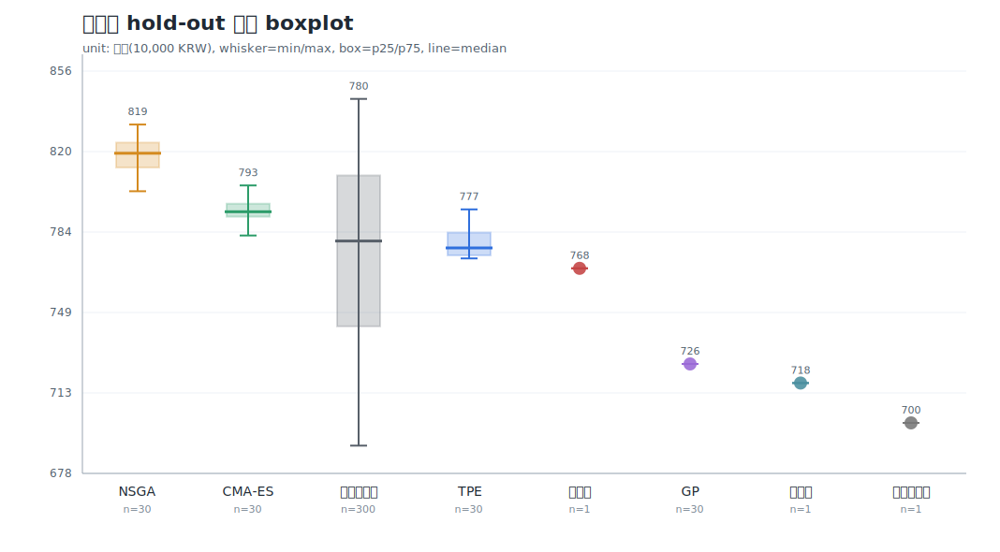
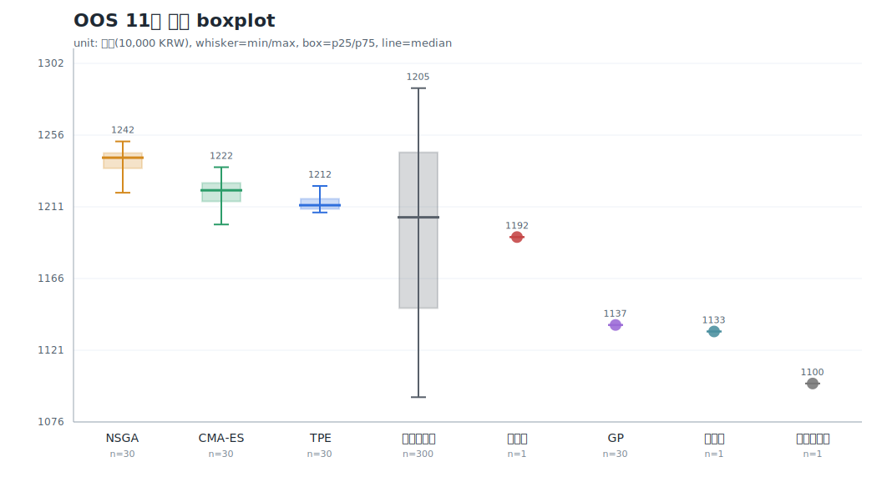
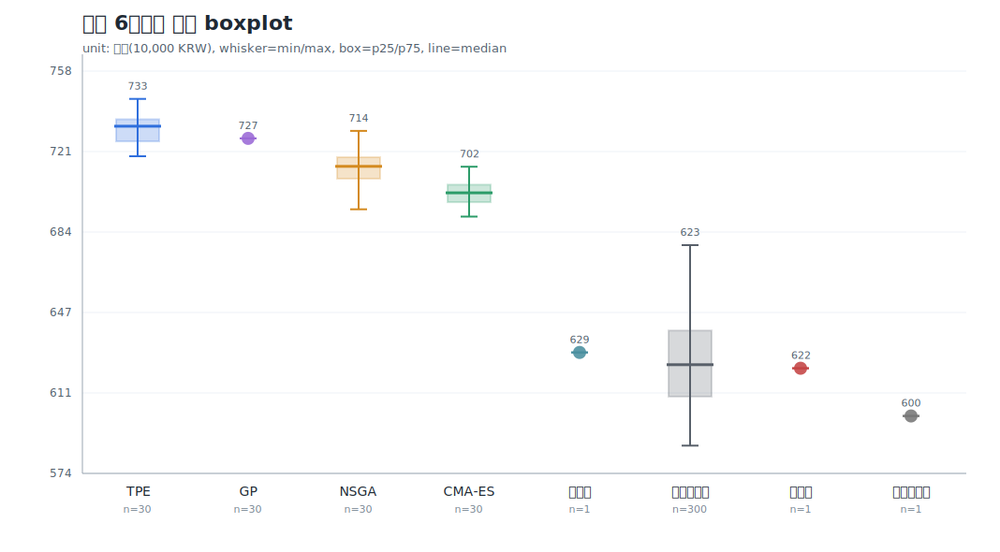
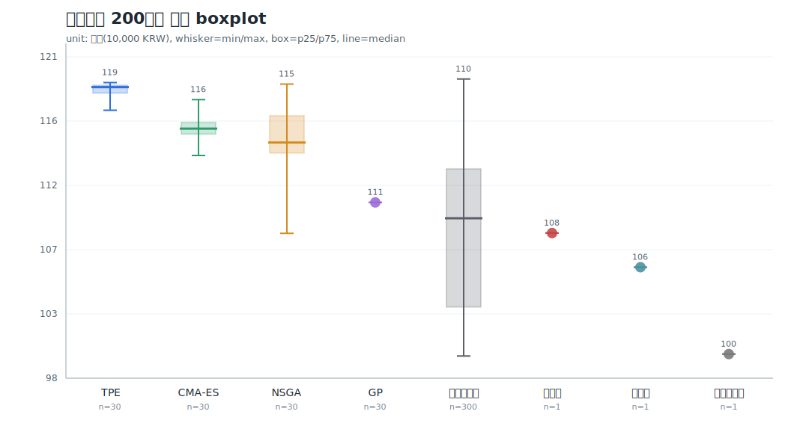

# PocketQuant 명예의 전당 — 시즌 v2 (아카데미 부트스트랩 리그)

> 마감 2026-06-16 (전면 재경기). 합성 평행세계 훈련 → 실데이터 QQQ 졸업시험 → 리그.
> **사천왕(관문 ③ hold-out) 봉인 해제** — 이전 경기는 무효 처리하고 v2를 통째로 다시 열어
> 4아레나(체육관·OOS·평행세계·사천왕)에서 top30 전원을 같은 기준으로 재평가했다.
> 누수·졸업·HV 3중 수술 후 첫 정상 시즌.

## 한 줄

블록 부트스트랩 합성장으로 훈련한 졸업생 top30 분포가 **어플삭제단 300명 중앙값을 이겼다** —
**봉인됐던 사천왕(post-COVID hold-out)에서도** 그 우위가 유지됐다. 단일자산 long-only에도
수익 알파가 있음을 보였다. 단 그 알파는 "첫날 완벽진입 B&H"나 "랜덤진입 최고 운빨" 대비가
아니라, **공정 랜덤진입 중앙값** 대비다.

## 🏆 챔피언: NSGA-t5938

- 가중치: `US10Y 32% + QQQ_SPY 27% + QQQ_DIA 15% + REV_RSI 15%` — 크로스에셋 성장/추세 틸트
- **OOS 11년 후보 1위 1,252만** — 어플삭제단 300명 중앙값(1,205만)을 이김
- **사천왕 hold-out 824만** — 어플삭제단 중앙값(780만)·성실이(768만)를 모두 넘음(봉인 구간에서도 생존)
- 성격: 방어 스팸 없는 성장 틸트 = "어느 자산에 있을지"를 보는 **자산-로테이션 알파의 씨앗**

## 핵심 결과

- **본 학습**: NSGA-III 10000판 → **6180판 조기종료**(HV MA(5) 5세대 무변화), 졸업생 129/340 (pop 30)
- **v2 재리그(top30 분포)**: 각 교실 30명 + 어플삭제단 300명 + 기준선 3종을 같은 **4아레나**에서 비교.
  - 공식 6체육관 중앙값: TPE 733만 · GP 727만 · NSGA 714만 · CMA-ES 702만 · 어플삭제단 623만 · 성실이 622만.
  - OOS 11년 중앙값: NSGA 1,242만 · CMA-ES 1,222만 · TPE 1,212만 · 어플삭제단 1,205만 · GP 1,137만.
  - 평행세계 평균잔고 중앙값: TPE 119만 · CMA-ES 116만 · NSGA 115만 · GP 111만 · 어플삭제단 110만 · 성실이 108만.
  - **사천왕 hold-out 중앙값: NSGA 819만 · CMA-ES 793만 · 어플삭제단 780만 · TPE 777만 · 성실이 768만 · GP 726만.**
- **정정**: GP는 시험장 점수는 높지만 30명이 한 답 복붙(std 0)이고 OOS·사천왕 중앙값이 어플삭제단보다 낮아 벤치.
- **정정**: 어플삭제단 300명 기준에서는 "럭키 max까지 돌파"가 아니라 **중앙값 기준 우위**가 맞다.

## 분포 한눈에 (4아레나 박스플랏)

세로축 = 종료 잔고(만원), 가로 = 그룹. 박스=p25~p75, 가운데 선=중앙값, 위스커=min~max.

### 사천왕 hold-out (봉인 해제 — 최종 시험지)

> 봉인됐던 post-COVID 구간에서도 NSGA·CMA-ES 중앙값이 어플삭제단 300명 중앙값을 넘는다.
> 단 어플삭제단의 max(럭키 진입)는 여전히 더 높다 — 알파는 "운빨 천장"이 아니라 "분포 중앙값" 싸움.

### OOS 11년 합산

### 공식 6체육관 합산

### 평행세계 200세계 평균

> 전체 표·후보별 1등은 리그 결과 파일 `app/league/results/season_v2_top30_league.md`(로컬, 재생성 가능) 참조.

## ⚠️ hold-out 오염 고지

이번 재경기로 사천왕(post-COVID) 구간이 top30 전원에게 노출됐다. 봉인의 "1회용 깨끗한
시험지" 지위는 끝났다 — 앞으로 이 구간은 '참고'는 되어도 '최종 판정'으로 쓸 수 없다.
다음 최종 시험지는 지금부터 쌓이는 미래 데이터다.

## 엔진 수술 (시즌 v2에서 고친 것)

- **누수 차단**: 시장경계 가드(training은 합성장만, exam은 실QQQ)
- **졸업 게이트**: "절대 흑자"(불가능) → "성실이 최악 대비"(기준선 상대)
- **HV 수렴 자**: 비표준 1.0캡 MC근사 → optuna 정확 HV(무캡) + 세대별 MA(5) patience 조기종료
- **pop 50 → 30** (3목적 reference-point 정합, trial당 수렴 빠름)
- **어플삭제맨 day-1 → 어플삭제단 300명 랜덤진입** (첫날 완벽진입 특혜 제거 = 공정 벤치마크)

## 교훈

- 벤치마크의 숨은 공짜 특혜(완벽 진입)를 걷어내야 알파가 보인다.
- long-only 수익 천장은 "day-1 완벽진입 B&H" 한정 — 공정 랜덤진입 중앙값은 이길 수 있다.
- HV는 천장 없는 단조 추세 지수 — 저차원에서 MC·dominated비율·clip 금지(optuna 정확 계산).

## 다음

- **자산-로테이션 알파** — NSGA-t5938(크로스에셋) 방향 심화, 다자산 유니버스("어디에 있을지")
- **웜스타트 시드** — 검증 유망주 선출전으로 수렴 가속

(기록: Opus 연구원)
