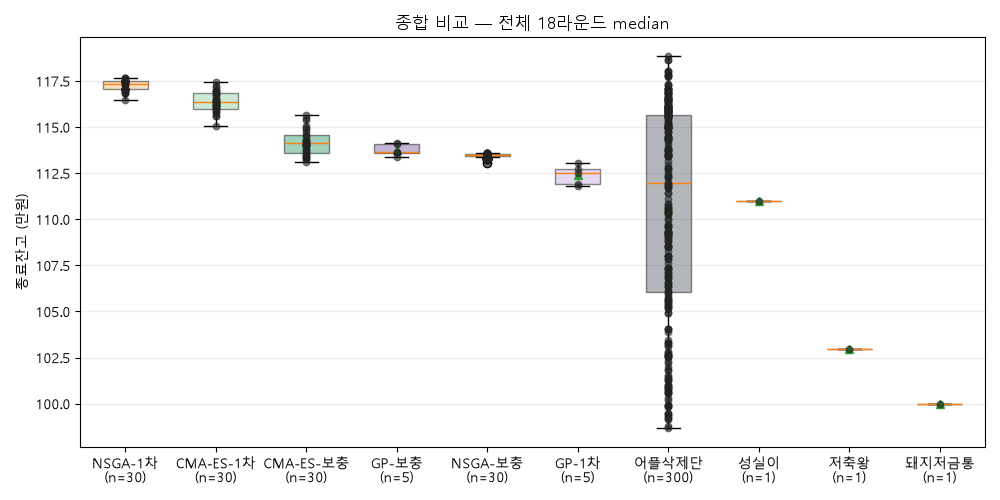
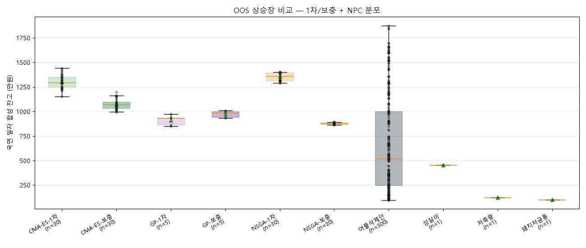
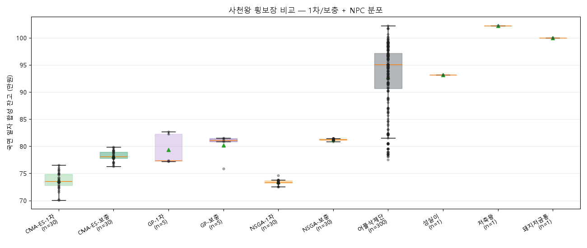

# PocketQuant 명예의 전당 — 시즌 v3 (비용 모델 완성 + 2단계 학교)

> 마감 2026-06-23. **비용 모델 사고 수습 후 첫 정상 시즌.** 위탁수수료만 반영하던
> 옛 학습 산출물은 게이트(`cost_model.complete=True`)로 입력 자체에서 차단하고,
> 슬리피지 1bp(전원 공통) + No-trade band 5%까지 박힌 비용 모델
> (`season3_flat_1bp_band5`)로 4교실(CMA-ES · GP · NSGA-III)을 1차+보충 2단계로
> 재학습한 뒤, 빅토리 로드 (OOS) 11년 → 사천왕 hold-out 7라운드 본경기를 쳤다.

## 한 줄

비용 모델이 박히자 챔피언의 모양이 바뀌었다. 시즌2의 집중형 크로스에셋 챔피언
(NSGA-t5938: US10Y 32% + QQQ_SPY 27%)이 졌고, **공포지수·추세·역발상 4축이
14~15%로 균형 잡힌 NSGA-1차-t2426**이 종합 1위로 올라섰다. 그러면서도 시즌3
NSGA-1차 30명의 분포는 **어플삭제단(공정 B&H) 300명 중앙값을 다시 한 번 넘었다**
— 슬리피지를 부담시켜도 알파가 살아남는다는 신호.

## 🏆 챔피언: NSGA-1차-t2426

- **학습 stamp**: `20260622_195214` · **비용 모델**: `season3_flat_1bp_band5`
- **종합 18라운드 median**: **117.7만원** (100만원 시드) — 그룹 1위(NSGA-1차 117.3만)
  중에서도 개인 1위
- **빅토리 로드 (OOS) 11년 median**: 109.6만 · **사천왕 7라운드 median**: 121.7만
- **성격**: 균형형 — 어느 한 축도 20%를 안 넘는다 (시즌2 챔피언이 US10Y 32%
  집중형이었던 것과 정반대)

### 가중치 카드 (정규화 후, %)

| 시그널 | 비중 | 분류 |
|---|---:|---|
| `FEAR_NQ` | 14.92% | 😱 나스닥 공포지수 (역발상) |
| `FEAR` | 14.84% | 😱 S&P 공포지수 (역발상) |
| `MA` | 14.64% | 🔥 200일 이평 (추세) |
| `REV_RSI` | 14.10% | 🌿 RSI 과매도 (이벤트형 역발상) |
| `VOL_SPIKE` | 10.88% | 📊 거래량 급증 + 음봉 |
| `QQQ_SPY` | 10.02% | 🚀 성장주 상대강도 |
| `QQQ_DIA` |  7.81% | 🏭 테크 vs 가치 |
| `VOL` |  6.87% | 💧 실현변동성 레짐 (방어) |
| `DXY` |  2.52% | 💰 달러 강세 |
| 그 외 4 | 합 3.4% | DD/MOM/REV_BB/SPY_TLT/US10Y (사실상 비활성) |

> 동률 후보(NSGA-1차-t2262/t2016)도 가중치가 사실상 같다. Pareto front 위에서 옵티마이저가
> 같은 자리를 여러 번 visit한 결과 — 챔피언은 단일 후보가 아니라 균형형 영역 전체로 봐도 된다.

> 시그널 파라미터(임계값 등)는 모두 기본값. 챔피언은 가중치만 학습됐다.

## 핵심 결과

**리그 규모**: 후보 130명 + baseline 303명 (어플삭제단 300명 + 성실이/저축왕/돼지저금통)

### 종합 median (18라운드 = 빅토리 로드 (OOS) 11년 + 사천왕 7라운드, 100만원 시드)

| 그룹 | n | overall median | 빅토리 로드 (OOS) median | holdout median |
|---|---:|---:|---:|---:|
| **NSGA-1차** | 30 | **117.3만** | 110.4만 | 121.4만 |
| CMA-ES-1차 | 30 | 116.4만 | 110.1만 | 120.0만 |
| CMA-ES-보충 | 30 | 114.1만 | 109.8만 | 116.3만 |
| GP-보충 | 5 | 113.7만 | 112.6만 | 114.9만 |
| NSGA-보충 | 30 | 113.5만 | 112.3만 | 114.7만 |
| GP-1차 | 5 | 112.5만 | 111.6만 | 114.5만 |
| 어플삭제단 (B&H×300) | 300 | 112.0만 | 109.0만 | 115.3만 |
| 성실이 (DCA) | 1 | 111.0만 | 107.9만 | 111.8만 |
| 저축왕 (연 3%) | 1 | 103.0만 | 103.0만 | 103.0만 |
| 돼지저금통 (현금 0%) | 1 | 100.0만 | 100.0만 | 100.0만 |

### 핵심 관찰

- **NSGA-1차 그룹이 어플삭제단을 6% 차이로 이겼다**(117.3만 vs 112.0만). 슬리피지를
  부담시킨 비용 모델에서도 알파 생존 — 시즌 v2의 결론이 새 비용 모델 아래서도 재확인됐다.
- **NSGA-보충 < NSGA-1차** — 약점 보충 수업이 오히려 종합 점수를 깎았다. 1차 챔피언은
  공격/방어/이벤트가 4축으로 균형 잡혀 있었는데, 약점 국면(횡보·하락) 적대 교과서
  30%를 섞은 보충에서 방어 시그널(`DD`/`VOL`)로 더 빨려 들어가면서 상승장 알파가 깎인
  걸로 보인다. GP만 보충 효과가 살짝 양(+1.2만) — GP는 그래도 표본이 n=5라 단정 금지.
- **CMA-ES-1차도 어플삭제단 위**. NSGA-1차 다음으로 안정적.
- 모든 후보가 어플삭제단의 **최댓값**(118.9만, 럭키 진입)은 넘지 못한다 — 알파는
  여전히 "운빨 천장"이 아니라 "분포 중앙값" 싸움.

## 분포 한눈에 (시즌3 박스플랏)

세로축 = 종료 잔고(만원), 가로 = 그룹.

### 종합 (18라운드 median 분포)

### 관문별

### 국면별 — 일 단위 라벨로 라운드별 점수를 상승/하락/횡보/변동 카테고리로 쪼개 합성

#### 빅토리 로드 (OOS) 11년

#### 사천왕 7라운드

> 라운드별 전체 표·국면 비율은 [`season3_league.md`](../../app/lab/reports/season/season3_league/season3_league.md) 참조 (lab 산출물 — 매 실행마다 덮어쓰임, 영구 기록은 본 페이지가 보존).

## 비용 모델 사고 — 시즌3가 정상 시즌이 된 이유

시즌2는 위탁수수료(0.1%/편도)만 반영한 비용 모델로 학습·졸업했다. 슬리피지와
No-trade band는 2026-06-18에 이미 설계 결정된 항목이었지만 학습 코드에 박히지
않은 상태였다 — 그 누락 위에서 "GP가 성실이를 이겼다(112 vs 111)"는 보고가 나간
사고가 있었다(2026-06-22).

코덱스 연구원이 다음 항목으로 수습:

1. **비용 분리 + DCA 비대칭 구조** — 전략은 수수료+슬리피지+밴드 전부 부담, 성실이는
   수수료만 면제하고 슬리피지는 공통 부담 ([`battle.py`](../../app/pocket/battle.py))
2. **학습 게이트** — `cost_model.complete=False`인 산출물은 학습 시작 단계에서
   `RuntimeError`로 차단 (`assert_training_cost_model_ready`)
3. **소비자 게이트** — 졸업시험·시즌3 리그가 옛 산출물을 입력으로 받지 않게 봉인
   (`graduate.py`, `season3_league.py`의 `_top30_compatible`)
4. **회귀 가드** — `tools/test_cost_model_contract.py` 두 함수가 pytest에서 실제로 실행
5. **시즌3 학습**(stamp 20260622_195214)부터 새 비용 모델로 4교실 2단계 학습 완주

→ 시즌3는 "비용 모델 박힌 첫 정상 시즌"이고, 시즌2 결과는 비용 미완 잠정치로 격하됐다.

## 비용 부담이 챔피언 모양을 바꿨다

같은 NSGA-III + 같은 시그널 풀(14마리)인데 챔피언이 완전히 달라졌다:

| | 시즌 v2 챔피언 (NSGA-t5938) | 시즌 v3 챔피언 (NSGA-1차-t2426) |
|---|---|---|
| 비용 모델 | 수수료 0.1%만 | 수수료 + 슬리피지 1bp + No-trade band 5% |
| 1축 비중 | US10Y **32%** | FEAR_NQ **15%** |
| 2~4축 합 | QQQ_SPY 27% + QQQ_DIA 15% + REV_RSI 15% (= 57%) | FEAR 15% + MA 15% + REV_RSI 14% (= 44%) |
| 성격 | 집중형 크로스에셋 성장 틸트 | 균형형 (공포·추세·역발상·자산횡단) |

해석: 슬리피지(전원 공통)와 No-trade band(미세 리밸런싱 차단)가 들어가자 **고회전 한
방을 노리는 집중형이 보험료를 더 내게 됐다.** 옵티마이저가 그 압력 아래서 4축을 비슷한
비중으로 펴는 균형형 해를 골랐다. 같은 NSGA-III의 다른 출제 환경에서 다른 답이 나온
것이지, 한 쪽이 틀린 게 아니다 — 비용을 어떻게 보느냐가 챔피언을 정한다.

## 교훈

- **시즌3 그룹별 진단**: 애들은 상승장에서 돈을 잘 번다. 하락장은 출전을 안 시키는 게
  답이고, 횡보장은 저축왕이 땡큐다. 한 모델에 다 욱여넣어 매일 평균내면 상승장 알파와
  방어/역발상 알파가 서로 깎인다. **이게 시즌4 Regime Scanner의 동기**.
- **보충 수업은 만능 아니다**: NSGA·CMA-ES는 1차가 보충보다 종합에서 강했다.
  약점 적대 교과서 30%가 1차 챔피언의 균형을 깬다. 보충이 효과적인 교실은 GP뿐 (그것도
  n=5라 단정 보류).
- **공정 잣대는 어플삭제단 300명 중앙값**: B&H 첫날 완벽 진입 특혜를 제거한 분포 중앙값을
  여전히 우리의 베이스라인으로 쓴다. 운빨 max는 챔피언이 못 잡는다.

## ⚠️ 사천왕 hold-out 상태

사천왕(2020-07~)은 시즌 v2 전면 재경기 때 이미 봉인이 풀려 오염된 상태로 시즌3에 들어왔다.
시즌3는 그 위에 130명을 한 번 더 응시시켰다 — 봉인 시험지로서의 가치는 끝났고, 이제 사천왕
구간은 '빅토리 로드 (OOS) 끝자락 참고 시험지'로 본다. **다음 최종 시험지는 지금부터 쌓이는 미래 데이터**.

## 다음 (시즌4 방향)

- **Regime Scanner = "감독" 문제**: 더 센 단일 트레이더가 아니라, **언제 안 뛸지 아는 감독**.
  - 상승장 → 공격 트레이더(NSGA-1차 균형형)
  - 하락장 → NSGA/DCA식 줍줍 후보 (단순 회피와 구분)
  - 횡보장 → 저축왕 (방향 없는 곳에 비용 안 씀)
  - 변동장 → 바닥형/휩쏘형/조정형 세 갈래로 더 쪼개 분류
- **잘 모르겠으면 저축왕**: 이 프로젝트에서 "아무것도 안 함" = 저축왕 포지션.
- **배틀 프론티어 개편**(별개 트랙): 합성 평행세계가 외부 시그널(VIX·금리·DXY)을 꺼버리는
  '장님' 문제 — 시즌3에선 본경기에서 제외했고 시즌4에서 다시 살릴지 검토.

## 산출물 (재현용)

- 학습: `python -m app.academy.training.study` (4교실 2단계, stamp 자동)
- 졸업 진단: `python -m app.academy.exam.graduate` (실QQQ 6체육관, 진단 전용)
- 리그 본경기: `python -m app.league.v3.season3_league`
- 리그 결과(lab 산출물): [`season3_league.md`](../../app/lab/reports/season/season3_league/season3_league.md) · [`season3_league.json`](../../app/lab/reports/season/season3_league/season3_league.json)
- 학습 산출물: `app/academy/training/results/classroom_top30_20260622_195214_v2.json`

(기록: Opus 연구원)
