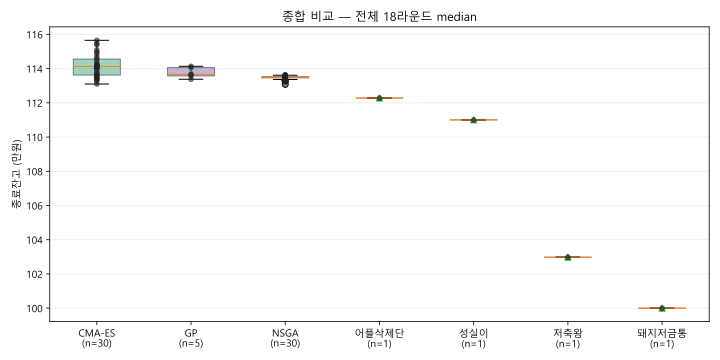
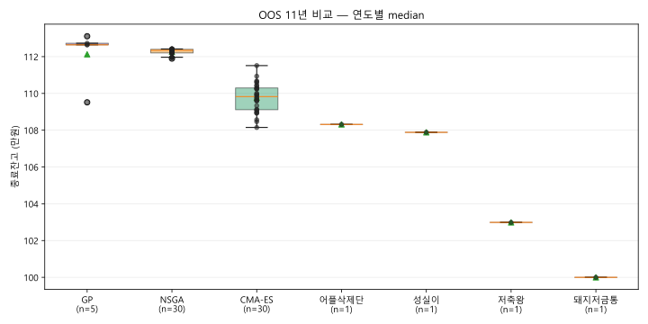
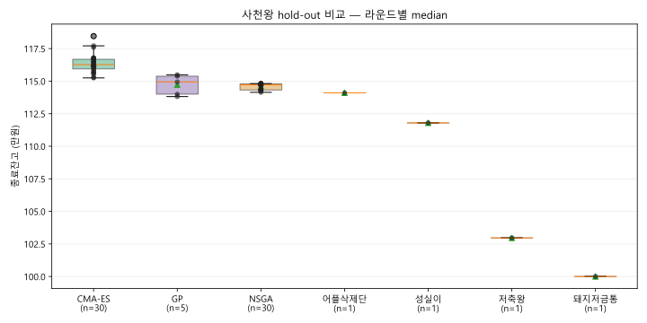
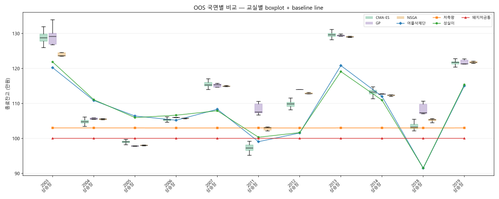
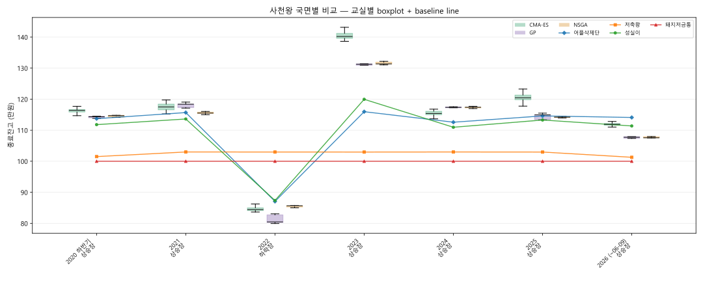

# Season3 League

- top30: `C:\HomeLab\my_project\quant\pocket_quant\app\academy\training\results\classroom_top30_20260622_195214_v2.json`
- cost_model: `season3_flat_1bp_band5`
- contestants: candidates 65명 + baseline 4명
- order: OOS 11년 → 사천왕 hold-out

## 종합 비교

| group | n | overall median | oos median | holdout median |
|---|---:|---:|---:|---:|
| CMA-ES | 30 | 1141295 | 1098282 | 1162665 |
| GP | 5 | 1136660 | 1126415 | 1149387 |
| NSGA | 30 | 1134706 | 1123409 | 1147142 |
| 어플삭제단 | 1 | 1122809 | 1083156 | 1140990 |
| 성실이 | 1 | 1110023 | 1078858 | 1117944 |
| 저축왕 | 1 | 1029818 | 1029879 | 1029637 |
| 돼지저금통 | 1 | 1000000 | 1000000 | 1000000 |

## 관문별 비교

## 국면별 비교 — OOS

| round | daily regime mix | CMA-ES median | GP median | NSGA median | best baseline | balance |
|---|---|---:|---:|---:|---|---:|
| 2003 | 상승장 81% / 하락장 12% / 횡보장 6% | 1287406 | 1291257 | 1236106 | 성실이 | 1218346 |
| 2004 | 상승장 54% / 하락장 25% / 횡보장 21% | 1047468 | 1055594 | 1055196 | 성실이 | 1110549 |
| 2005 | 상승장 50% / 하락장 14% / 횡보장 35% | 990002 | 978117 | 979720 | 어플삭제단 | 1063849 |
| 2006 | 상승장 50% / 하락장 25% / 횡보장 21% / 변동장 4% | 1053328 | 1059763 | 1057465 | 성실이 | 1066193 |
| 2007 | 상승장 79% / 횡보장 8% / 변동장 14% | 1152666 | 1153001 | 1148642 | 어플삭제단 | 1083156 |
| 2011 | 상승장 52% / 하락장 21% / 횡보장 21% / 변동장 6% | 972308 | 1075194 | 1030316 | 저축왕 | 1029879 |
| 2012 | 상승장 67% / 하락장 10% / 횡보장 23% | 1098282 | 1139403 | 1127552 | 저축왕 | 1029637 |
| 2013 | 상승장 90% / 횡보장 10% | 1295908 | 1294298 | 1289761 | 어플삭제단 | 1208109 |
| 2014 | 상승장 83% / 횡보장 4% / 변동장 13% | 1132292 | 1126415 | 1123409 | 어플삭제단 | 1119855 |
| 2018 | 상승장 65% / 하락장 17% / 횡보장 1% / 변동장 16% | 1032093 | 1073140 | 1053394 | 저축왕 | 1029758 |
| 2019 | 상승장 75% / 하락장 6% / 횡보장 18% / 변동장 0% | 1217114 | 1212750 | 1216775 | 성실이 | 1153427 |

## 국면별 비교 — 사천왕

| round | daily regime mix | CMA-ES median | GP median | NSGA median | best baseline | balance |
|---|---|---:|---:|---:|---|---:|
| 2020 하반기 | 상승장 96% / 횡보장 4% | 1163800 | 1143319 | 1146891 | 어플삭제단 | 1137151 |
| 2021 | 상승장 86% / 횡보장 14% | 1174988 | 1183877 | 1155223 | 어플삭제단 | 1156827 |
| 2022 | 상승장 3% / 하락장 80% / 횡보장 14% / 변동장 3% | 844179 | 804614 | 856464 | 저축왕 | 1029758 |
| 2023 | 상승장 79% / 하락장 3% / 횡보장 18% | 1401882 | 1312312 | 1313733 | 성실이 | 1199508 |
| 2024 | 상승장 88% / 횡보장 5% / 변동장 6% | 1153869 | 1173564 | 1173846 | 어플삭제단 | 1125763 |
| 2025 | 상승장 71% / 하락장 18% / 횡보장 10% / 변동장 1% | 1204484 | 1149387 | 1142112 | 어플삭제단 | 1146052 |
| 2026 (~06-09) | 상승장 61% / 하락장 11% / 횡보장 28% | 1119028 | 1077216 | 1075580 | 어플삭제단 | 1140990 |